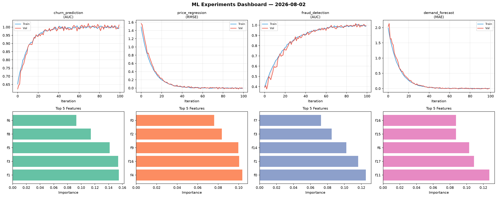
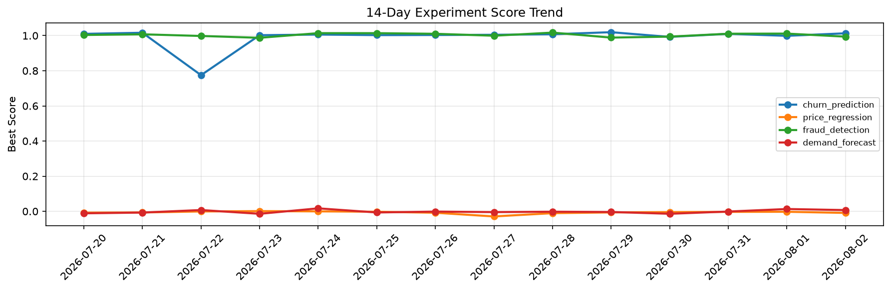

# ML Experiments Report — 2026-08-02

**Run ID:** `c8fb3037e8` | **Experiments:** 4 | **Trials:** 16

## Delta vs Yesterday

| Experiment | Today | Yesterday | Change |
|-----------|-------|-----------|--------|
| churn_prediction | 1.0132 | 0.9988 | 📈 1.4% |
| price_regression | -0.0091 | -0.0026 | 📉 -250.0% |
| fraud_detection | 0.9941 | 1.0115 | 📉 -1.7% |
| demand_forecast | 0.007 | 0.0131 | 📉 -46.6% |

## churn_prediction (AUC)

**Best Score:** 1.0132 (Trial 2)

| Trial | Score | Overfit Gap | Time | LR | Trees | Leaves |
|-------|-------|-------------|------|-----|-------|--------|
| 1 | 0.9892 | 0.016 | 9.72s | 0.2 | 500 | 15 |
| 2 ⭐ | 1.0132 | 0.0194 | 43.13s | 0.2 | 200 | 127 |
| 3 | 0.9924 | 0.0115 | 20.53s | 0.2 | 500 | 127 |

## price_regression (RMSE)

**Best Score:** -0.0091 (Trial 1)

| Trial | Score | Overfit Gap | Time | LR | Trees | Leaves |
|-------|-------|-------------|------|-----|-------|--------|
| 1 ⭐ | -0.0091 | 0.0116 | 34.14s | 0.2 | 200 | 31 |
| 2 | 0.0123 | 0.0016 | 49.98s | 0.1 | 1000 | 63 |
| 3 | 0.0025 | 0.0025 | 18.27s | 0.2 | 100 | 15 |
| 4 | 0.0758 | 0.0217 | 188.19s | 0.05 | 1000 | 127 |
| 5 | 0.0152 | 0.0041 | 25.2s | 0.1 | 100 | 31 |

## fraud_detection (AUC)

**Best Score:** 0.9941 (Trial 2)

| Trial | Score | Overfit Gap | Time | LR | Trees | Leaves |
|-------|-------|-------------|------|-----|-------|--------|
| 1 | 0.6349 | 0.0454 | 64.83s | 0.01 | 500 | 31 |
| 2 ⭐ | 0.9941 | 0.0039 | 95.24s | 0.1 | 500 | 127 |
| 3 | 0.5773 | 0.0614 | 284.38s | 0.01 | 1000 | 15 |

## demand_forecast (MAE)

**Best Score:** 0.007 (Trial 2)

| Trial | Score | Overfit Gap | Time | LR | Trees | Leaves |
|-------|-------|-------------|------|-----|-------|--------|
| 1 | 1.3015 | 0.1164 | 12.86s | 0.01 | 100 | 63 |
| 2 ⭐ | 0.007 | 0.0047 | 66.71s | 0.2 | 500 | 63 |
| 3 | 0.1063 | 0.0119 | 281.32s | 0.05 | 1000 | 15 |
| 4 | 0.0128 | 0.0101 | 24.82s | 0.1 | 100 | 15 |
| 5 | 0.1229 | 0.0294 | 6.1s | 0.05 | 100 | 127 |
