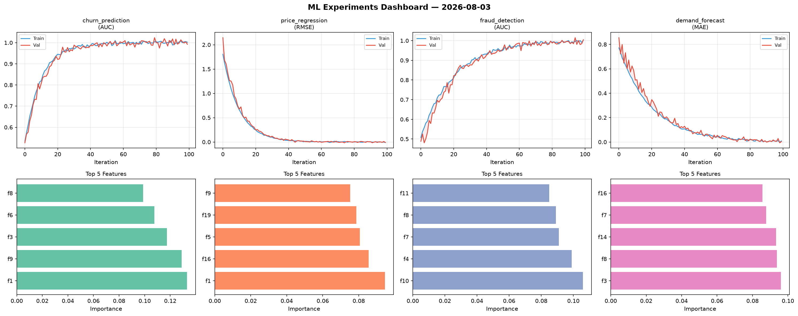
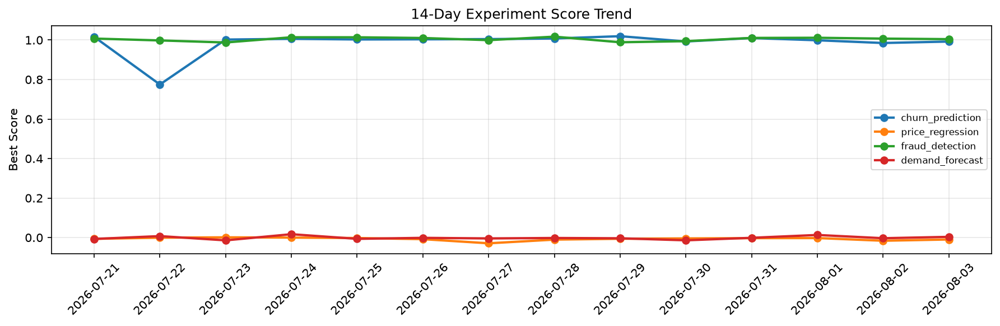

# ML Experiments Report — 2026-08-03

**Run ID:** `a63ed4cdce` | **Experiments:** 4 | **Trials:** 19

## Delta vs Yesterday

| Experiment | Today | Yesterday | Change |
|-----------|-------|-----------|--------|
| churn_prediction | 0.9923 | 0.985 | 📈 0.7% |
| price_regression | -0.0098 | -0.0162 | 📈 39.5% |
| fraud_detection | 1.0045 | 1.0073 | 📉 -0.3% |
| demand_forecast | 0.0035 | -0.0034 | 📈 202.9% |

## churn_prediction (AUC)

**Best Score:** 0.9923 (Trial 3)

| Trial | Score | Overfit Gap | Time | LR | Trees | Leaves |
|-------|-------|-------------|------|-----|-------|--------|
| 1 | 0.9576 | 0.0038 | 147.69s | 0.05 | 1000 | 15 |
| 2 | 0.9872 | 0.0042 | 5.27s | 0.1 | 200 | 63 |
| 3 ⭐ | 0.9923 | 0.0099 | 58.02s | 0.2 | 500 | 127 |
| 4 | 0.7172 | 0.0339 | 35.26s | 0.01 | 200 | 63 |

## price_regression (RMSE)

**Best Score:** -0.0098 (Trial 3)

| Trial | Score | Overfit Gap | Time | LR | Trees | Leaves |
|-------|-------|-------------|------|-----|-------|--------|
| 1 | 0.0027 | 0.0084 | 122.78s | 0.2 | 500 | 127 |
| 2 | -0.0058 | 0.0173 | 78.62s | 0.1 | 500 | 31 |
| 3 ⭐ | -0.0098 | 0.0015 | 46.16s | 0.2 | 200 | 31 |
| 4 | 1.3135 | 0.0961 | 6.19s | 0.01 | 100 | 15 |
| 5 | 0.1194 | 0.0076 | 24.42s | 0.05 | 100 | 31 |

## fraud_detection (AUC)

**Best Score:** 1.0045 (Trial 3)

| Trial | Score | Overfit Gap | Time | LR | Trees | Leaves |
|-------|-------|-------------|------|-----|-------|--------|
| 1 | 0.7232 | 0.0188 | 33.56s | 0.01 | 500 | 63 |
| 2 | 0.9702 | 0.0015 | 47.22s | 0.05 | 1000 | 127 |
| 3 ⭐ | 1.0045 | 0.0013 | 91.91s | 0.1 | 500 | 63 |
| 4 | 0.9862 | 0.0104 | 37.47s | 0.1 | 1000 | 31 |
| 5 | 0.6574 | 0.0035 | 28.41s | 0.01 | 200 | 15 |

## demand_forecast (MAE)

**Best Score:** 0.0035 (Trial 4)

| Trial | Score | Overfit Gap | Time | LR | Trees | Leaves |
|-------|-------|-------------|------|-----|-------|--------|
| 1 | 0.6816 | 0.0061 | 12.25s | 0.01 | 200 | 63 |
| 2 | 0.08 | 0.0184 | 26.9s | 0.05 | 100 | 127 |
| 3 | 0.0078 | 0.009 | 57.45s | 0.1 | 500 | 127 |
| 4 ⭐ | 0.0035 | 0.005 | 17.52s | 0.1 | 200 | 15 |
| 5 | 0.0219 | 0.0102 | 21.71s | 0.1 | 200 | 127 |
