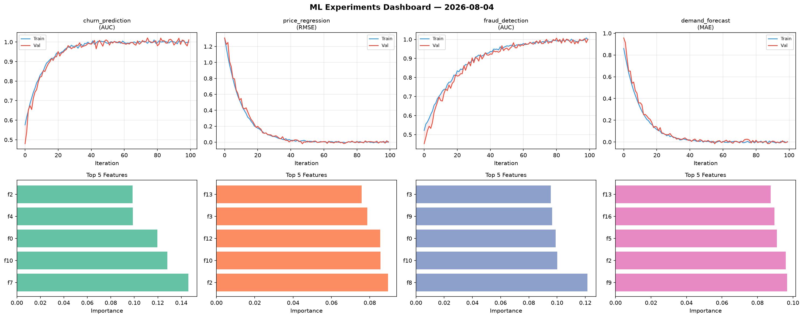
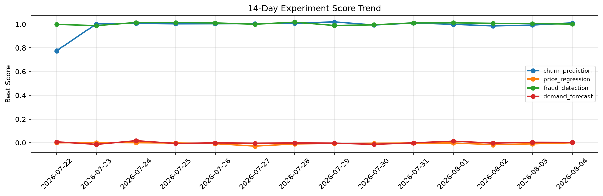

# ML Experiments Report — 2026-08-04

**Run ID:** `b2438b1ae2` | **Experiments:** 4 | **Trials:** 21

## Delta vs Yesterday

| Experiment | Today | Yesterday | Change |
|-----------|-------|-----------|--------|
| churn_prediction | 1.0112 | 0.9923 | 📈 1.9% |
| price_regression | -0.0005 | -0.0098 | 📈 94.9% |
| fraud_detection | 1.0011 | 1.0045 | 📉 -0.3% |
| demand_forecast | 0.0027 | 0.0035 | 📉 -22.9% |

## churn_prediction (AUC)

**Best Score:** 1.0112 (Trial 3)

| Trial | Score | Overfit Gap | Time | LR | Trees | Leaves |
|-------|-------|-------------|------|-----|-------|--------|
| 1 | 0.9963 | 0.0054 | 18.64s | 0.1 | 100 | 15 |
| 2 | 0.6768 | 0.0256 | 28.09s | 0.01 | 100 | 63 |
| 3 ⭐ | 1.0112 | 0.0117 | 26.02s | 0.2 | 1000 | 127 |
| 4 | 0.765 | 0.017 | 13.35s | 0.01 | 200 | 31 |

## price_regression (RMSE)

**Best Score:** -0.0005 (Trial 5)

| Trial | Score | Overfit Gap | Time | LR | Trees | Leaves |
|-------|-------|-------------|------|-----|-------|--------|
| 1 | 0.0097 | 0.001 | 97.97s | 0.1 | 500 | 15 |
| 2 | 0.0052 | 0.0155 | 283.07s | 0.2 | 1000 | 31 |
| 3 | 0.1706 | 0.0112 | 112.72s | 0.05 | 500 | 63 |
| 4 | 0.706 | 0.0359 | 80.2s | 0.01 | 500 | 127 |
| 5 ⭐ | -0.0005 | 0.008 | 6.19s | 0.2 | 200 | 15 |
| 6 | 0.1337 | 0.0029 | 25.23s | 0.05 | 500 | 63 |

## fraud_detection (AUC)

**Best Score:** 1.0011 (Trial 2)

| Trial | Score | Overfit Gap | Time | LR | Trees | Leaves |
|-------|-------|-------------|------|-----|-------|--------|
| 1 | 0.938 | 0.0219 | 15.74s | 0.05 | 200 | 127 |
| 2 ⭐ | 1.0011 | 0.0021 | 23.92s | 0.1 | 200 | 127 |
| 3 | 0.9978 | 0.0005 | 119.05s | 0.2 | 500 | 63 |
| 4 | 0.9839 | 0.0251 | 18.02s | 0.05 | 200 | 63 |
| 5 | 0.9908 | 0.0063 | 99.8s | 0.1 | 500 | 127 |
| 6 | 0.9827 | 0.0162 | 91.8s | 0.2 | 1000 | 127 |

## demand_forecast (MAE)

**Best Score:** 0.0027 (Trial 1)

| Trial | Score | Overfit Gap | Time | LR | Trees | Leaves |
|-------|-------|-------------|------|-----|-------|--------|
| 1 ⭐ | 0.0027 | 0.0026 | 25.22s | 0.2 | 1000 | 63 |
| 2 | 0.0051 | 0.0007 | 65.15s | 0.1 | 500 | 63 |
| 3 | 1.0714 | 0.15 | 31.96s | 0.01 | 200 | 31 |
| 4 | 0.4475 | 0.0401 | 146.06s | 0.01 | 500 | 15 |
| 5 | 0.1304 | 0.0191 | 1.53s | 0.05 | 200 | 127 |
