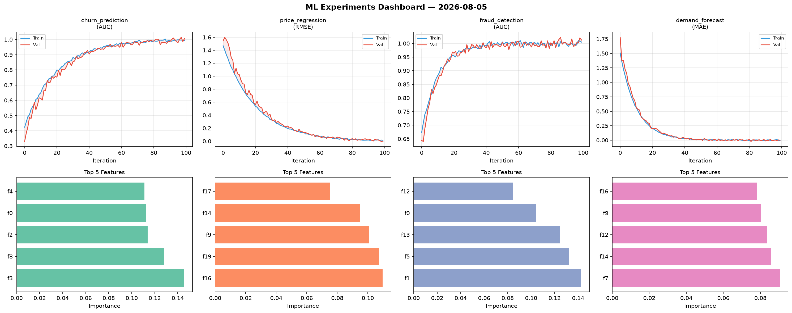
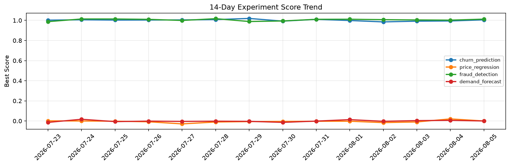

# ML Experiments Report — 2026-08-05

**Run ID:** `69eae88928` | **Experiments:** 4 | **Trials:** 19

## Delta vs Yesterday

| Experiment | Today | Yesterday | Change |
|-----------|-------|-----------|--------|
| churn_prediction | 1.0055 | 0.9944 | 📈 1.1% |
| price_regression | -0.0002 | 0.0205 | 📉 -101.0% |
| fraud_detection | 1.0125 | 1.0025 | 📈 1.0% |
| demand_forecast | -0.0001 | 0.0058 | 📉 -101.7% |

## churn_prediction (AUC)

**Best Score:** 1.0055 (Trial 4)

| Trial | Score | Overfit Gap | Time | LR | Trees | Leaves |
|-------|-------|-------------|------|-----|-------|--------|
| 1 | 0.9837 | 0.0126 | 17.17s | 0.1 | 200 | 15 |
| 2 | 0.9566 | 0.0091 | 114.08s | 0.05 | 1000 | 63 |
| 3 | 0.9988 | 0.0026 | 28.97s | 0.1 | 200 | 15 |
| 4 ⭐ | 1.0055 | 0.0124 | 16.14s | 0.1 | 100 | 15 |
| 5 | 0.5969 | 0.0568 | 33.45s | 0.01 | 200 | 63 |

## price_regression (RMSE)

**Best Score:** -0.0002 (Trial 4)

| Trial | Score | Overfit Gap | Time | LR | Trees | Leaves |
|-------|-------|-------------|------|-----|-------|--------|
| 1 | 0.0064 | 0.0061 | 140.72s | 0.1 | 1000 | 31 |
| 2 | 0.0115 | 0.0087 | 2.71s | 0.1 | 100 | 63 |
| 3 | 0.6658 | 0.0901 | 13.89s | 0.01 | 100 | 63 |
| 4 ⭐ | -0.0002 | 0.0131 | 17.55s | 0.1 | 200 | 15 |
| 5 | 0.0584 | 0.0011 | 33.25s | 0.05 | 200 | 127 |

## fraud_detection (AUC)

**Best Score:** 1.0125 (Trial 3)

| Trial | Score | Overfit Gap | Time | LR | Trees | Leaves |
|-------|-------|-------------|------|-----|-------|--------|
| 1 | 0.9831 | 0.0206 | 18.69s | 0.1 | 1000 | 63 |
| 2 | 0.7009 | 0.0309 | 46.83s | 0.01 | 200 | 15 |
| 3 ⭐ | 1.0125 | 0.0076 | 8.45s | 0.2 | 200 | 31 |
| 4 | 0.9882 | 0.0072 | 19.65s | 0.1 | 100 | 15 |
| 5 | 0.6987 | 0.0003 | 85.83s | 0.01 | 1000 | 63 |
| 6 | 0.6955 | 0.0099 | 29.15s | 0.01 | 200 | 127 |

## demand_forecast (MAE)

**Best Score:** -0.0001 (Trial 2)

| Trial | Score | Overfit Gap | Time | LR | Trees | Leaves |
|-------|-------|-------------|------|-----|-------|--------|
| 1 | 0.5431 | 0.1016 | 288.44s | 0.01 | 1000 | 31 |
| 2 ⭐ | -0.0001 | 0.005 | 126.67s | 0.2 | 1000 | 63 |
| 3 | 0.0138 | 0.0062 | 6.72s | 0.1 | 100 | 63 |
