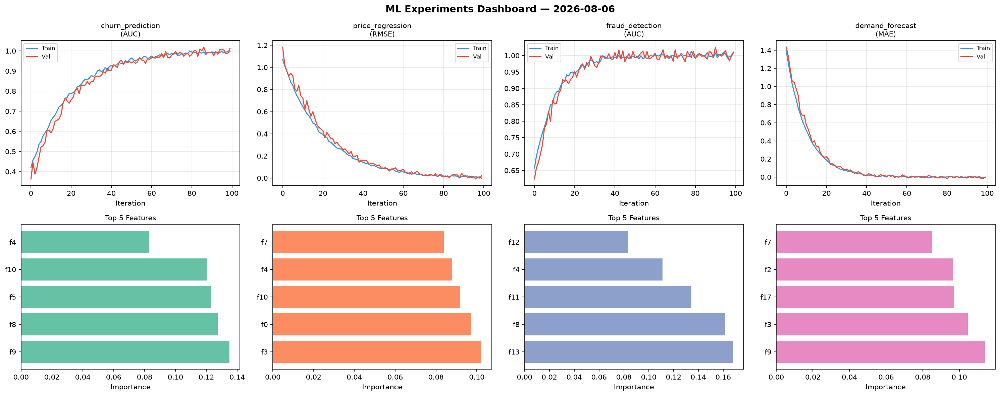
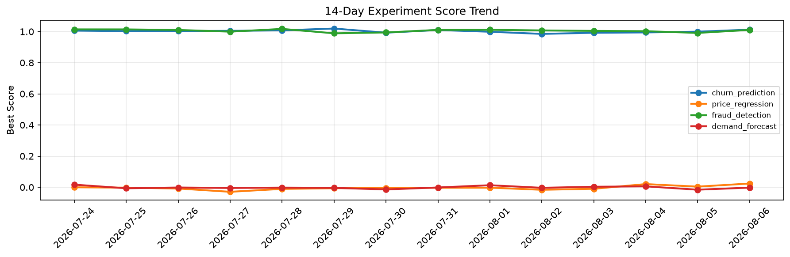

# ML Experiments Report — 2026-08-06

**Run ID:** `b6b8647d83` | **Experiments:** 4 | **Trials:** 14

## Delta vs Yesterday

| Experiment | Today | Yesterday | Change |
|-----------|-------|-----------|--------|
| churn_prediction | 1.0124 | 0.9994 | 📈 1.3% |
| price_regression | 0.0241 | 0.0041 | 📈 487.8% |
| fraud_detection | 1.0107 | 0.9912 | 📈 2.0% |
| demand_forecast | -0.0023 | -0.0156 | 📈 85.3% |

## churn_prediction (AUC)

**Best Score:** 1.0124 (Trial 4)

| Trial | Score | Overfit Gap | Time | LR | Trees | Leaves |
|-------|-------|-------------|------|-----|-------|--------|
| 1 | 0.9346 | 0.0142 | 16.98s | 0.05 | 200 | 31 |
| 2 | 0.9556 | 0.0082 | 120.5s | 0.05 | 500 | 63 |
| 3 | 0.6613 | 0.0494 | 109.85s | 0.01 | 500 | 15 |
| 4 ⭐ | 1.0124 | 0.0152 | 46.93s | 0.1 | 500 | 63 |
| 5 | 0.9976 | 0.004 | 166.15s | 0.1 | 1000 | 127 |

## price_regression (RMSE)

**Best Score:** 0.0241 (Trial 3)

| Trial | Score | Overfit Gap | Time | LR | Trees | Leaves |
|-------|-------|-------------|------|-----|-------|--------|
| 1 | 0.1251 | 0.0123 | 135.6s | 0.05 | 500 | 127 |
| 2 | 1.141 | 0.0924 | 35.29s | 0.01 | 200 | 63 |
| 3 ⭐ | 0.0241 | 0.0264 | 215.03s | 0.1 | 1000 | 63 |

## fraud_detection (AUC)

**Best Score:** 1.0107 (Trial 3)

| Trial | Score | Overfit Gap | Time | LR | Trees | Leaves |
|-------|-------|-------------|------|-----|-------|--------|
| 1 | 0.7539 | 0.0223 | 15.55s | 0.01 | 200 | 63 |
| 2 | 0.9944 | 0.0042 | 11.69s | 0.2 | 100 | 15 |
| 3 ⭐ | 1.0107 | 0.0021 | 19.15s | 0.2 | 100 | 15 |

## demand_forecast (MAE)

**Best Score:** -0.0023 (Trial 2)

| Trial | Score | Overfit Gap | Time | LR | Trees | Leaves |
|-------|-------|-------------|------|-----|-------|--------|
| 1 | 0.006 | 0.0014 | 98.2s | 0.1 | 500 | 127 |
| 2 ⭐ | -0.0023 | 0.0005 | 2.6s | 0.2 | 200 | 15 |
| 3 | 0.3498 | 0.0016 | 115.41s | 0.01 | 500 | 31 |
