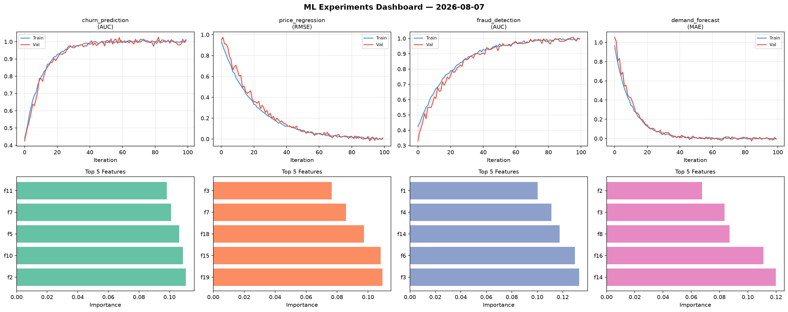
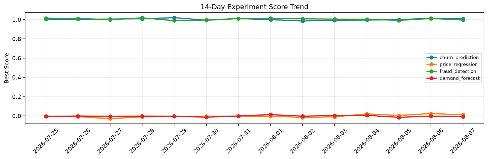

# ML Experiments Report — 2026-08-07

**Run ID:** `efc27f3851` | **Experiments:** 4 | **Trials:** 18

## Delta vs Yesterday

| Experiment | Today | Yesterday | Change |
|-----------|-------|-----------|--------|
| churn_prediction | 1.0071 | 1.0124 | 📉 -0.5% |
| price_regression | 0.0112 | 0.0241 | 📉 -53.5% |
| fraud_detection | 0.9955 | 1.0107 | 📉 -1.5% |
| demand_forecast | -0.0069 | -0.0023 | 📉 -200.0% |

## churn_prediction (AUC)

**Best Score:** 1.0071 (Trial 1)

| Trial | Score | Overfit Gap | Time | LR | Trees | Leaves |
|-------|-------|-------------|------|-----|-------|--------|
| 1 ⭐ | 1.0071 | 0.0052 | 24.4s | 0.2 | 200 | 127 |
| 2 | 0.9543 | 0.0135 | 24.63s | 0.05 | 100 | 63 |
| 3 | 0.9796 | 0.0044 | 18.18s | 0.05 | 100 | 63 |

## price_regression (RMSE)

**Best Score:** 0.0112 (Trial 5)

| Trial | Score | Overfit Gap | Time | LR | Trees | Leaves |
|-------|-------|-------------|------|-----|-------|--------|
| 1 | 1.0139 | 0.1614 | 36.97s | 0.01 | 200 | 15 |
| 2 | 0.1401 | 0.0137 | 26.53s | 0.05 | 500 | 15 |
| 3 | 1.1153 | 0.0723 | 4.93s | 0.01 | 100 | 127 |
| 4 | 0.1453 | 0.0322 | 10.34s | 0.05 | 100 | 63 |
| 5 ⭐ | 0.0112 | 0.0108 | 32.37s | 0.1 | 200 | 127 |

## fraud_detection (AUC)

**Best Score:** 0.9955 (Trial 5)

| Trial | Score | Overfit Gap | Time | LR | Trees | Leaves |
|-------|-------|-------------|------|-----|-------|--------|
| 1 | 0.9426 | 0.0079 | 27.9s | 0.05 | 500 | 127 |
| 2 | 0.9949 | 0.0008 | 12.63s | 0.2 | 100 | 127 |
| 3 | 0.7845 | 0.0071 | 256.55s | 0.01 | 1000 | 31 |
| 4 | 0.9475 | 0.0026 | 36.05s | 0.05 | 200 | 127 |
| 5 ⭐ | 0.9955 | 0.0048 | 10.45s | 0.1 | 500 | 63 |

## demand_forecast (MAE)

**Best Score:** -0.0069 (Trial 5)

| Trial | Score | Overfit Gap | Time | LR | Trees | Leaves |
|-------|-------|-------------|------|-----|-------|--------|
| 1 | 0.0273 | 0.0254 | 23.17s | 0.2 | 100 | 63 |
| 2 | 0.0045 | 0.0115 | 36.28s | 0.2 | 1000 | 63 |
| 3 | 1.1267 | 0.1315 | 20.12s | 0.01 | 100 | 31 |
| 4 | 0.0055 | 0.0044 | 19.89s | 0.1 | 200 | 15 |
| 5 ⭐ | -0.0069 | 0.009 | 6.5s | 0.2 | 100 | 63 |
