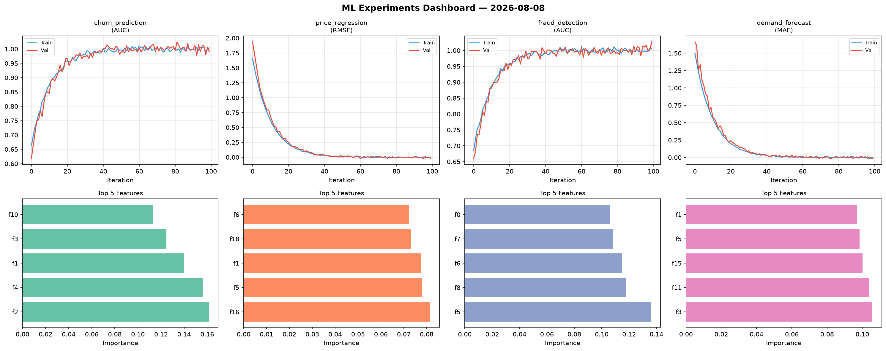
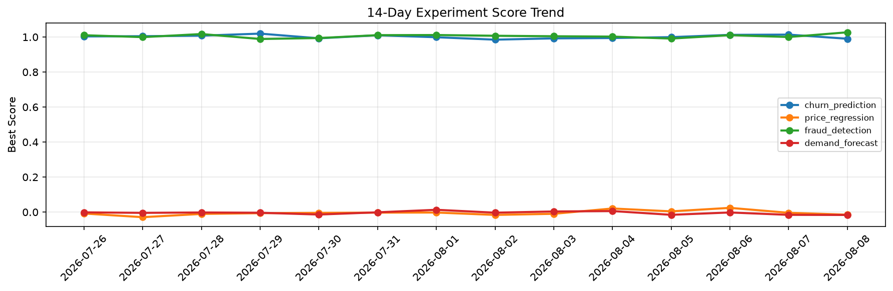

# ML Experiments Report — 2026-08-08

**Run ID:** `56b3e7053c` | **Experiments:** 4 | **Trials:** 16

## Delta vs Yesterday

| Experiment | Today | Yesterday | Change |
|-----------|-------|-----------|--------|
| churn_prediction | 0.9901 | 1.0138 | 📉 -2.3% |
| price_regression | -0.015 | -0.0041 | 📉 -265.9% |
| fraud_detection | 1.027 | 1.0001 | 📈 2.7% |
| demand_forecast | -0.0165 | -0.0158 | 📉 -4.4% |

## churn_prediction (AUC)

**Best Score:** 0.9901 (Trial 5)

| Trial | Score | Overfit Gap | Time | LR | Trees | Leaves |
|-------|-------|-------------|------|-----|-------|--------|
| 1 | 0.9577 | 0.0083 | 110.23s | 0.05 | 500 | 15 |
| 2 | 0.9872 | 0.0265 | 13.12s | 0.05 | 100 | 31 |
| 3 | 0.9642 | 0.0002 | 254.16s | 0.05 | 1000 | 31 |
| 4 | 0.706 | 0.0121 | 27.21s | 0.01 | 200 | 31 |
| 5 ⭐ | 0.9901 | 0.0138 | 44.94s | 0.2 | 200 | 15 |

## price_regression (RMSE)

**Best Score:** -0.015 (Trial 2)

| Trial | Score | Overfit Gap | Time | LR | Trees | Leaves |
|-------|-------|-------------|------|-----|-------|--------|
| 1 | -0.0006 | 0.0116 | 26.01s | 0.1 | 100 | 15 |
| 2 ⭐ | -0.015 | 0.0124 | 24.19s | 0.2 | 100 | 31 |
| 3 | 0.0001 | 0.0065 | 42.91s | 0.2 | 1000 | 63 |

## fraud_detection (AUC)

**Best Score:** 1.027 (Trial 2)

| Trial | Score | Overfit Gap | Time | LR | Trees | Leaves |
|-------|-------|-------------|------|-----|-------|--------|
| 1 | 0.7627 | 0.042 | 23.11s | 0.01 | 100 | 127 |
| 2 ⭐ | 1.027 | 0.021 | 42.81s | 0.2 | 1000 | 31 |
| 3 | 0.9871 | 0.017 | 76.22s | 0.2 | 500 | 31 |

## demand_forecast (MAE)

**Best Score:** -0.0165 (Trial 2)

| Trial | Score | Overfit Gap | Time | LR | Trees | Leaves |
|-------|-------|-------------|------|-----|-------|--------|
| 1 | 0.019 | 0.0034 | 64.52s | 0.1 | 500 | 63 |
| 2 ⭐ | -0.0165 | 0.0117 | 15.4s | 0.2 | 1000 | 127 |
| 3 | 0.1276 | 0.0017 | 168.32s | 0.05 | 1000 | 127 |
| 4 | 0.016 | 0.0064 | 28.08s | 0.1 | 100 | 127 |
| 5 | 0.0645 | 0.0112 | 56.84s | 0.05 | 500 | 127 |
