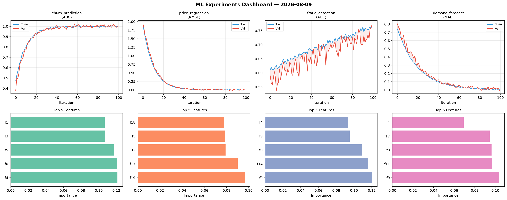
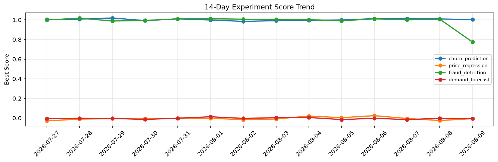

# ML Experiments Report — 2026-08-09

**Run ID:** `8bfebfe397` | **Experiments:** 4 | **Trials:** 18

## Delta vs Yesterday

| Experiment | Today | Yesterday | Change |
|-----------|-------|-----------|--------|
| churn_prediction | 1.0037 | 1.0095 | 📉 -0.6% |
| price_regression | -0.006 | -0.0254 | 📈 76.4% |
| fraud_detection | 0.7744 | 1.0072 | 📉 -23.1% |
| demand_forecast | -0.0057 | -0.0022 | 📉 -159.1% |

## churn_prediction (AUC)

**Best Score:** 1.0037 (Trial 5)

| Trial | Score | Overfit Gap | Time | LR | Trees | Leaves |
|-------|-------|-------------|------|-----|-------|--------|
| 1 | 0.9962 | 0.0114 | 40.6s | 0.1 | 500 | 31 |
| 2 | 0.6517 | 0.0011 | 50.22s | 0.01 | 200 | 63 |
| 3 | 1.0011 | 0.0083 | 3.67s | 0.1 | 200 | 127 |
| 4 | 0.98 | 0.0113 | 178.47s | 0.05 | 1000 | 15 |
| 5 ⭐ | 1.0037 | 0.0107 | 15.6s | 0.2 | 200 | 15 |

## price_regression (RMSE)

**Best Score:** -0.006 (Trial 6)

| Trial | Score | Overfit Gap | Time | LR | Trees | Leaves |
|-------|-------|-------------|------|-----|-------|--------|
| 1 | 1.3518 | 0.1764 | 52.25s | 0.01 | 200 | 63 |
| 2 | 0.0128 | 0.0049 | 72.32s | 0.2 | 500 | 63 |
| 3 | 0.0131 | 0.0029 | 56.17s | 0.1 | 200 | 31 |
| 4 | 0.0919 | 0.0102 | 9.0s | 0.05 | 100 | 15 |
| 5 | 0.8718 | 0.1184 | 7.75s | 0.01 | 100 | 31 |
| 6 ⭐ | -0.006 | 0.0129 | 17.73s | 0.2 | 500 | 127 |

## fraud_detection (AUC)

**Best Score:** 0.7744 (Trial 1)

| Trial | Score | Overfit Gap | Time | LR | Trees | Leaves |
|-------|-------|-------------|------|-----|-------|--------|
| 1 ⭐ | 0.7744 | 0.0046 | 5.32s | 0.01 | 100 | 15 |
| 2 | 0.7149 | 0.0161 | 27.73s | 0.01 | 100 | 127 |
| 3 | 0.7506 | 0.0191 | 3.8s | 0.01 | 200 | 127 |

## demand_forecast (MAE)

**Best Score:** -0.0057 (Trial 1)

| Trial | Score | Overfit Gap | Time | LR | Trees | Leaves |
|-------|-------|-------------|------|-----|-------|--------|
| 1 ⭐ | -0.0057 | 0.0089 | 52.32s | 0.1 | 500 | 63 |
| 2 | 0.9567 | 0.085 | 3.41s | 0.01 | 100 | 63 |
| 3 | 0.0177 | 0.0246 | 62.06s | 0.2 | 500 | 63 |
| 4 | 0.0036 | 0.0026 | 2.85s | 0.1 | 200 | 31 |
