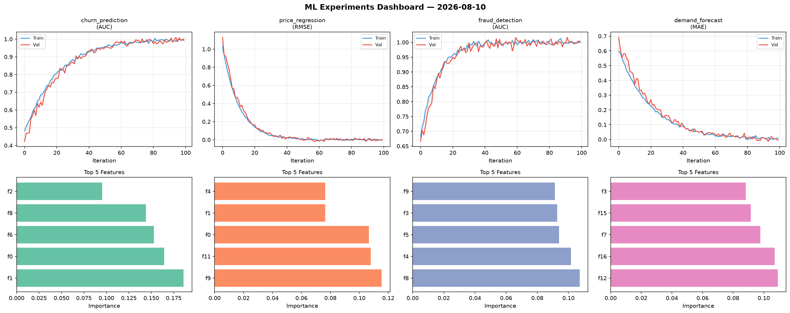
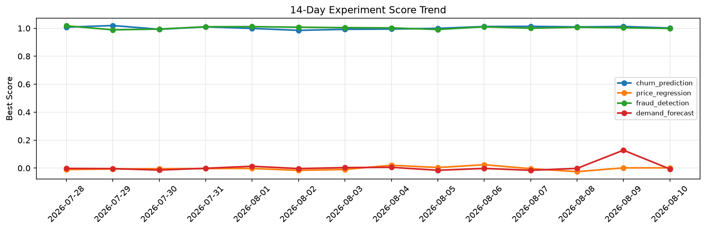

# ML Experiments Report — 2026-08-10

**Run ID:** `ad592322be` | **Experiments:** 4 | **Trials:** 19

## Delta vs Yesterday

| Experiment | Today | Yesterday | Change |
|-----------|-------|-----------|--------|
| churn_prediction | 1.0017 | 1.0127 | 📉 -1.1% |
| price_regression | 0.0018 | 0.0017 | 📈 5.9% |
| fraud_detection | 0.9986 | 1.0035 | 📉 -0.5% |
| demand_forecast | -0.0066 | 0.128 | 📉 -105.2% |

## churn_prediction (AUC)

**Best Score:** 1.0017 (Trial 4)

| Trial | Score | Overfit Gap | Time | LR | Trees | Leaves |
|-------|-------|-------------|------|-----|-------|--------|
| 1 | 0.7012 | 0.0301 | 116.57s | 0.01 | 500 | 15 |
| 2 | 0.7151 | 0.0482 | 106.83s | 0.01 | 500 | 15 |
| 3 | 0.771 | 0.0169 | 9.95s | 0.01 | 100 | 63 |
| 4 ⭐ | 1.0017 | 0.0102 | 136.1s | 0.1 | 500 | 63 |

## price_regression (RMSE)

**Best Score:** 0.0018 (Trial 6)

| Trial | Score | Overfit Gap | Time | LR | Trees | Leaves |
|-------|-------|-------------|------|-----|-------|--------|
| 1 | 0.4147 | 0.0388 | 108.65s | 0.01 | 500 | 15 |
| 2 | 1.0508 | 0.0855 | 55.65s | 0.01 | 500 | 15 |
| 3 | 0.0176 | 0.0086 | 44.14s | 0.1 | 200 | 31 |
| 4 | 0.0025 | 0.0094 | 33.78s | 0.1 | 500 | 127 |
| 5 | 0.3833 | 0.0688 | 68.11s | 0.01 | 1000 | 15 |
| 6 ⭐ | 0.0018 | 0.0083 | 13.7s | 0.2 | 100 | 15 |

## fraud_detection (AUC)

**Best Score:** 0.9986 (Trial 4)

| Trial | Score | Overfit Gap | Time | LR | Trees | Leaves |
|-------|-------|-------------|------|-----|-------|--------|
| 1 | 0.9963 | 0.0044 | 118.64s | 0.2 | 1000 | 15 |
| 2 | 0.7123 | 0.0044 | 27.38s | 0.01 | 100 | 63 |
| 3 | 0.7011 | 0.0356 | 202.61s | 0.01 | 1000 | 31 |
| 4 ⭐ | 0.9986 | 0.0056 | 17.85s | 0.2 | 200 | 15 |
| 5 | 0.9654 | 0.0169 | 114.22s | 0.05 | 500 | 15 |
| 6 | 0.9648 | 0.0114 | 22.95s | 0.05 | 200 | 127 |

## demand_forecast (MAE)

**Best Score:** -0.0066 (Trial 2)

| Trial | Score | Overfit Gap | Time | LR | Trees | Leaves |
|-------|-------|-------------|------|-----|-------|--------|
| 1 | 0.8449 | 0.0075 | 130.01s | 0.01 | 1000 | 63 |
| 2 ⭐ | -0.0066 | 0.0158 | 32.03s | 0.1 | 200 | 63 |
| 3 | 0.0191 | 0.001 | 127.41s | 0.1 | 500 | 31 |
