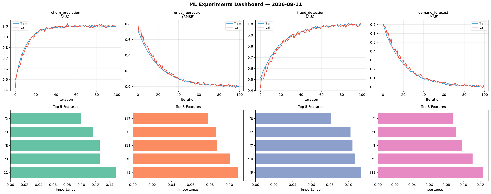
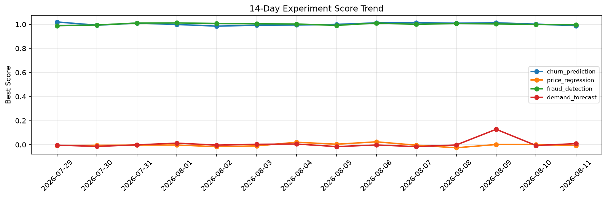

# ML Experiments Report — 2026-08-11

**Run ID:** `5707847ca2` | **Experiments:** 4 | **Trials:** 19

## Delta vs Yesterday

| Experiment | Today | Yesterday | Change |
|-----------|-------|-----------|--------|
| churn_prediction | 0.9886 | 1.0017 | 📉 -1.3% |
| price_regression | -0.008 | 0.0018 | 📉 -544.4% |
| fraud_detection | 0.9967 | 0.9986 | 📉 -0.2% |
| demand_forecast | 0.0088 | -0.0066 | 📈 233.3% |

## churn_prediction (AUC)

**Best Score:** 0.9886 (Trial 1)

| Trial | Score | Overfit Gap | Time | LR | Trees | Leaves |
|-------|-------|-------------|------|-----|-------|--------|
| 1 ⭐ | 0.9886 | 0.0103 | 89.63s | 0.2 | 500 | 15 |
| 2 | 0.9472 | 0.0162 | 272.28s | 0.05 | 1000 | 63 |
| 3 | 0.9884 | 0.0044 | 4.7s | 0.1 | 100 | 31 |
| 4 | 0.7855 | 0.0263 | 22.54s | 0.01 | 500 | 127 |
| 5 | 0.9491 | 0.0215 | 215.99s | 0.05 | 1000 | 15 |
| 6 | 0.6012 | 0.0534 | 26.41s | 0.01 | 200 | 63 |

## price_regression (RMSE)

**Best Score:** -0.008 (Trial 5)

| Trial | Score | Overfit Gap | Time | LR | Trees | Leaves |
|-------|-------|-------------|------|-----|-------|--------|
| 1 | 0.5582 | 0.0012 | 212.17s | 0.01 | 1000 | 63 |
| 2 | -0.0022 | 0.0042 | 11.45s | 0.2 | 200 | 127 |
| 3 | 0.4187 | 0.041 | 43.28s | 0.01 | 200 | 31 |
| 4 | 0.1271 | 0.005 | 191.46s | 0.05 | 1000 | 15 |
| 5 ⭐ | -0.008 | 0.0094 | 100.67s | 0.1 | 500 | 127 |

## fraud_detection (AUC)

**Best Score:** 0.9967 (Trial 3)

| Trial | Score | Overfit Gap | Time | LR | Trees | Leaves |
|-------|-------|-------------|------|-----|-------|--------|
| 1 | 0.9952 | 0.0065 | 46.85s | 0.2 | 200 | 31 |
| 2 | 0.735 | 0.0345 | 28.51s | 0.01 | 500 | 31 |
| 3 ⭐ | 0.9967 | 0.0015 | 4.79s | 0.1 | 200 | 127 |

## demand_forecast (MAE)

**Best Score:** 0.0088 (Trial 5)

| Trial | Score | Overfit Gap | Time | LR | Trees | Leaves |
|-------|-------|-------------|------|-----|-------|--------|
| 1 | 0.1401 | 0.0037 | 16.79s | 0.05 | 1000 | 15 |
| 2 | 1.345 | 0.1833 | 5.33s | 0.01 | 100 | 15 |
| 3 | 0.9274 | 0.0463 | 50.05s | 0.01 | 200 | 31 |
| 4 | 0.1205 | 0.0208 | 264.39s | 0.05 | 1000 | 15 |
| 5 ⭐ | 0.0088 | 0.0058 | 49.15s | 0.1 | 200 | 63 |
