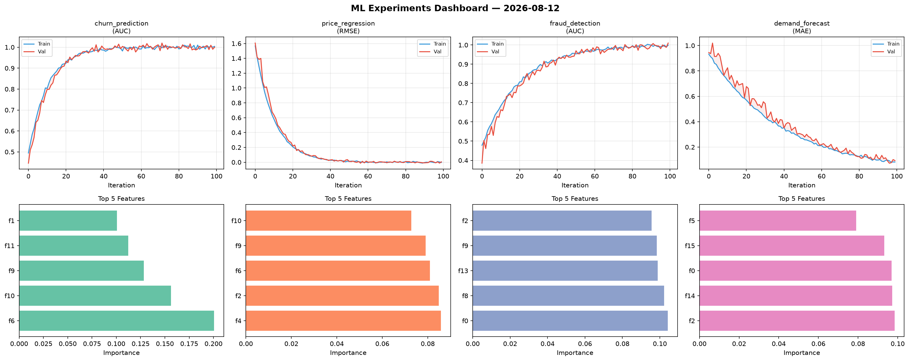
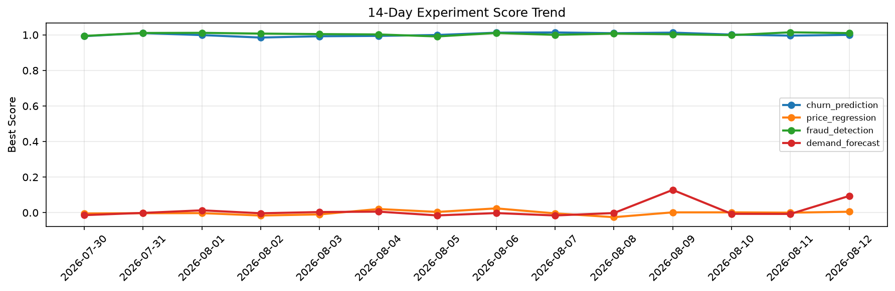

# ML Experiments Report — 2026-08-12

**Run ID:** `0da7d8c53a` | **Experiments:** 4 | **Trials:** 19

## Delta vs Yesterday

| Experiment | Today | Yesterday | Change |
|-----------|-------|-----------|--------|
| churn_prediction | 1.0 | 0.9959 | 📈 0.4% |
| price_regression | 0.0052 | 0.0 | 📈 520.0% |
| fraud_detection | 1.01 | 1.0145 | 📉 -0.4% |
| demand_forecast | 0.094 | -0.0072 | 📈 1405.6% |

## churn_prediction (AUC)

**Best Score:** 1.0 (Trial 4)

| Trial | Score | Overfit Gap | Time | LR | Trees | Leaves |
|-------|-------|-------------|------|-----|-------|--------|
| 1 | 0.9864 | 0.0043 | 1.77s | 0.2 | 200 | 31 |
| 2 | 0.9357 | 0.0136 | 25.33s | 0.05 | 100 | 15 |
| 3 | 0.6851 | 0.0424 | 29.25s | 0.01 | 100 | 127 |
| 4 ⭐ | 1.0 | 0.0038 | 1.59s | 0.2 | 100 | 63 |
| 5 | 0.9558 | 0.0035 | 4.05s | 0.05 | 100 | 63 |
| 6 | 0.995 | 0.0032 | 161.44s | 0.1 | 1000 | 31 |

## price_regression (RMSE)

**Best Score:** 0.0052 (Trial 2)

| Trial | Score | Overfit Gap | Time | LR | Trees | Leaves |
|-------|-------|-------------|------|-----|-------|--------|
| 1 | 0.1069 | 0.0101 | 110.46s | 0.05 | 500 | 31 |
| 2 ⭐ | 0.0052 | 0.0082 | 5.05s | 0.2 | 200 | 63 |
| 3 | 0.0239 | 0.0141 | 86.71s | 0.1 | 500 | 15 |

## fraud_detection (AUC)

**Best Score:** 1.01 (Trial 1)

| Trial | Score | Overfit Gap | Time | LR | Trees | Leaves |
|-------|-------|-------------|------|-----|-------|--------|
| 1 ⭐ | 1.01 | 0.011 | 23.39s | 0.1 | 100 | 63 |
| 2 | 0.968 | 0.0087 | 49.99s | 0.05 | 200 | 63 |
| 3 | 0.997 | 0.0015 | 40.65s | 0.1 | 1000 | 31 |
| 4 | 0.6386 | 0.052 | 8.87s | 0.01 | 100 | 15 |
| 5 | 1.0011 | 0.006 | 54.55s | 0.2 | 1000 | 63 |
| 6 | 0.6231 | 0.0309 | 51.67s | 0.01 | 200 | 63 |

## demand_forecast (MAE)

**Best Score:** 0.094 (Trial 3)

| Trial | Score | Overfit Gap | Time | LR | Trees | Leaves |
|-------|-------|-------------|------|-----|-------|--------|
| 1 | 0.7753 | 0.0001 | 103.53s | 0.01 | 500 | 15 |
| 2 | 1.1252 | 0.131 | 165.26s | 0.01 | 1000 | 31 |
| 3 ⭐ | 0.094 | 0.0116 | 59.75s | 0.05 | 500 | 63 |
| 4 | 0.1387 | 0.0004 | 2.34s | 0.05 | 100 | 127 |
