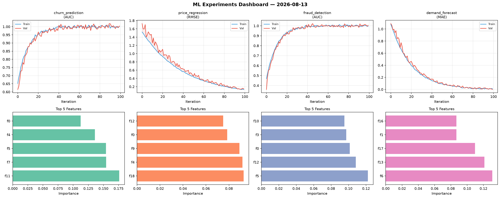
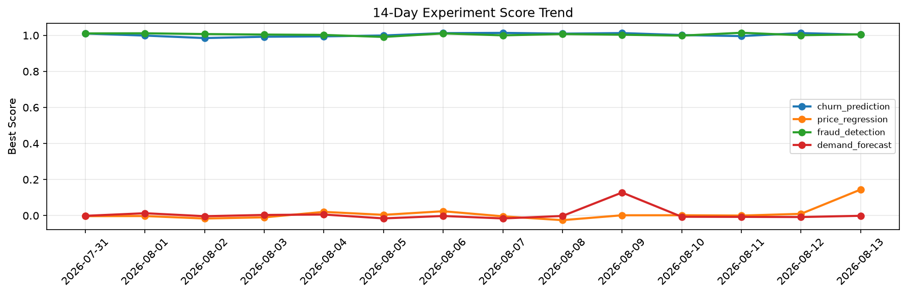

# ML Experiments Report — 2026-08-13

**Run ID:** `e892db3faa` | **Experiments:** 4 | **Trials:** 18

## Delta vs Yesterday

| Experiment | Today | Yesterday | Change |
|-----------|-------|-----------|--------|
| churn_prediction | 1.0043 | 1.0127 | 📉 -0.8% |
| price_regression | 0.1444 | 0.0097 | 📈 1388.7% |
| fraud_detection | 1.0057 | 1.0007 | 📈 0.5% |
| demand_forecast | -0.0012 | -0.0081 | 📈 85.2% |

## churn_prediction (AUC)

**Best Score:** 1.0043 (Trial 3)

| Trial | Score | Overfit Gap | Time | LR | Trees | Leaves |
|-------|-------|-------------|------|-----|-------|--------|
| 1 | 0.9899 | 0.0055 | 37.73s | 0.2 | 200 | 127 |
| 2 | 0.9773 | 0.0228 | 85.06s | 0.1 | 500 | 127 |
| 3 ⭐ | 1.0043 | 0.0027 | 121.12s | 0.2 | 1000 | 127 |
| 4 | 0.9688 | 0.0094 | 21.18s | 0.05 | 100 | 63 |

## price_regression (RMSE)

**Best Score:** 0.1444 (Trial 3)

| Trial | Score | Overfit Gap | Time | LR | Trees | Leaves |
|-------|-------|-------------|------|-----|-------|--------|
| 1 | 0.1861 | 0.032 | 116.94s | 0.05 | 1000 | 15 |
| 2 | 0.6011 | 0.075 | 139.31s | 0.01 | 1000 | 127 |
| 3 ⭐ | 0.1444 | 0.0117 | 23.22s | 0.05 | 100 | 63 |

## fraud_detection (AUC)

**Best Score:** 1.0057 (Trial 3)

| Trial | Score | Overfit Gap | Time | LR | Trees | Leaves |
|-------|-------|-------------|------|-----|-------|--------|
| 1 | 0.9868 | 0.0203 | 53.33s | 0.1 | 500 | 63 |
| 2 | 0.9885 | 0.008 | 174.48s | 0.1 | 1000 | 127 |
| 3 ⭐ | 1.0057 | 0.0098 | 28.02s | 0.2 | 100 | 127 |
| 4 | 0.9863 | 0.0019 | 58.07s | 0.1 | 1000 | 127 |
| 5 | 0.9564 | 0.0082 | 22.78s | 0.05 | 200 | 127 |
| 6 | 0.964 | 0.0114 | 23.44s | 0.05 | 100 | 31 |

## demand_forecast (MAE)

**Best Score:** -0.0012 (Trial 5)

| Trial | Score | Overfit Gap | Time | LR | Trees | Leaves |
|-------|-------|-------------|------|-----|-------|--------|
| 1 | 0.0045 | 0.0019 | 103.24s | 0.1 | 1000 | 127 |
| 2 | 0.1668 | 0.038 | 189.56s | 0.05 | 1000 | 15 |
| 3 | 0.1073 | 0.0154 | 10.6s | 0.05 | 200 | 63 |
| 4 | 1.2457 | 0.1394 | 48.52s | 0.01 | 200 | 15 |
| 5 ⭐ | -0.0012 | 0.0129 | 65.85s | 0.1 | 500 | 15 |
