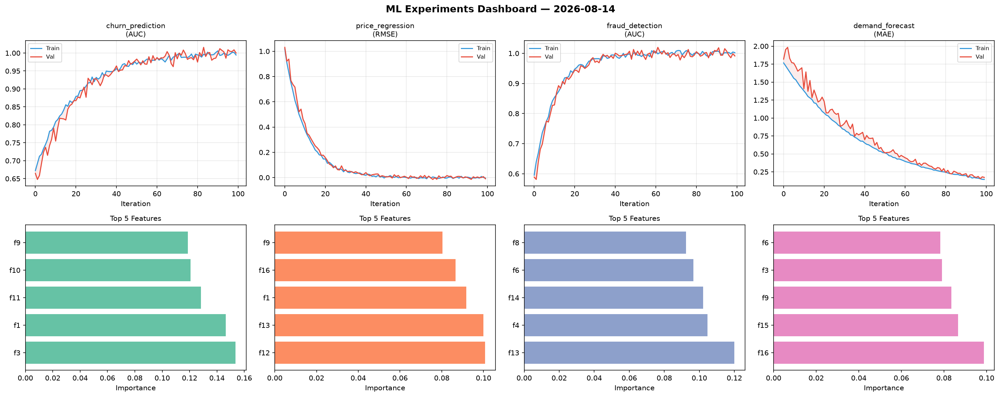
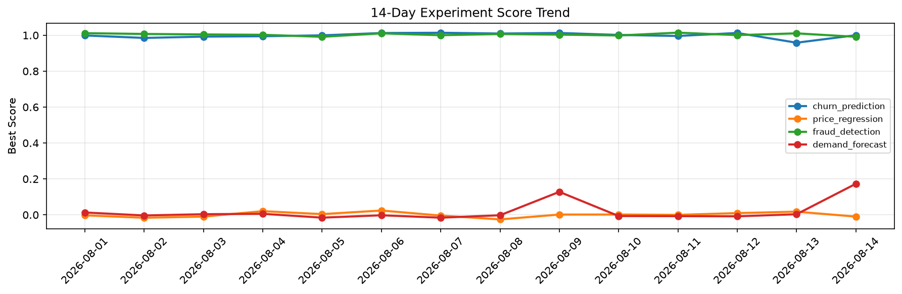

# ML Experiments Report — 2026-08-14

**Run ID:** `9e962618e5` | **Experiments:** 4 | **Trials:** 15

## Delta vs Yesterday

| Experiment | Today | Yesterday | Change |
|-----------|-------|-----------|--------|
| churn_prediction | 1.0002 | 0.9584 | 📈 4.4% |
| price_regression | -0.0097 | 0.0177 | 📉 -154.8% |
| fraud_detection | 0.9912 | 1.0106 | 📉 -1.9% |
| demand_forecast | 0.173 | 0.0034 | 📈 4988.2% |

## churn_prediction (AUC)

**Best Score:** 1.0002 (Trial 1)

| Trial | Score | Overfit Gap | Time | LR | Trees | Leaves |
|-------|-------|-------------|------|-----|-------|--------|
| 1 ⭐ | 1.0002 | 0.0057 | 46.54s | 0.1 | 200 | 31 |
| 2 | 0.9903 | 0.0038 | 30.17s | 0.2 | 1000 | 31 |
| 3 | 0.9576 | 0.0057 | 44.38s | 0.05 | 500 | 31 |

## price_regression (RMSE)

**Best Score:** -0.0097 (Trial 1)

| Trial | Score | Overfit Gap | Time | LR | Trees | Leaves |
|-------|-------|-------------|------|-----|-------|--------|
| 1 ⭐ | -0.0097 | 0.0057 | 6.18s | 0.2 | 100 | 63 |
| 2 | 0.1061 | 0.0242 | 43.55s | 0.05 | 500 | 127 |
| 3 | 0.1433 | 0.0131 | 161.35s | 0.05 | 1000 | 63 |
| 4 | 0.0147 | 0.0151 | 57.76s | 0.2 | 200 | 63 |

## fraud_detection (AUC)

**Best Score:** 0.9912 (Trial 4)

| Trial | Score | Overfit Gap | Time | LR | Trees | Leaves |
|-------|-------|-------------|------|-----|-------|--------|
| 1 | 0.9697 | 0.0015 | 137.15s | 0.05 | 500 | 31 |
| 2 | 0.9455 | 0.012 | 8.94s | 0.05 | 100 | 15 |
| 3 | 0.9607 | 0.014 | 3.7s | 0.05 | 100 | 127 |
| 4 ⭐ | 0.9912 | 0.0111 | 27.11s | 0.2 | 100 | 31 |
| 5 | 0.7643 | 0.0282 | 11.99s | 0.01 | 100 | 31 |

## demand_forecast (MAE)

**Best Score:** 0.173 (Trial 2)

| Trial | Score | Overfit Gap | Time | LR | Trees | Leaves |
|-------|-------|-------------|------|-----|-------|--------|
| 1 | 0.6996 | 0.1113 | 93.24s | 0.01 | 500 | 15 |
| 2 ⭐ | 0.173 | 0.0287 | 50.89s | 0.05 | 500 | 127 |
| 3 | 0.5211 | 0.0115 | 28.53s | 0.01 | 200 | 15 |
