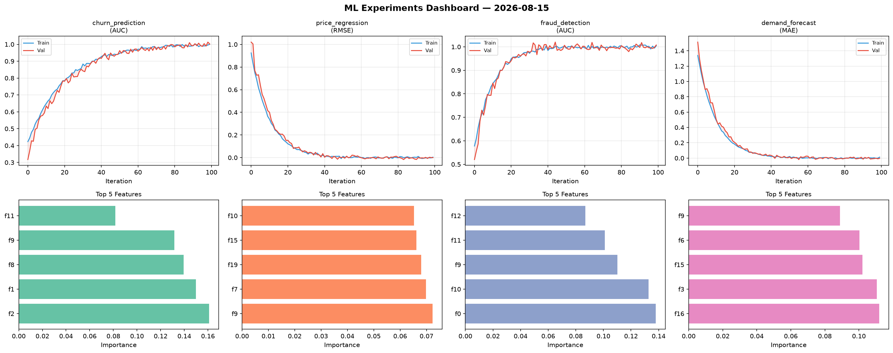
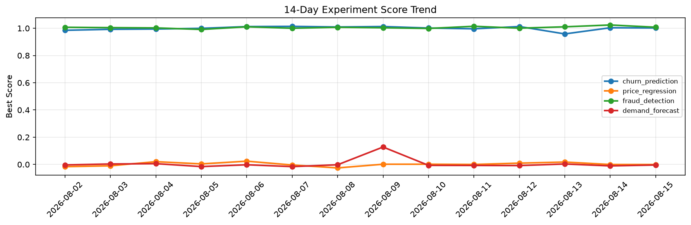

# ML Experiments Report — 2026-08-15

**Run ID:** `2cc6aa6914` | **Experiments:** 4 | **Trials:** 18

## Delta vs Yesterday

| Experiment | Today | Yesterday | Change |
|-----------|-------|-----------|--------|
| churn_prediction | 1.0019 | 1.0037 | 📉 -0.2% |
| price_regression | -0.0004 | -0.0004 | 📉 0.0% |
| fraud_detection | 1.0077 | 1.0241 | 📉 -1.6% |
| demand_forecast | -0.0041 | -0.0104 | 📈 60.6% |

## churn_prediction (AUC)

**Best Score:** 1.0019 (Trial 3)

| Trial | Score | Overfit Gap | Time | LR | Trees | Leaves |
|-------|-------|-------------|------|-----|-------|--------|
| 1 | 0.6391 | 0.0128 | 3.97s | 0.01 | 200 | 127 |
| 2 | 0.9572 | 0.0098 | 26.41s | 0.05 | 500 | 127 |
| 3 ⭐ | 1.0019 | 0.0019 | 56.29s | 0.1 | 200 | 31 |
| 4 | 0.9964 | 0.0065 | 73.51s | 0.1 | 500 | 31 |

## price_regression (RMSE)

**Best Score:** -0.0004 (Trial 4)

| Trial | Score | Overfit Gap | Time | LR | Trees | Leaves |
|-------|-------|-------------|------|-----|-------|--------|
| 1 | 0.0141 | 0.0072 | 20.18s | 0.1 | 100 | 127 |
| 2 | 0.862 | 0.0339 | 96.04s | 0.01 | 1000 | 15 |
| 3 | 1.0402 | 0.0841 | 90.13s | 0.01 | 500 | 63 |
| 4 ⭐ | -0.0004 | 0.0044 | 11.83s | 0.2 | 100 | 127 |

## fraud_detection (AUC)

**Best Score:** 1.0077 (Trial 5)

| Trial | Score | Overfit Gap | Time | LR | Trees | Leaves |
|-------|-------|-------------|------|-----|-------|--------|
| 1 | 0.6512 | 0.0409 | 20.68s | 0.01 | 100 | 31 |
| 2 | 0.7499 | 0.0466 | 9.45s | 0.01 | 200 | 127 |
| 3 | 0.9881 | 0.0132 | 24.35s | 0.1 | 100 | 63 |
| 4 | 1.0034 | 0.0063 | 16.49s | 0.2 | 100 | 127 |
| 5 ⭐ | 1.0077 | 0.0028 | 23.43s | 0.2 | 200 | 31 |

## demand_forecast (MAE)

**Best Score:** -0.0041 (Trial 3)

| Trial | Score | Overfit Gap | Time | LR | Trees | Leaves |
|-------|-------|-------------|------|-----|-------|--------|
| 1 | 0.1895 | 0.0214 | 52.44s | 0.05 | 200 | 63 |
| 2 | 0.1151 | 0.003 | 56.35s | 0.05 | 500 | 63 |
| 3 ⭐ | -0.0041 | 0.0163 | 142.24s | 0.2 | 500 | 127 |
| 4 | 0.1649 | 0.0267 | 248.92s | 0.05 | 1000 | 127 |
| 5 | 0.0058 | 0.0034 | 3.59s | 0.1 | 200 | 15 |
