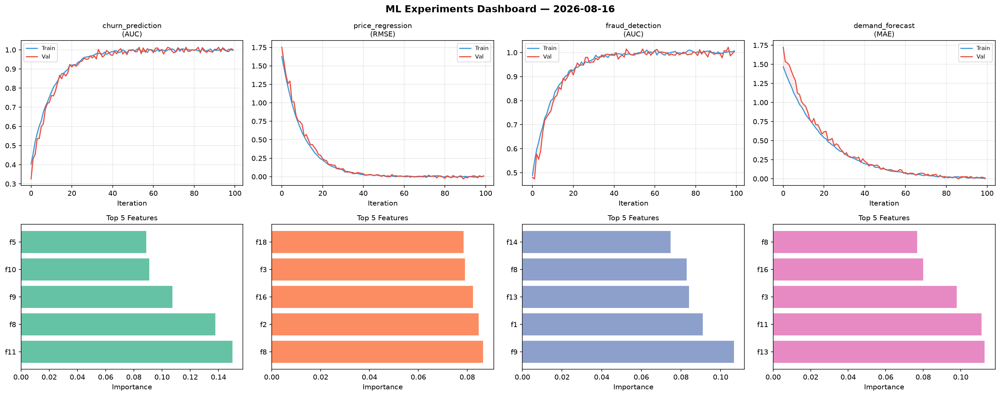
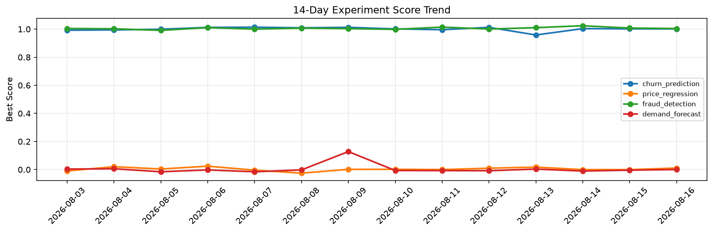

# ML Experiments Report — 2026-08-16

**Run ID:** `ef537b4e55` | **Experiments:** 4 | **Trials:** 18

## Delta vs Yesterday

| Experiment | Today | Yesterday | Change |
|-----------|-------|-----------|--------|
| churn_prediction | 1.0016 | 1.0019 | 📉 -0.0% |
| price_regression | 0.0109 | -0.0004 | 📈 1130.0% |
| fraud_detection | 1.0042 | 1.0077 | 📉 -0.3% |
| demand_forecast | 0.0003 | -0.0041 | 📈 107.3% |

## churn_prediction (AUC)

**Best Score:** 1.0016 (Trial 5)

| Trial | Score | Overfit Gap | Time | LR | Trees | Leaves |
|-------|-------|-------------|------|-----|-------|--------|
| 1 | 0.9894 | 0.0075 | 8.65s | 0.1 | 500 | 15 |
| 2 | 0.9627 | 0.0151 | 180.8s | 0.05 | 1000 | 31 |
| 3 | 0.9981 | 0.0007 | 27.62s | 0.1 | 100 | 15 |
| 4 | 0.9515 | 0.008 | 7.99s | 0.05 | 200 | 15 |
| 5 ⭐ | 1.0016 | 0.0043 | 23.8s | 0.2 | 100 | 63 |

## price_regression (RMSE)

**Best Score:** 0.0109 (Trial 4)

| Trial | Score | Overfit Gap | Time | LR | Trees | Leaves |
|-------|-------|-------------|------|-----|-------|--------|
| 1 | 0.0334 | 0.013 | 26.76s | 0.05 | 100 | 127 |
| 2 | 0.5069 | 0.0365 | 14.19s | 0.01 | 1000 | 63 |
| 3 | 0.0151 | 0.0051 | 75.65s | 0.1 | 500 | 63 |
| 4 ⭐ | 0.0109 | 0.0057 | 80.43s | 0.2 | 500 | 31 |
| 5 | 0.0226 | 0.0075 | 31.12s | 0.1 | 500 | 63 |
| 6 | 0.1183 | 0.0035 | 23.98s | 0.05 | 100 | 15 |

## fraud_detection (AUC)

**Best Score:** 1.0042 (Trial 1)

| Trial | Score | Overfit Gap | Time | LR | Trees | Leaves |
|-------|-------|-------------|------|-----|-------|--------|
| 1 ⭐ | 1.0042 | 0.0028 | 73.92s | 0.2 | 1000 | 63 |
| 2 | 0.994 | 0.0021 | 169.03s | 0.2 | 1000 | 127 |
| 3 | 0.9675 | 0.0059 | 11.51s | 0.05 | 100 | 15 |
| 4 | 0.7223 | 0.0007 | 69.44s | 0.01 | 500 | 15 |

## demand_forecast (MAE)

**Best Score:** 0.0003 (Trial 2)

| Trial | Score | Overfit Gap | Time | LR | Trees | Leaves |
|-------|-------|-------------|------|-----|-------|--------|
| 1 | 0.1364 | 0.0062 | 49.1s | 0.05 | 500 | 127 |
| 2 ⭐ | 0.0003 | 0.0128 | 141.8s | 0.1 | 1000 | 127 |
| 3 | 0.0191 | 0.0171 | 24.53s | 0.2 | 100 | 127 |
