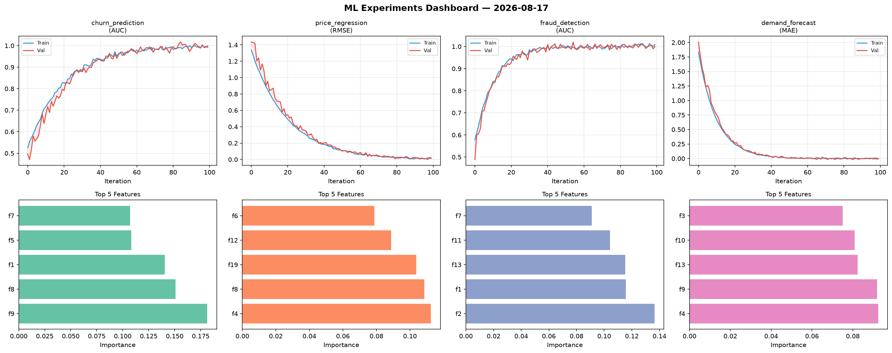
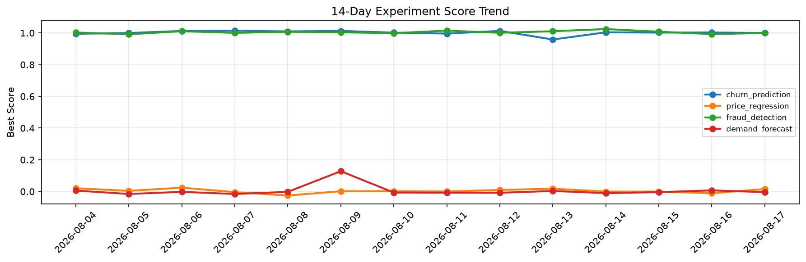

# ML Experiments Report — 2026-08-17

**Run ID:** `ccfaf875b3` | **Experiments:** 4 | **Trials:** 17

## Delta vs Yesterday

| Experiment | Today | Yesterday | Change |
|-----------|-------|-----------|--------|
| churn_prediction | 0.9992 | 1.0027 | 📉 -0.3% |
| price_regression | 0.0153 | -0.011 | 📈 239.1% |
| fraud_detection | 0.9995 | 0.9922 | 📈 0.7% |
| demand_forecast | -0.0038 | 0.007 | 📉 -154.3% |

## churn_prediction (AUC)

**Best Score:** 0.9992 (Trial 2)

| Trial | Score | Overfit Gap | Time | LR | Trees | Leaves |
|-------|-------|-------------|------|-----|-------|--------|
| 1 | 0.9586 | 0.0065 | 151.11s | 0.05 | 1000 | 31 |
| 2 ⭐ | 0.9992 | 0.0076 | 102.02s | 0.1 | 500 | 127 |
| 3 | 0.7433 | 0.0006 | 28.46s | 0.01 | 100 | 63 |
| 4 | 0.7925 | 0.0168 | 58.21s | 0.01 | 200 | 127 |
| 5 | 0.9906 | 0.0046 | 7.29s | 0.2 | 500 | 31 |

## price_regression (RMSE)

**Best Score:** 0.0153 (Trial 2)

| Trial | Score | Overfit Gap | Time | LR | Trees | Leaves |
|-------|-------|-------------|------|-----|-------|--------|
| 1 | 0.0428 | 0.0009 | 122.91s | 0.05 | 1000 | 127 |
| 2 ⭐ | 0.0153 | 0.002 | 14.06s | 0.1 | 500 | 31 |
| 3 | 1.1987 | 0.0307 | 199.17s | 0.01 | 1000 | 63 |
| 4 | 1.0338 | 0.139 | 43.59s | 0.01 | 200 | 63 |
| 5 | 0.0155 | 0.0075 | 21.69s | 0.1 | 200 | 63 |

## fraud_detection (AUC)

**Best Score:** 0.9995 (Trial 1)

| Trial | Score | Overfit Gap | Time | LR | Trees | Leaves |
|-------|-------|-------------|------|-----|-------|--------|
| 1 ⭐ | 0.9995 | 0.0091 | 23.83s | 0.2 | 100 | 15 |
| 2 | 0.9896 | 0.0135 | 2.09s | 0.1 | 100 | 15 |
| 3 | 0.6427 | 0.056 | 69.26s | 0.01 | 500 | 63 |
| 4 | 0.974 | 0.0204 | 28.2s | 0.1 | 200 | 127 |

## demand_forecast (MAE)

**Best Score:** -0.0038 (Trial 1)

| Trial | Score | Overfit Gap | Time | LR | Trees | Leaves |
|-------|-------|-------------|------|-----|-------|--------|
| 1 ⭐ | -0.0038 | 0.0029 | 11.22s | 0.2 | 100 | 63 |
| 2 | 0.1482 | 0.0102 | 8.82s | 0.05 | 100 | 63 |
| 3 | 0.0104 | 0.0025 | 25.57s | 0.1 | 200 | 63 |
