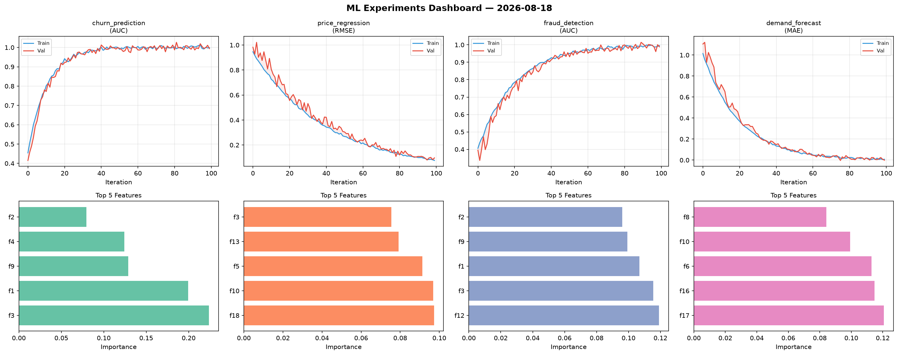
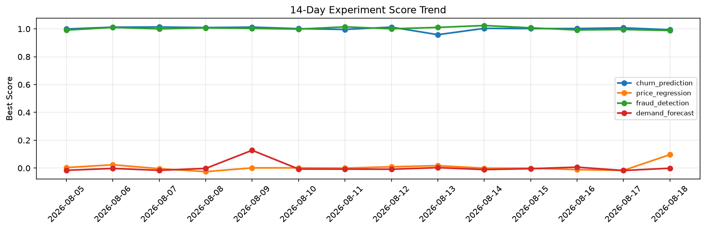

# ML Experiments Report — 2026-08-18

**Run ID:** `48301c3685` | **Experiments:** 4 | **Trials:** 20

## Delta vs Yesterday

| Experiment | Today | Yesterday | Change |
|-----------|-------|-----------|--------|
| churn_prediction | 0.9942 | 1.0074 | 📉 -1.3% |
| price_regression | 0.0969 | -0.0164 | 📈 690.9% |
| fraud_detection | 0.9885 | 0.9955 | 📉 -0.7% |
| demand_forecast | -0.0008 | -0.0172 | 📈 95.3% |

## churn_prediction (AUC)

**Best Score:** 0.9942 (Trial 4)

| Trial | Score | Overfit Gap | Time | LR | Trees | Leaves |
|-------|-------|-------------|------|-----|-------|--------|
| 1 | 0.9666 | 0.0026 | 22.27s | 0.05 | 500 | 127 |
| 2 | 0.9521 | 0.0039 | 275.72s | 0.05 | 1000 | 31 |
| 3 | 0.6737 | 0.0496 | 52.8s | 0.01 | 200 | 127 |
| 4 ⭐ | 0.9942 | 0.0045 | 173.22s | 0.2 | 1000 | 63 |
| 5 | 0.9848 | 0.0125 | 1.08s | 0.2 | 100 | 15 |

## price_regression (RMSE)

**Best Score:** 0.0969 (Trial 1)

| Trial | Score | Overfit Gap | Time | LR | Trees | Leaves |
|-------|-------|-------------|------|-----|-------|--------|
| 1 ⭐ | 0.0969 | 0.0205 | 42.09s | 0.05 | 500 | 63 |
| 2 | 0.5019 | 0.0445 | 16.61s | 0.01 | 200 | 63 |
| 3 | 0.74 | 0.0049 | 17.46s | 0.01 | 100 | 31 |

## fraud_detection (AUC)

**Best Score:** 0.9885 (Trial 1)

| Trial | Score | Overfit Gap | Time | LR | Trees | Leaves |
|-------|-------|-------------|------|-----|-------|--------|
| 1 ⭐ | 0.9885 | 0.0074 | 51.09s | 0.1 | 500 | 63 |
| 2 | 0.9651 | 0.0054 | 23.55s | 0.05 | 500 | 15 |
| 3 | 0.7169 | 0.0039 | 251.96s | 0.01 | 1000 | 15 |
| 4 | 0.6929 | 0.0223 | 50.9s | 0.01 | 200 | 15 |
| 5 | 0.9818 | 0.0033 | 274.92s | 0.05 | 1000 | 63 |
| 6 | 0.7508 | 0.0114 | 82.48s | 0.01 | 500 | 15 |

## demand_forecast (MAE)

**Best Score:** -0.0008 (Trial 2)

| Trial | Score | Overfit Gap | Time | LR | Trees | Leaves |
|-------|-------|-------------|------|-----|-------|--------|
| 1 | 0.0746 | 0.0027 | 137.95s | 0.05 | 500 | 63 |
| 2 ⭐ | -0.0008 | 0.0089 | 146.79s | 0.1 | 1000 | 127 |
| 3 | 0.0107 | 0.0128 | 7.73s | 0.1 | 100 | 63 |
| 4 | 0.0025 | 0.0007 | 52.54s | 0.1 | 200 | 31 |
| 5 | 0.6653 | 0.0339 | 36.05s | 0.01 | 200 | 63 |
| 6 | 0.01 | 0.0123 | 51.06s | 0.2 | 200 | 63 |
