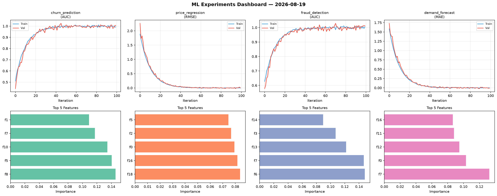
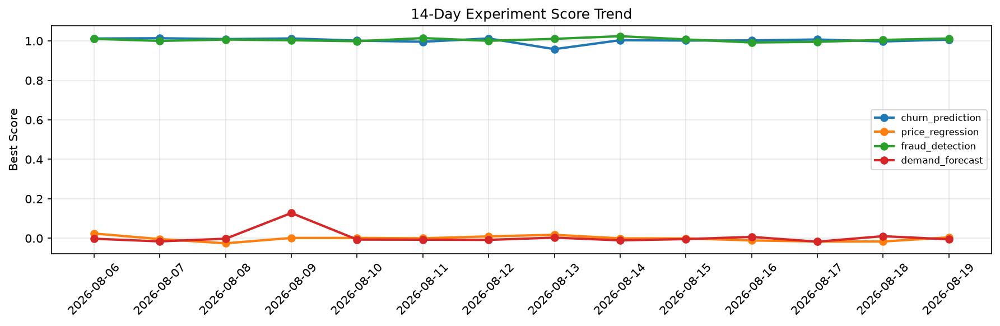

# ML Experiments Report — 2026-08-19

**Run ID:** `5eb08e239b` | **Experiments:** 4 | **Trials:** 18

## Delta vs Yesterday

| Experiment | Today | Yesterday | Change |
|-----------|-------|-----------|--------|
| churn_prediction | 1.0067 | 0.9974 | 📈 0.9% |
| price_regression | 0.0046 | -0.0163 | 📈 128.2% |
| fraud_detection | 1.0124 | 1.0053 | 📈 0.7% |
| demand_forecast | -0.0052 | 0.0107 | 📉 -148.6% |

## churn_prediction (AUC)

**Best Score:** 1.0067 (Trial 3)

| Trial | Score | Overfit Gap | Time | LR | Trees | Leaves |
|-------|-------|-------------|------|-----|-------|--------|
| 1 | 0.6391 | 0.0234 | 82.57s | 0.01 | 500 | 127 |
| 2 | 0.9555 | 0.0083 | 11.33s | 0.05 | 200 | 15 |
| 3 ⭐ | 1.0067 | 0.015 | 132.53s | 0.2 | 1000 | 127 |
| 4 | 1.0 | 0.0063 | 6.91s | 0.2 | 100 | 15 |
| 5 | 0.9651 | 0.0001 | 122.93s | 0.05 | 500 | 31 |

## price_regression (RMSE)

**Best Score:** 0.0046 (Trial 1)

| Trial | Score | Overfit Gap | Time | LR | Trees | Leaves |
|-------|-------|-------------|------|-----|-------|--------|
| 1 ⭐ | 0.0046 | 0.0075 | 17.71s | 0.2 | 100 | 31 |
| 2 | 0.0175 | 0.0108 | 28.52s | 0.2 | 500 | 15 |
| 3 | 0.0829 | 0.0068 | 47.63s | 0.05 | 200 | 31 |
| 4 | 1.2166 | 0.1382 | 143.86s | 0.01 | 500 | 127 |

## fraud_detection (AUC)

**Best Score:** 1.0124 (Trial 4)

| Trial | Score | Overfit Gap | Time | LR | Trees | Leaves |
|-------|-------|-------------|------|-----|-------|--------|
| 1 | 0.936 | 0.0104 | 108.2s | 0.05 | 500 | 31 |
| 2 | 1.0106 | 0.0041 | 19.65s | 0.2 | 200 | 127 |
| 3 | 0.9958 | 0.001 | 39.46s | 0.2 | 200 | 31 |
| 4 ⭐ | 1.0124 | 0.0067 | 3.95s | 0.2 | 200 | 15 |

## demand_forecast (MAE)

**Best Score:** -0.0052 (Trial 1)

| Trial | Score | Overfit Gap | Time | LR | Trees | Leaves |
|-------|-------|-------------|------|-----|-------|--------|
| 1 ⭐ | -0.0052 | 0.0039 | 228.47s | 0.2 | 1000 | 63 |
| 2 | 0.1406 | 0.0011 | 17.65s | 0.05 | 100 | 127 |
| 3 | -0.0038 | 0.0002 | 72.97s | 0.2 | 500 | 63 |
| 4 | 0.0049 | 0.0094 | 7.14s | 0.1 | 100 | 31 |
| 5 | 0.0703 | 0.0093 | 16.57s | 0.05 | 100 | 15 |
