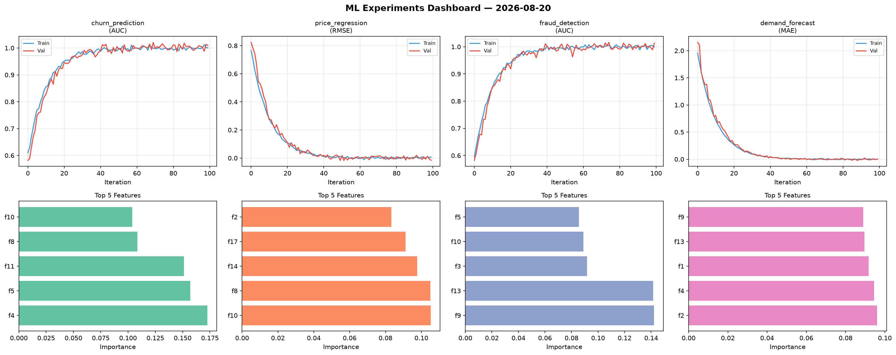
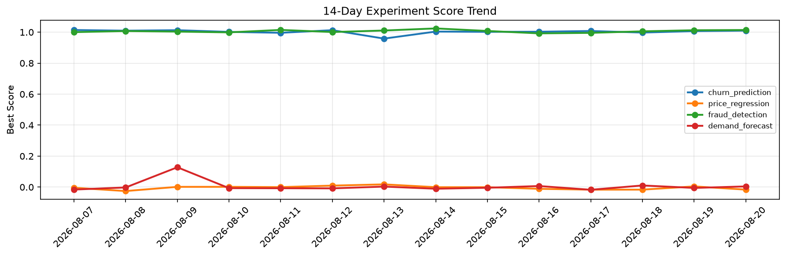

# ML Experiments Report — 2026-08-20

**Run ID:** `9a385bb4da` | **Experiments:** 4 | **Trials:** 22

## Delta vs Yesterday

| Experiment | Today | Yesterday | Change |
|-----------|-------|-----------|--------|
| churn_prediction | 1.0099 | 1.0067 | 📈 0.3% |
| price_regression | -0.0161 | 0.0046 | 📉 -450.0% |
| fraud_detection | 1.0139 | 1.0124 | 📈 0.1% |
| demand_forecast | 0.0045 | -0.0052 | 📈 186.5% |

## churn_prediction (AUC)

**Best Score:** 1.0099 (Trial 3)

| Trial | Score | Overfit Gap | Time | LR | Trees | Leaves |
|-------|-------|-------------|------|-----|-------|--------|
| 1 | 0.9784 | 0.0049 | 89.73s | 0.1 | 500 | 127 |
| 2 | 0.9984 | 0.0027 | 118.88s | 0.1 | 500 | 15 |
| 3 ⭐ | 1.0099 | 0.0097 | 83.35s | 0.2 | 500 | 63 |
| 4 | 0.9904 | 0.003 | 16.59s | 0.2 | 100 | 31 |
| 5 | 0.9491 | 0.0041 | 20.71s | 0.05 | 500 | 63 |

## price_regression (RMSE)

**Best Score:** -0.0161 (Trial 5)

| Trial | Score | Overfit Gap | Time | LR | Trees | Leaves |
|-------|-------|-------------|------|-----|-------|--------|
| 1 | 0.1438 | 0.0219 | 4.66s | 0.05 | 200 | 31 |
| 2 | 0.0144 | 0.0139 | 10.43s | 0.1 | 500 | 63 |
| 3 | -0.0117 | 0.0047 | 57.39s | 0.2 | 200 | 127 |
| 4 | 1.1859 | 0.0777 | 29.8s | 0.01 | 100 | 15 |
| 5 ⭐ | -0.0161 | 0.024 | 15.6s | 0.2 | 100 | 15 |
| 6 | 0.5284 | 0.0635 | 148.55s | 0.01 | 500 | 127 |

## fraud_detection (AUC)

**Best Score:** 1.0139 (Trial 6)

| Trial | Score | Overfit Gap | Time | LR | Trees | Leaves |
|-------|-------|-------------|------|-----|-------|--------|
| 1 | 0.5847 | 0.0489 | 29.38s | 0.01 | 100 | 31 |
| 2 | 0.9938 | 0.0083 | 24.93s | 0.2 | 100 | 15 |
| 3 | 0.9542 | 0.0064 | 37.43s | 0.05 | 1000 | 63 |
| 4 | 0.9789 | 0.011 | 21.07s | 0.05 | 200 | 127 |
| 5 | 1.001 | 0.0016 | 12.46s | 0.1 | 100 | 63 |
| 6 ⭐ | 1.0139 | 0.0144 | 46.5s | 0.2 | 200 | 127 |

## demand_forecast (MAE)

**Best Score:** 0.0045 (Trial 5)

| Trial | Score | Overfit Gap | Time | LR | Trees | Leaves |
|-------|-------|-------------|------|-----|-------|--------|
| 1 | 0.9819 | 0.1147 | 35.66s | 0.01 | 200 | 31 |
| 2 | 0.0835 | 0.0153 | 58.19s | 0.05 | 500 | 63 |
| 3 | 0.5961 | 0.0213 | 15.55s | 0.01 | 100 | 31 |
| 4 | 0.1252 | 0.0005 | 69.9s | 0.05 | 500 | 31 |
| 5 ⭐ | 0.0045 | 0.0045 | 11.66s | 0.2 | 200 | 63 |
