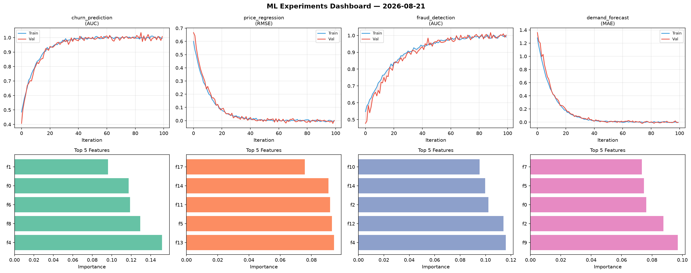
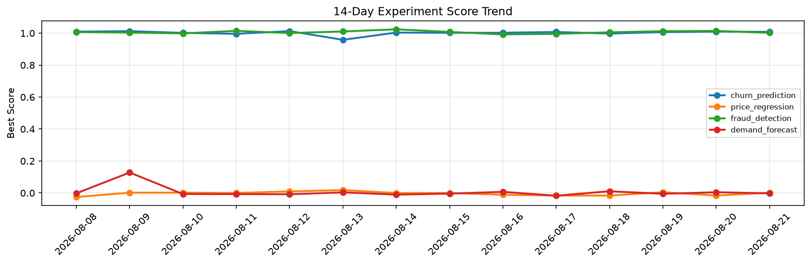

# ML Experiments Report — 2026-08-21

**Run ID:** `31ff9f6671` | **Experiments:** 4 | **Trials:** 17

## Delta vs Yesterday

| Experiment | Today | Yesterday | Change |
|-----------|-------|-----------|--------|
| churn_prediction | 1.0081 | 1.0099 | 📉 -0.2% |
| price_regression | 0.0015 | -0.0161 | 📈 109.3% |
| fraud_detection | 1.0023 | 1.0139 | 📉 -1.1% |
| demand_forecast | -0.0023 | 0.0045 | 📉 -151.1% |

## churn_prediction (AUC)

**Best Score:** 1.0081 (Trial 3)

| Trial | Score | Overfit Gap | Time | LR | Trees | Leaves |
|-------|-------|-------------|------|-----|-------|--------|
| 1 | 1.008 | 0.0142 | 17.35s | 0.2 | 200 | 15 |
| 2 | 0.9564 | 0.0038 | 3.46s | 0.05 | 200 | 63 |
| 3 ⭐ | 1.0081 | 0.0127 | 16.04s | 0.2 | 100 | 15 |

## price_regression (RMSE)

**Best Score:** 0.0015 (Trial 4)

| Trial | Score | Overfit Gap | Time | LR | Trees | Leaves |
|-------|-------|-------------|------|-----|-------|--------|
| 1 | 0.6158 | 0.0479 | 241.42s | 0.01 | 1000 | 31 |
| 2 | 0.578 | 0.0746 | 16.62s | 0.01 | 1000 | 127 |
| 3 | 0.0294 | 0.0087 | 8.08s | 0.1 | 100 | 63 |
| 4 ⭐ | 0.0015 | 0.0031 | 80.8s | 0.2 | 500 | 15 |
| 5 | 1.1251 | 0.1009 | 215.68s | 0.01 | 1000 | 15 |
| 6 | 0.1005 | 0.0052 | 87.73s | 0.05 | 500 | 31 |

## fraud_detection (AUC)

**Best Score:** 1.0023 (Trial 3)

| Trial | Score | Overfit Gap | Time | LR | Trees | Leaves |
|-------|-------|-------------|------|-----|-------|--------|
| 1 | 0.6677 | 0.0155 | 263.3s | 0.01 | 1000 | 15 |
| 2 | 0.9961 | 0.0008 | 28.92s | 0.1 | 100 | 127 |
| 3 ⭐ | 1.0023 | 0.0114 | 31.46s | 0.1 | 500 | 63 |
| 4 | 0.9815 | 0.0235 | 103.9s | 0.1 | 500 | 127 |
| 5 | 0.7649 | 0.0357 | 7.73s | 0.01 | 100 | 127 |

## demand_forecast (MAE)

**Best Score:** -0.0023 (Trial 2)

| Trial | Score | Overfit Gap | Time | LR | Trees | Leaves |
|-------|-------|-------------|------|-----|-------|--------|
| 1 | 1.3173 | 0.1688 | 14.02s | 0.01 | 100 | 127 |
| 2 ⭐ | -0.0023 | 0.0043 | 24.54s | 0.2 | 100 | 63 |
| 3 | 0.0014 | 0.0029 | 30.97s | 0.2 | 500 | 63 |
