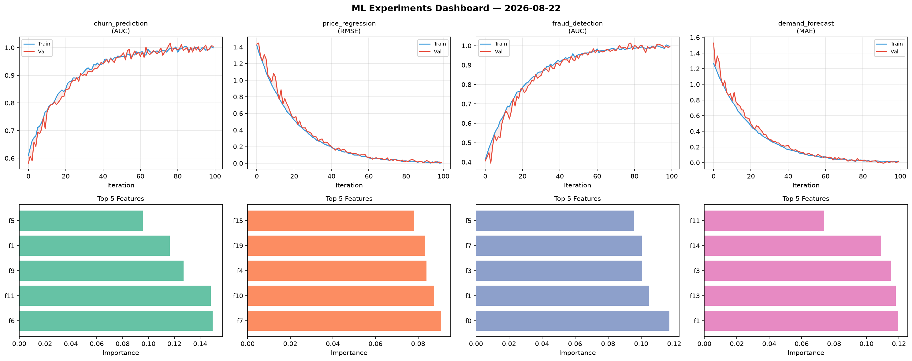
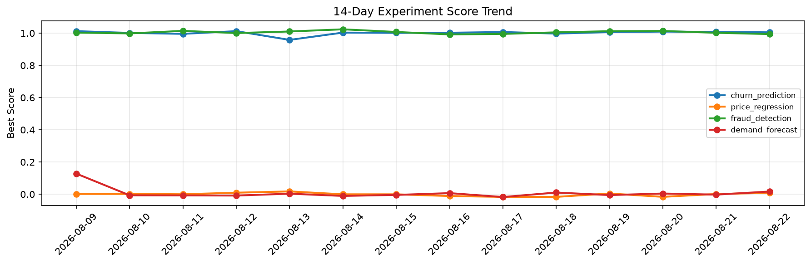

# ML Experiments Report — 2026-08-22

**Run ID:** `86410b4e9c` | **Experiments:** 4 | **Trials:** 20

## Delta vs Yesterday

| Experiment | Today | Yesterday | Change |
|-----------|-------|-----------|--------|
| churn_prediction | 1.0054 | 1.0081 | 📉 -0.3% |
| price_regression | 0.0086 | 0.0015 | 📈 473.3% |
| fraud_detection | 0.9945 | 1.0023 | 📉 -0.8% |
| demand_forecast | 0.017 | -0.0023 | 📈 839.1% |

## churn_prediction (AUC)

**Best Score:** 1.0054 (Trial 1)

| Trial | Score | Overfit Gap | Time | LR | Trees | Leaves |
|-------|-------|-------------|------|-----|-------|--------|
| 1 ⭐ | 1.0054 | 0.0058 | 21.2s | 0.1 | 200 | 31 |
| 2 | 0.9907 | 0.002 | 56.6s | 0.1 | 500 | 63 |
| 3 | 0.9849 | 0.0125 | 2.43s | 0.1 | 100 | 63 |
| 4 | 0.9864 | 0.0067 | 22.0s | 0.1 | 100 | 31 |
| 5 | 0.7575 | 0.0103 | 22.1s | 0.01 | 100 | 63 |

## price_regression (RMSE)

**Best Score:** 0.0086 (Trial 1)

| Trial | Score | Overfit Gap | Time | LR | Trees | Leaves |
|-------|-------|-------------|------|-----|-------|--------|
| 1 ⭐ | 0.0086 | 0.0033 | 10.68s | 0.1 | 200 | 31 |
| 2 | 0.915 | 0.0318 | 57.35s | 0.01 | 200 | 63 |
| 3 | 1.0244 | 0.1503 | 34.58s | 0.01 | 200 | 127 |
| 4 | 0.5934 | 0.0048 | 10.09s | 0.01 | 200 | 63 |
| 5 | 0.0187 | 0.0061 | 63.91s | 0.1 | 1000 | 15 |

## fraud_detection (AUC)

**Best Score:** 0.9945 (Trial 4)

| Trial | Score | Overfit Gap | Time | LR | Trees | Leaves |
|-------|-------|-------------|------|-----|-------|--------|
| 1 | 0.9891 | 0.0153 | 14.53s | 0.2 | 100 | 31 |
| 2 | 0.9694 | 0.0006 | 17.1s | 0.05 | 100 | 31 |
| 3 | 0.9941 | 0.0051 | 36.67s | 0.1 | 200 | 127 |
| 4 ⭐ | 0.9945 | 0.0008 | 6.53s | 0.1 | 100 | 127 |
| 5 | 0.9542 | 0.0041 | 18.21s | 0.05 | 100 | 63 |

## demand_forecast (MAE)

**Best Score:** 0.017 (Trial 5)

| Trial | Score | Overfit Gap | Time | LR | Trees | Leaves |
|-------|-------|-------------|------|-----|-------|--------|
| 1 | 0.1031 | 0.0015 | 13.44s | 0.05 | 100 | 127 |
| 2 | 0.0206 | 0.0079 | 98.47s | 0.1 | 500 | 31 |
| 3 | 0.0846 | 0.0234 | 40.23s | 0.05 | 200 | 63 |
| 4 | 0.0579 | 0.0028 | 26.09s | 0.05 | 500 | 63 |
| 5 ⭐ | 0.017 | 0.0063 | 148.63s | 0.1 | 1000 | 127 |
