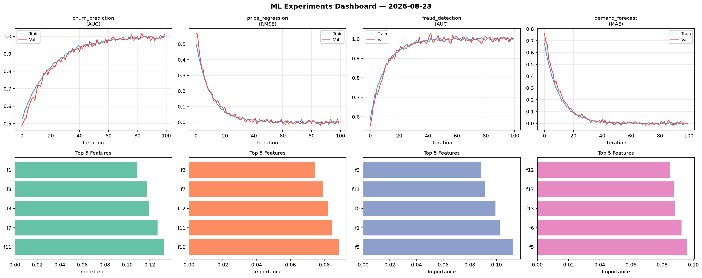
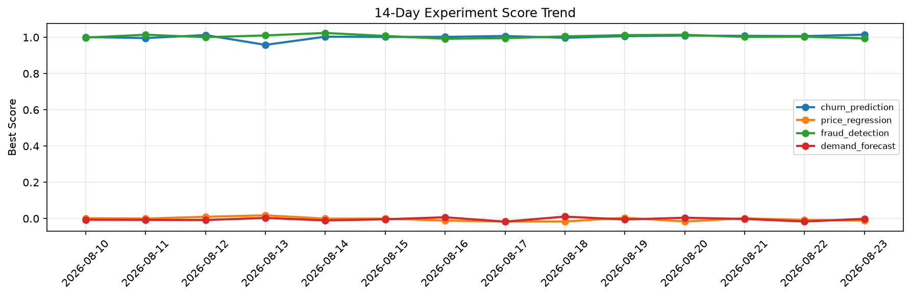

# ML Experiments Report — 2026-08-23

**Run ID:** `de485ab3c0` | **Experiments:** 4 | **Trials:** 16

## Delta vs Yesterday

| Experiment | Today | Yesterday | Change |
|-----------|-------|-----------|--------|
| churn_prediction | 1.0149 | 1.0067 | 📈 0.8% |
| price_regression | -0.0113 | -0.0078 | 📉 -44.9% |
| fraud_detection | 0.9943 | 1.0033 | 📉 -0.9% |
| demand_forecast | -0.0017 | -0.0163 | 📈 89.6% |

## churn_prediction (AUC)

**Best Score:** 1.0149 (Trial 4)

| Trial | Score | Overfit Gap | Time | LR | Trees | Leaves |
|-------|-------|-------------|------|-----|-------|--------|
| 1 | 0.6841 | 0.0612 | 34.32s | 0.01 | 500 | 127 |
| 2 | 0.962 | 0.0009 | 7.69s | 0.05 | 100 | 63 |
| 3 | 0.965 | 0.0031 | 49.05s | 0.05 | 500 | 63 |
| 4 ⭐ | 1.0149 | 0.0141 | 34.49s | 0.1 | 500 | 31 |
| 5 | 0.6853 | 0.0326 | 107.73s | 0.01 | 500 | 15 |

## price_regression (RMSE)

**Best Score:** -0.0113 (Trial 3)

| Trial | Score | Overfit Gap | Time | LR | Trees | Leaves |
|-------|-------|-------------|------|-----|-------|--------|
| 1 | 0.0011 | 0.0053 | 23.76s | 0.2 | 100 | 63 |
| 2 | 0.0192 | 0.0099 | 4.29s | 0.1 | 100 | 31 |
| 3 ⭐ | -0.0113 | 0.0083 | 2.34s | 0.2 | 100 | 63 |

## fraud_detection (AUC)

**Best Score:** 0.9943 (Trial 3)

| Trial | Score | Overfit Gap | Time | LR | Trees | Leaves |
|-------|-------|-------------|------|-----|-------|--------|
| 1 | 0.7539 | 0.0127 | 34.83s | 0.01 | 1000 | 127 |
| 2 | 0.9822 | 0.0263 | 205.42s | 0.2 | 1000 | 127 |
| 3 ⭐ | 0.9943 | 0.0084 | 71.1s | 0.2 | 500 | 15 |

## demand_forecast (MAE)

**Best Score:** -0.0017 (Trial 2)

| Trial | Score | Overfit Gap | Time | LR | Trees | Leaves |
|-------|-------|-------------|------|-----|-------|--------|
| 1 | 0.0502 | 0.0155 | 16.44s | 0.05 | 100 | 63 |
| 2 ⭐ | -0.0017 | 0.0038 | 191.58s | 0.2 | 1000 | 127 |
| 3 | 0.0159 | 0.0063 | 17.33s | 0.2 | 100 | 127 |
| 4 | 0.1371 | 0.0125 | 19.47s | 0.05 | 1000 | 15 |
| 5 | 0.0107 | 0.0116 | 107.57s | 0.2 | 500 | 15 |
