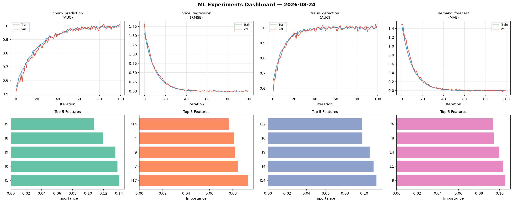
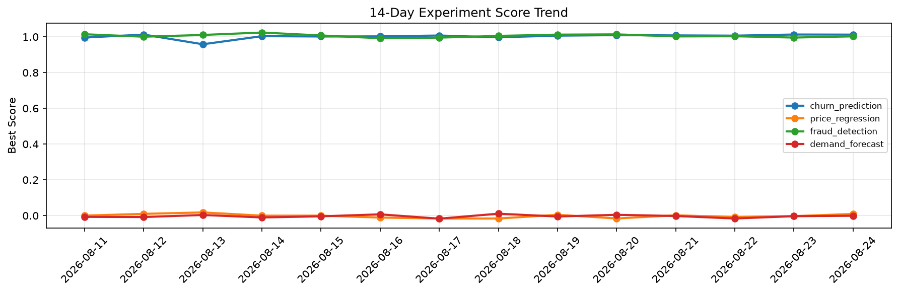

# ML Experiments Report — 2026-08-24

**Run ID:** `80766cf777` | **Experiments:** 4 | **Trials:** 21

## Delta vs Yesterday

| Experiment | Today | Yesterday | Change |
|-----------|-------|-----------|--------|
| churn_prediction | 1.0124 | 1.013 | 📉 -0.1% |
| price_regression | 0.0092 | -0.003 | 📈 406.7% |
| fraud_detection | 1.0027 | 0.9959 | 📈 0.7% |
| demand_forecast | -0.001 | -0.0033 | 📈 69.7% |

## churn_prediction (AUC)

**Best Score:** 1.0124 (Trial 4)

| Trial | Score | Overfit Gap | Time | LR | Trees | Leaves |
|-------|-------|-------------|------|-----|-------|--------|
| 1 | 1.0053 | 0.0063 | 119.06s | 0.1 | 500 | 63 |
| 2 | 0.9445 | 0.0063 | 18.46s | 0.05 | 500 | 15 |
| 3 | 0.9993 | 0.0044 | 13.35s | 0.2 | 500 | 15 |
| 4 ⭐ | 1.0124 | 0.0193 | 13.58s | 0.1 | 200 | 15 |

## price_regression (RMSE)

**Best Score:** 0.0092 (Trial 6)

| Trial | Score | Overfit Gap | Time | LR | Trees | Leaves |
|-------|-------|-------------|------|-----|-------|--------|
| 1 | 0.1142 | 0.0298 | 50.97s | 0.05 | 200 | 63 |
| 2 | 0.0462 | 0.0046 | 118.61s | 0.05 | 1000 | 31 |
| 3 | 0.7526 | 0.0061 | 9.32s | 0.01 | 1000 | 63 |
| 4 | 0.5368 | 0.0488 | 136.28s | 0.01 | 500 | 127 |
| 5 | 0.0611 | 0.0061 | 115.01s | 0.05 | 500 | 127 |
| 6 ⭐ | 0.0092 | 0.0093 | 130.85s | 0.2 | 500 | 127 |

## fraud_detection (AUC)

**Best Score:** 1.0027 (Trial 1)

| Trial | Score | Overfit Gap | Time | LR | Trees | Leaves |
|-------|-------|-------------|------|-----|-------|--------|
| 1 ⭐ | 1.0027 | 0.0021 | 33.24s | 0.2 | 500 | 127 |
| 2 | 0.9963 | 0.0036 | 7.07s | 0.1 | 500 | 15 |
| 3 | 0.9575 | 0.0148 | 48.46s | 0.05 | 1000 | 15 |
| 4 | 0.7453 | 0.0064 | 24.59s | 0.01 | 100 | 31 |
| 5 | 0.635 | 0.0687 | 22.01s | 0.01 | 100 | 127 |
| 6 | 0.7454 | 0.0156 | 261.1s | 0.01 | 1000 | 127 |

## demand_forecast (MAE)

**Best Score:** -0.001 (Trial 4)

| Trial | Score | Overfit Gap | Time | LR | Trees | Leaves |
|-------|-------|-------------|------|-----|-------|--------|
| 1 | 0.0093 | 0.0139 | 120.33s | 0.2 | 500 | 15 |
| 2 | 0.855 | 0.0406 | 53.74s | 0.01 | 200 | 15 |
| 3 | 0.0192 | 0.0003 | 2.93s | 0.1 | 100 | 127 |
| 4 ⭐ | -0.001 | 0.0039 | 57.3s | 0.2 | 200 | 15 |
| 5 | 0.378 | 0.0483 | 120.05s | 0.01 | 1000 | 31 |
