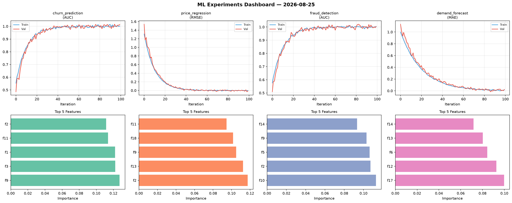
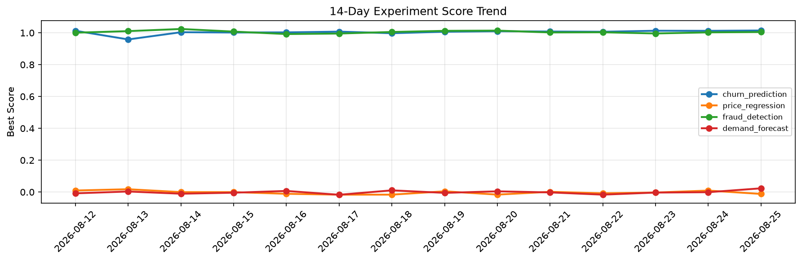

# ML Experiments Report — 2026-08-25

**Run ID:** `d3b93e4dbc` | **Experiments:** 4 | **Trials:** 17

## Delta vs Yesterday

| Experiment | Today | Yesterday | Change |
|-----------|-------|-----------|--------|
| churn_prediction | 1.0146 | 1.0124 | 📈 0.2% |
| price_regression | -0.0118 | 0.0092 | 📉 -228.3% |
| fraud_detection | 1.0049 | 1.0027 | 📈 0.2% |
| demand_forecast | 0.0234 | -0.001 | 📈 2440.0% |

## churn_prediction (AUC)

**Best Score:** 1.0146 (Trial 4)

| Trial | Score | Overfit Gap | Time | LR | Trees | Leaves |
|-------|-------|-------------|------|-----|-------|--------|
| 1 | 0.997 | 0.0033 | 234.96s | 0.2 | 1000 | 63 |
| 2 | 0.9973 | 0.0031 | 5.45s | 0.1 | 100 | 15 |
| 3 | 0.9754 | 0.0302 | 4.94s | 0.1 | 500 | 127 |
| 4 ⭐ | 1.0146 | 0.0134 | 20.45s | 0.2 | 200 | 127 |

## price_regression (RMSE)

**Best Score:** -0.0118 (Trial 5)

| Trial | Score | Overfit Gap | Time | LR | Trees | Leaves |
|-------|-------|-------------|------|-----|-------|--------|
| 1 | 0.0034 | 0.0077 | 23.27s | 0.2 | 100 | 15 |
| 2 | 0.0845 | 0.0135 | 20.5s | 0.05 | 100 | 127 |
| 3 | 0.0113 | 0.0012 | 14.14s | 0.1 | 100 | 31 |
| 4 | 0.1266 | 0.0109 | 112.73s | 0.05 | 1000 | 63 |
| 5 ⭐ | -0.0118 | 0.011 | 110.58s | 0.2 | 1000 | 127 |

## fraud_detection (AUC)

**Best Score:** 1.0049 (Trial 3)

| Trial | Score | Overfit Gap | Time | LR | Trees | Leaves |
|-------|-------|-------------|------|-----|-------|--------|
| 1 | 0.6549 | 0.0223 | 157.1s | 0.01 | 1000 | 63 |
| 2 | 0.9709 | 0.0057 | 85.9s | 0.05 | 500 | 31 |
| 3 ⭐ | 1.0049 | 0.0046 | 18.2s | 0.2 | 100 | 63 |
| 4 | 0.9543 | 0.0015 | 4.9s | 0.05 | 100 | 31 |
| 5 | 0.989 | 0.0019 | 6.27s | 0.1 | 1000 | 31 |

## demand_forecast (MAE)

**Best Score:** 0.0234 (Trial 2)

| Trial | Score | Overfit Gap | Time | LR | Trees | Leaves |
|-------|-------|-------------|------|-----|-------|--------|
| 1 | 0.7138 | 0.0462 | 174.05s | 0.01 | 1000 | 31 |
| 2 ⭐ | 0.0234 | 0.0087 | 186.56s | 0.1 | 1000 | 15 |
| 3 | 1.1159 | 0.0187 | 37.1s | 0.01 | 200 | 127 |
