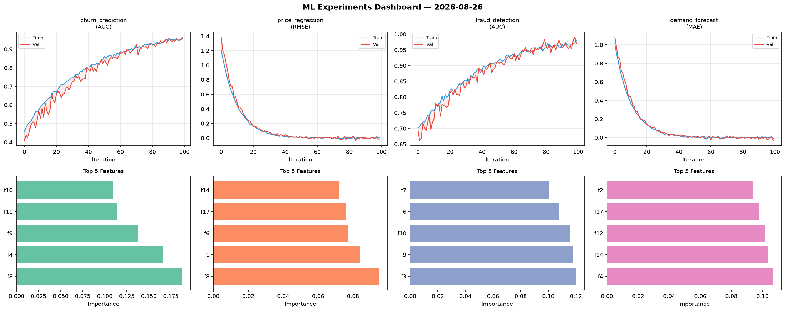
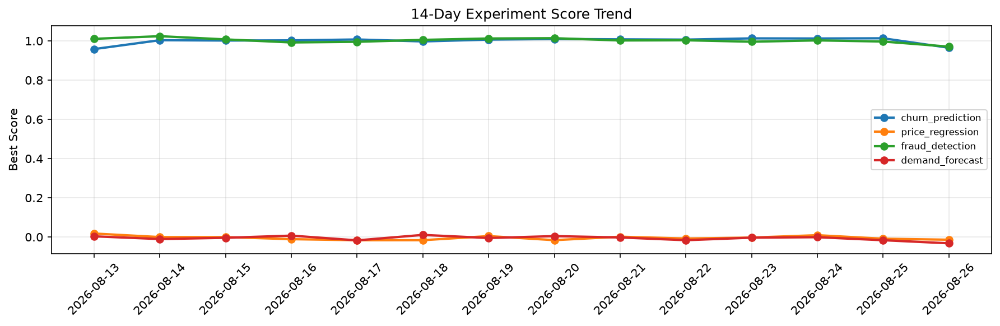

# ML Experiments Report — 2026-08-26

**Run ID:** `415d1508c7` | **Experiments:** 4 | **Trials:** 14

## Delta vs Yesterday

| Experiment | Today | Yesterday | Change |
|-----------|-------|-----------|--------|
| churn_prediction | 0.9652 | 1.0134 | 📉 -4.8% |
| price_regression | -0.0139 | -0.0088 | 📉 -58.0% |
| fraud_detection | 0.9708 | 0.9969 | 📉 -2.6% |
| demand_forecast | -0.0321 | -0.0164 | 📉 -95.7% |

## churn_prediction (AUC)

**Best Score:** 0.9652 (Trial 4)

| Trial | Score | Overfit Gap | Time | LR | Trees | Leaves |
|-------|-------|-------------|------|-----|-------|--------|
| 1 | 0.599 | 0.0587 | 24.12s | 0.01 | 500 | 127 |
| 2 | 0.6033 | 0.044 | 32.56s | 0.01 | 200 | 63 |
| 3 | 0.954 | 0.0035 | 20.15s | 0.05 | 100 | 15 |
| 4 ⭐ | 0.9652 | 0.0057 | 2.71s | 0.05 | 100 | 15 |

## price_regression (RMSE)

**Best Score:** -0.0139 (Trial 2)

| Trial | Score | Overfit Gap | Time | LR | Trees | Leaves |
|-------|-------|-------------|------|-----|-------|--------|
| 1 | 1.3602 | 0.1467 | 23.36s | 0.01 | 500 | 127 |
| 2 ⭐ | -0.0139 | 0.0223 | 10.75s | 0.2 | 100 | 63 |
| 3 | 1.2934 | 0.1866 | 12.48s | 0.01 | 200 | 63 |
| 4 | 0.0837 | 0.0054 | 85.11s | 0.05 | 500 | 63 |

## fraud_detection (AUC)

**Best Score:** 0.9708 (Trial 1)

| Trial | Score | Overfit Gap | Time | LR | Trees | Leaves |
|-------|-------|-------------|------|-----|-------|--------|
| 1 ⭐ | 0.9708 | 0.0101 | 26.91s | 0.05 | 100 | 63 |
| 2 | 0.6729 | 0.0206 | 6.76s | 0.01 | 200 | 63 |
| 3 | 0.9683 | 0.0022 | 52.22s | 0.05 | 1000 | 31 |

## demand_forecast (MAE)

**Best Score:** -0.0321 (Trial 2)

| Trial | Score | Overfit Gap | Time | LR | Trees | Leaves |
|-------|-------|-------------|------|-----|-------|--------|
| 1 | 0.9599 | 0.1258 | 19.95s | 0.01 | 200 | 63 |
| 2 ⭐ | -0.0321 | 0.0256 | 47.73s | 0.2 | 500 | 127 |
| 3 | 0.0176 | 0.0123 | 51.53s | 0.2 | 200 | 31 |
