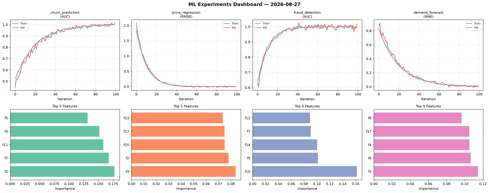
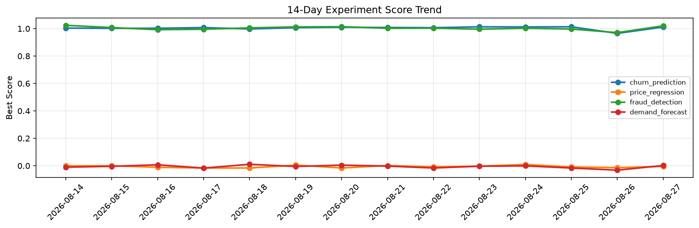

# ML Experiments Report — 2026-08-27

**Run ID:** `f74ec471d9` | **Experiments:** 4 | **Trials:** 21

## Delta vs Yesterday

| Experiment | Today | Yesterday | Change |
|-----------|-------|-----------|--------|
| churn_prediction | 1.0114 | 0.9652 | 📈 4.8% |
| price_regression | -0.0049 | -0.0139 | 📈 64.7% |
| fraud_detection | 1.0201 | 0.9708 | 📈 5.1% |
| demand_forecast | 0.0018 | -0.0321 | 📈 105.6% |

## churn_prediction (AUC)

**Best Score:** 1.0114 (Trial 1)

| Trial | Score | Overfit Gap | Time | LR | Trees | Leaves |
|-------|-------|-------------|------|-----|-------|--------|
| 1 ⭐ | 1.0114 | 0.0063 | 56.06s | 0.1 | 200 | 63 |
| 2 | 0.9496 | 0.0161 | 22.82s | 0.05 | 200 | 15 |
| 3 | 0.9945 | 0.0061 | 147.02s | 0.2 | 500 | 31 |
| 4 | 0.9664 | 0.0115 | 24.57s | 0.05 | 100 | 15 |
| 5 | 0.7689 | 0.0282 | 63.02s | 0.01 | 500 | 127 |
| 6 | 0.9898 | 0.0097 | 140.39s | 0.2 | 1000 | 63 |

## price_regression (RMSE)

**Best Score:** -0.0049 (Trial 1)

| Trial | Score | Overfit Gap | Time | LR | Trees | Leaves |
|-------|-------|-------------|------|-----|-------|--------|
| 1 ⭐ | -0.0049 | 0.0054 | 137.42s | 0.2 | 500 | 31 |
| 2 | 0.0877 | 0.0048 | 4.4s | 0.05 | 100 | 63 |
| 3 | 0.087 | 0.0034 | 25.42s | 0.05 | 500 | 15 |
| 4 | 1.1758 | 0.1766 | 21.23s | 0.01 | 200 | 63 |
| 5 | 0.4156 | 0.0302 | 12.91s | 0.01 | 500 | 127 |
| 6 | 1.0163 | 0.0838 | 136.37s | 0.01 | 500 | 63 |

## fraud_detection (AUC)

**Best Score:** 1.0201 (Trial 1)

| Trial | Score | Overfit Gap | Time | LR | Trees | Leaves |
|-------|-------|-------------|------|-----|-------|--------|
| 1 ⭐ | 1.0201 | 0.0226 | 90.67s | 0.2 | 1000 | 31 |
| 2 | 0.9942 | 0.0015 | 1.32s | 0.1 | 100 | 127 |
| 3 | 0.9563 | 0.0004 | 8.42s | 0.05 | 100 | 127 |
| 4 | 1.0076 | 0.0082 | 64.14s | 0.1 | 1000 | 63 |
| 5 | 0.9993 | 0.0061 | 55.41s | 0.1 | 200 | 63 |
| 6 | 0.9396 | 0.0032 | 15.41s | 0.05 | 100 | 15 |

## demand_forecast (MAE)

**Best Score:** 0.0018 (Trial 3)

| Trial | Score | Overfit Gap | Time | LR | Trees | Leaves |
|-------|-------|-------------|------|-----|-------|--------|
| 1 | 0.8086 | 0.0314 | 115.32s | 0.01 | 500 | 63 |
| 2 | 0.0228 | 0.0134 | 9.97s | 0.1 | 100 | 15 |
| 3 ⭐ | 0.0018 | 0.0163 | 28.97s | 0.1 | 100 | 15 |
