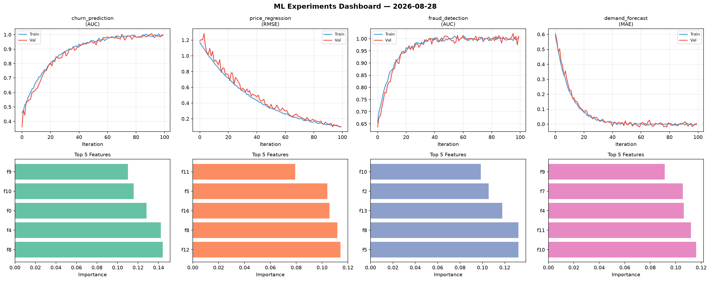
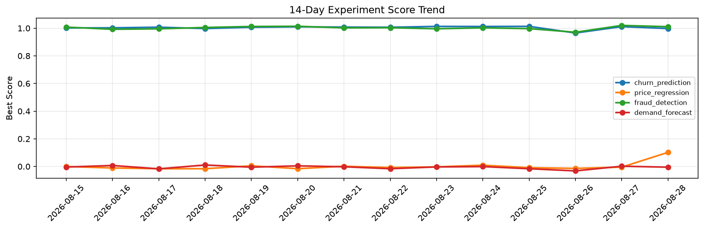

# ML Experiments Report — 2026-08-28

**Run ID:** `61b727c775` | **Experiments:** 4 | **Trials:** 18

## Delta vs Yesterday

| Experiment | Today | Yesterday | Change |
|-----------|-------|-----------|--------|
| churn_prediction | 0.9975 | 1.0114 | 📉 -1.4% |
| price_regression | 0.102 | -0.0049 | 📈 2181.6% |
| fraud_detection | 1.0109 | 1.0201 | 📉 -0.9% |
| demand_forecast | -0.0051 | 0.0018 | 📉 -383.3% |

## churn_prediction (AUC)

**Best Score:** 0.9975 (Trial 2)

| Trial | Score | Overfit Gap | Time | LR | Trees | Leaves |
|-------|-------|-------------|------|-----|-------|--------|
| 1 | 0.9552 | 0.0067 | 207.05s | 0.05 | 1000 | 31 |
| 2 ⭐ | 0.9975 | 0.0016 | 7.46s | 0.1 | 1000 | 127 |
| 3 | 0.6959 | 0.0611 | 163.68s | 0.01 | 1000 | 15 |
| 4 | 0.9552 | 0.0085 | 8.16s | 0.05 | 100 | 15 |
| 5 | 0.591 | 0.0455 | 146.39s | 0.01 | 500 | 127 |

## price_regression (RMSE)

**Best Score:** 0.102 (Trial 1)

| Trial | Score | Overfit Gap | Time | LR | Trees | Leaves |
|-------|-------|-------------|------|-----|-------|--------|
| 1 ⭐ | 0.102 | 0.0062 | 81.91s | 0.05 | 500 | 15 |
| 2 | 1.2387 | 0.1904 | 112.89s | 0.01 | 500 | 31 |
| 3 | 0.1203 | 0.0153 | 114.72s | 0.05 | 1000 | 15 |
| 4 | 0.1137 | 0.0002 | 93.36s | 0.05 | 500 | 31 |
| 5 | 0.1404 | 0.026 | 169.35s | 0.05 | 1000 | 63 |

## fraud_detection (AUC)

**Best Score:** 1.0109 (Trial 3)

| Trial | Score | Overfit Gap | Time | LR | Trees | Leaves |
|-------|-------|-------------|------|-----|-------|--------|
| 1 | 0.9848 | 0.0018 | 0.76s | 0.1 | 100 | 127 |
| 2 | 1.0071 | 0.0032 | 256.01s | 0.2 | 1000 | 127 |
| 3 ⭐ | 1.0109 | 0.0071 | 22.44s | 0.2 | 100 | 31 |

## demand_forecast (MAE)

**Best Score:** -0.0051 (Trial 3)

| Trial | Score | Overfit Gap | Time | LR | Trees | Leaves |
|-------|-------|-------------|------|-----|-------|--------|
| 1 | 0.0208 | 0.0091 | 42.41s | 0.1 | 200 | 15 |
| 2 | 1.1537 | 0.1484 | 18.75s | 0.01 | 100 | 15 |
| 3 ⭐ | -0.0051 | 0.0104 | 25.95s | 0.2 | 200 | 127 |
| 4 | 0.0801 | 0.0024 | 98.45s | 0.05 | 500 | 63 |
| 5 | 0.0951 | 0.0194 | 45.16s | 0.05 | 200 | 31 |
