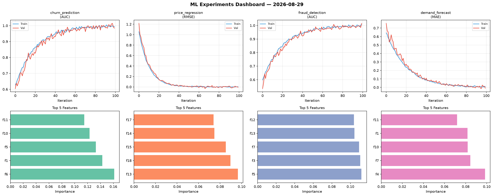
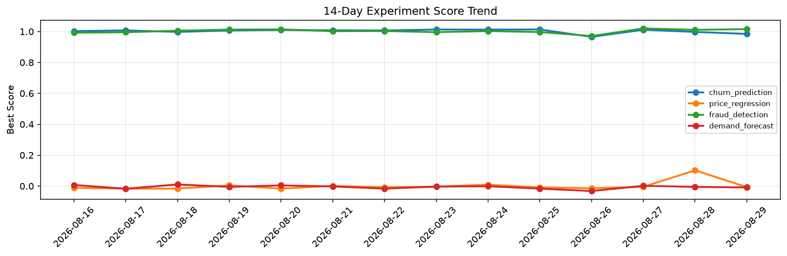

# ML Experiments Report — 2026-08-29

**Run ID:** `c3dc8071b0` | **Experiments:** 4 | **Trials:** 18

## Delta vs Yesterday

| Experiment | Today | Yesterday | Change |
|-----------|-------|-----------|--------|
| churn_prediction | 0.9845 | 0.9975 | 📉 -1.3% |
| price_regression | -0.0067 | 0.102 | 📉 -106.6% |
| fraud_detection | 1.0155 | 1.0109 | 📈 0.5% |
| demand_forecast | -0.009 | -0.0051 | 📉 -76.5% |

## churn_prediction (AUC)

**Best Score:** 0.9845 (Trial 5)

| Trial | Score | Overfit Gap | Time | LR | Trees | Leaves |
|-------|-------|-------------|------|-----|-------|--------|
| 1 | 0.9831 | 0.0103 | 188.13s | 0.1 | 1000 | 31 |
| 2 | 0.5889 | 0.0459 | 34.66s | 0.01 | 200 | 31 |
| 3 | 0.7211 | 0.0158 | 110.24s | 0.01 | 1000 | 31 |
| 4 | 0.7583 | 0.0131 | 65.21s | 0.01 | 500 | 31 |
| 5 ⭐ | 0.9845 | 0.0091 | 0.92s | 0.1 | 100 | 63 |

## price_regression (RMSE)

**Best Score:** -0.0067 (Trial 1)

| Trial | Score | Overfit Gap | Time | LR | Trees | Leaves |
|-------|-------|-------------|------|-----|-------|--------|
| 1 ⭐ | -0.0067 | 0.0106 | 24.78s | 0.2 | 200 | 15 |
| 2 | -0.0004 | 0.0014 | 17.01s | 0.2 | 100 | 63 |
| 3 | 0.155 | 0.0208 | 7.06s | 0.05 | 100 | 15 |
| 4 | -0.0051 | 0.0031 | 20.01s | 0.2 | 200 | 63 |
| 5 | -0.0039 | 0.016 | 27.59s | 0.2 | 100 | 15 |

## fraud_detection (AUC)

**Best Score:** 1.0155 (Trial 2)

| Trial | Score | Overfit Gap | Time | LR | Trees | Leaves |
|-------|-------|-------------|------|-----|-------|--------|
| 1 | 0.9568 | 0.0051 | 208.7s | 0.05 | 1000 | 15 |
| 2 ⭐ | 1.0155 | 0.0083 | 42.29s | 0.1 | 200 | 15 |
| 3 | 0.9867 | 0.0041 | 25.41s | 0.1 | 200 | 31 |
| 4 | 0.7075 | 0.0401 | 269.2s | 0.01 | 1000 | 15 |

## demand_forecast (MAE)

**Best Score:** -0.009 (Trial 1)

| Trial | Score | Overfit Gap | Time | LR | Trees | Leaves |
|-------|-------|-------------|------|-----|-------|--------|
| 1 ⭐ | -0.009 | 0.0207 | 29.4s | 0.1 | 1000 | 15 |
| 2 | 0.0217 | 0.0164 | 12.21s | 0.2 | 100 | 15 |
| 3 | 0.6825 | 0.0255 | 7.74s | 0.01 | 200 | 15 |
| 4 | 0.6329 | 0.0479 | 52.42s | 0.01 | 200 | 31 |
