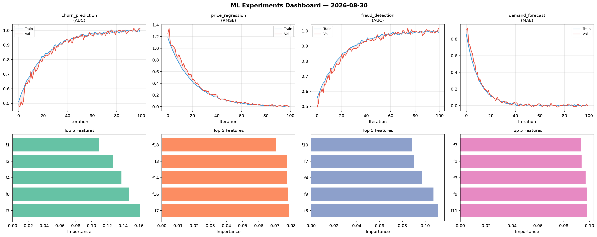
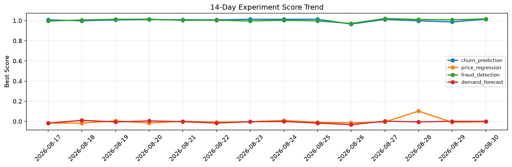

# ML Experiments Report — 2026-08-30

**Run ID:** `7fd6bc7d41` | **Experiments:** 4 | **Trials:** 15

## Delta vs Yesterday

| Experiment | Today | Yesterday | Change |
|-----------|-------|-----------|--------|
| churn_prediction | 1.0135 | 0.9863 | 📈 2.8% |
| price_regression | -0.0033 | -0.0084 | 📈 60.7% |
| fraud_detection | 1.0164 | 1.0076 | 📈 0.9% |
| demand_forecast | 0.0003 | 0.0008 | 📉 -50.0% |

## churn_prediction (AUC)

**Best Score:** 1.0135 (Trial 2)

| Trial | Score | Overfit Gap | Time | LR | Trees | Leaves |
|-------|-------|-------------|------|-----|-------|--------|
| 1 | 0.9573 | 0.0096 | 146.81s | 0.05 | 1000 | 15 |
| 2 ⭐ | 1.0135 | 0.0246 | 39.01s | 0.1 | 200 | 31 |
| 3 | 0.796 | 0.0086 | 7.63s | 0.01 | 100 | 15 |

## price_regression (RMSE)

**Best Score:** -0.0033 (Trial 1)

| Trial | Score | Overfit Gap | Time | LR | Trees | Leaves |
|-------|-------|-------------|------|-----|-------|--------|
| 1 ⭐ | -0.0033 | 0.0099 | 3.16s | 0.1 | 100 | 15 |
| 2 | 0.0014 | 0.0066 | 12.18s | 0.1 | 500 | 63 |
| 3 | 0.0065 | 0.0048 | 13.68s | 0.2 | 500 | 63 |
| 4 | 0.7242 | 0.0569 | 179.78s | 0.01 | 1000 | 127 |

## fraud_detection (AUC)

**Best Score:** 1.0164 (Trial 3)

| Trial | Score | Overfit Gap | Time | LR | Trees | Leaves |
|-------|-------|-------------|------|-----|-------|--------|
| 1 | 0.6943 | 0.0198 | 17.42s | 0.01 | 100 | 127 |
| 2 | 0.9769 | 0.0023 | 19.37s | 0.05 | 100 | 127 |
| 3 ⭐ | 1.0164 | 0.0257 | 12.5s | 0.1 | 200 | 127 |
| 4 | 0.9692 | 0.0178 | 231.34s | 0.05 | 1000 | 31 |
| 5 | 0.9845 | 0.0196 | 17.44s | 0.2 | 100 | 15 |

## demand_forecast (MAE)

**Best Score:** 0.0003 (Trial 1)

| Trial | Score | Overfit Gap | Time | LR | Trees | Leaves |
|-------|-------|-------------|------|-----|-------|--------|
| 1 ⭐ | 0.0003 | 0.0056 | 21.8s | 0.2 | 100 | 31 |
| 2 | 0.131 | 0.0117 | 145.88s | 0.05 | 1000 | 127 |
| 3 | 0.1064 | 0.0062 | 94.06s | 0.05 | 1000 | 15 |
