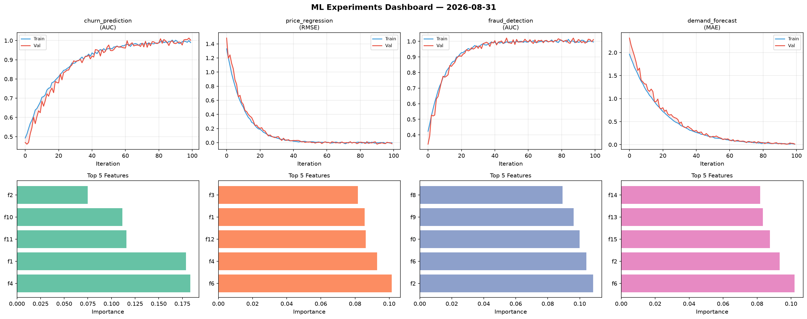
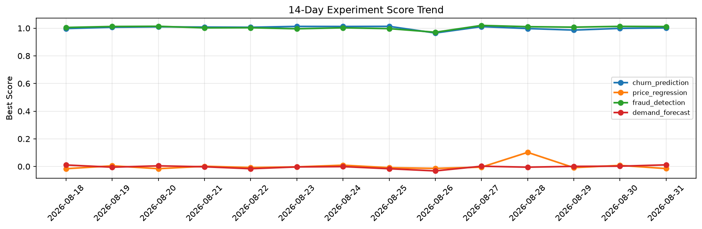

# ML Experiments Report — 2026-08-31

**Run ID:** `b5484d098a` | **Experiments:** 4 | **Trials:** 17

## Delta vs Yesterday

| Experiment | Today | Yesterday | Change |
|-----------|-------|-----------|--------|
| churn_prediction | 1.0021 | 0.9988 | 📈 0.3% |
| price_regression | -0.0153 | 0.0077 | 📉 -298.7% |
| fraud_detection | 1.0117 | 1.0133 | 📉 -0.2% |
| demand_forecast | 0.0116 | 0.002 | 📈 480.0% |

## churn_prediction (AUC)

**Best Score:** 1.0021 (Trial 3)

| Trial | Score | Overfit Gap | Time | LR | Trees | Leaves |
|-------|-------|-------------|------|-----|-------|--------|
| 1 | 0.9998 | 0.0076 | 74.02s | 0.2 | 500 | 31 |
| 2 | 0.9931 | 0.0059 | 12.21s | 0.2 | 100 | 127 |
| 3 ⭐ | 1.0021 | 0.0128 | 220.93s | 0.1 | 1000 | 15 |

## price_regression (RMSE)

**Best Score:** -0.0153 (Trial 3)

| Trial | Score | Overfit Gap | Time | LR | Trees | Leaves |
|-------|-------|-------------|------|-----|-------|--------|
| 1 | 0.0704 | 0.0134 | 27.73s | 0.05 | 100 | 15 |
| 2 | -0.0036 | 0.0116 | 48.71s | 0.1 | 500 | 127 |
| 3 ⭐ | -0.0153 | 0.0154 | 1.96s | 0.2 | 200 | 127 |
| 4 | 0.6293 | 0.0834 | 10.37s | 0.01 | 1000 | 127 |
| 5 | 0.5434 | 0.0628 | 36.5s | 0.01 | 500 | 31 |

## fraud_detection (AUC)

**Best Score:** 1.0117 (Trial 3)

| Trial | Score | Overfit Gap | Time | LR | Trees | Leaves |
|-------|-------|-------------|------|-----|-------|--------|
| 1 | 0.9585 | 0.0111 | 0.94s | 0.05 | 100 | 63 |
| 2 | 0.9841 | 0.0045 | 70.82s | 0.1 | 500 | 63 |
| 3 ⭐ | 1.0117 | 0.0159 | 18.92s | 0.2 | 100 | 15 |
| 4 | 0.9676 | 0.0049 | 10.28s | 0.05 | 500 | 31 |

## demand_forecast (MAE)

**Best Score:** 0.0116 (Trial 4)

| Trial | Score | Overfit Gap | Time | LR | Trees | Leaves |
|-------|-------|-------------|------|-----|-------|--------|
| 1 | 0.0189 | 0.0188 | 62.14s | 0.2 | 500 | 31 |
| 2 | 0.0975 | 0.0298 | 46.26s | 0.05 | 500 | 63 |
| 3 | 0.0761 | 0.0255 | 40.14s | 0.05 | 200 | 127 |
| 4 ⭐ | 0.0116 | 0.0006 | 21.06s | 0.1 | 200 | 31 |
| 5 | 0.168 | 0.0173 | 18.37s | 0.05 | 200 | 63 |
