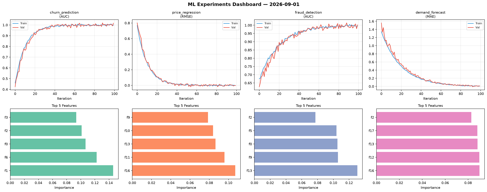
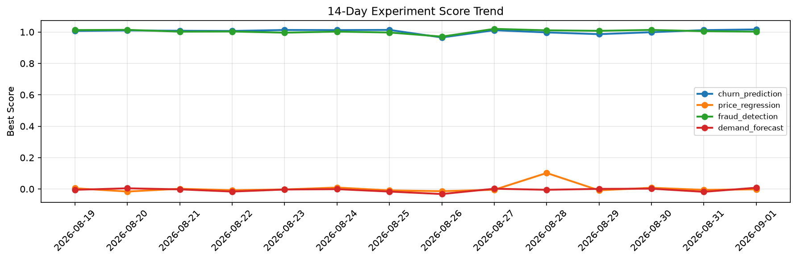

# ML Experiments Report — 2026-09-01

**Run ID:** `65ddd04f4b` | **Experiments:** 4 | **Trials:** 16

## Delta vs Yesterday

| Experiment | Today | Yesterday | Change |
|-----------|-------|-----------|--------|
| churn_prediction | 1.0167 | 1.0121 | 📈 0.5% |
| price_regression | -0.0022 | -0.0056 | 📈 60.7% |
| fraud_detection | 1.0023 | 1.0051 | 📉 -0.3% |
| demand_forecast | 0.0082 | -0.018 | 📈 145.6% |

## churn_prediction (AUC)

**Best Score:** 1.0167 (Trial 4)

| Trial | Score | Overfit Gap | Time | LR | Trees | Leaves |
|-------|-------|-------------|------|-----|-------|--------|
| 1 | 0.6011 | 0.0436 | 4.73s | 0.01 | 500 | 31 |
| 2 | 0.6144 | 0.0399 | 249.89s | 0.01 | 1000 | 31 |
| 3 | 0.6906 | 0.0299 | 9.71s | 0.01 | 100 | 63 |
| 4 ⭐ | 1.0167 | 0.0182 | 66.02s | 0.2 | 1000 | 127 |

## price_regression (RMSE)

**Best Score:** -0.0022 (Trial 4)

| Trial | Score | Overfit Gap | Time | LR | Trees | Leaves |
|-------|-------|-------------|------|-----|-------|--------|
| 1 | 1.1482 | 0.0184 | 139.93s | 0.01 | 1000 | 63 |
| 2 | 0.0941 | 0.004 | 12.72s | 0.05 | 200 | 31 |
| 3 | 0.0495 | 0.006 | 15.58s | 0.05 | 500 | 63 |
| 4 ⭐ | -0.0022 | 0.0013 | 148.05s | 0.2 | 500 | 127 |

## fraud_detection (AUC)

**Best Score:** 1.0023 (Trial 2)

| Trial | Score | Overfit Gap | Time | LR | Trees | Leaves |
|-------|-------|-------------|------|-----|-------|--------|
| 1 | 0.6692 | 0.0251 | 29.66s | 0.01 | 100 | 31 |
| 2 ⭐ | 1.0023 | 0.0071 | 20.23s | 0.1 | 100 | 31 |
| 3 | 0.7795 | 0.0186 | 24.66s | 0.01 | 1000 | 127 |
| 4 | 0.984 | 0.0068 | 13.87s | 0.1 | 100 | 15 |
| 5 | 0.9991 | 0.0082 | 6.45s | 0.2 | 100 | 31 |

## demand_forecast (MAE)

**Best Score:** 0.0082 (Trial 3)

| Trial | Score | Overfit Gap | Time | LR | Trees | Leaves |
|-------|-------|-------------|------|-----|-------|--------|
| 1 | 0.1595 | 0.0185 | 27.84s | 0.05 | 100 | 63 |
| 2 | 1.2988 | 0.1275 | 54.32s | 0.01 | 200 | 63 |
| 3 ⭐ | 0.0082 | 0.0035 | 15.64s | 0.1 | 100 | 15 |
