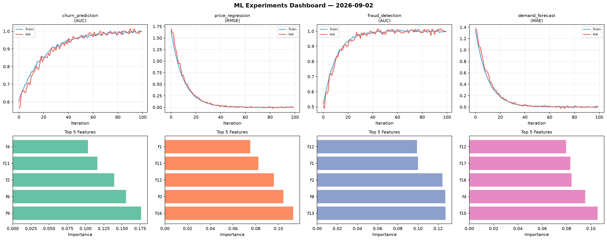
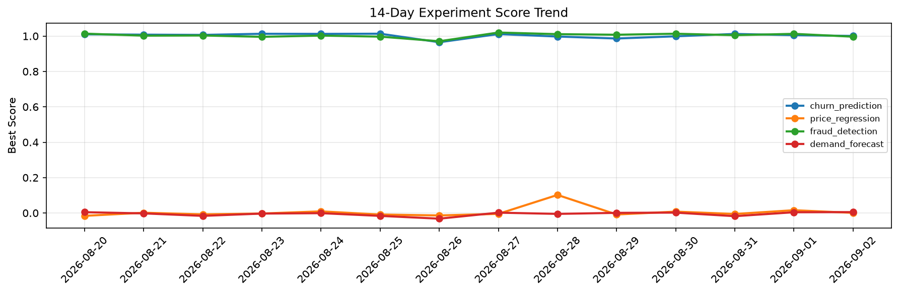

# ML Experiments Report — 2026-09-02

**Run ID:** `52c66f6374` | **Experiments:** 4 | **Trials:** 14

## Delta vs Yesterday

| Experiment | Today | Yesterday | Change |
|-----------|-------|-----------|--------|
| churn_prediction | 1.0008 | 1.0052 | 📉 -0.4% |
| price_regression | 0.0007 | 0.0157 | 📉 -95.5% |
| fraud_detection | 0.9965 | 1.0127 | 📉 -1.6% |
| demand_forecast | 0.005 | 0.0042 | 📈 19.0% |

## churn_prediction (AUC)

**Best Score:** 1.0008 (Trial 1)

| Trial | Score | Overfit Gap | Time | LR | Trees | Leaves |
|-------|-------|-------------|------|-----|-------|--------|
| 1 ⭐ | 1.0008 | 0.0029 | 23.65s | 0.1 | 100 | 31 |
| 2 | 0.9914 | 0.0059 | 32.81s | 0.2 | 1000 | 31 |
| 3 | 0.9701 | 0.0034 | 92.15s | 0.05 | 500 | 63 |
| 4 | 0.9922 | 0.0028 | 94.02s | 0.2 | 500 | 31 |

## price_regression (RMSE)

**Best Score:** 0.0007 (Trial 2)

| Trial | Score | Overfit Gap | Time | LR | Trees | Leaves |
|-------|-------|-------------|------|-----|-------|--------|
| 1 | 0.0248 | 0.0199 | 67.06s | 0.1 | 1000 | 63 |
| 2 ⭐ | 0.0007 | 0.0007 | 215.57s | 0.2 | 1000 | 31 |
| 3 | 0.0379 | 0.0073 | 148.64s | 0.05 | 500 | 15 |

## fraud_detection (AUC)

**Best Score:** 0.9965 (Trial 1)

| Trial | Score | Overfit Gap | Time | LR | Trees | Leaves |
|-------|-------|-------------|------|-----|-------|--------|
| 1 ⭐ | 0.9965 | 0.0063 | 12.4s | 0.2 | 1000 | 127 |
| 2 | 0.8094 | 0.0018 | 44.86s | 0.01 | 200 | 31 |
| 3 | 0.6096 | 0.0359 | 154.05s | 0.01 | 1000 | 127 |

## demand_forecast (MAE)

**Best Score:** 0.005 (Trial 4)

| Trial | Score | Overfit Gap | Time | LR | Trees | Leaves |
|-------|-------|-------------|------|-----|-------|--------|
| 1 | 0.1211 | 0.0045 | 17.17s | 0.05 | 100 | 127 |
| 2 | 0.0156 | 0.0102 | 260.3s | 0.1 | 1000 | 127 |
| 3 | 0.0164 | 0.0122 | 2.23s | 0.1 | 100 | 63 |
| 4 ⭐ | 0.005 | 0.0051 | 28.14s | 0.2 | 100 | 15 |
