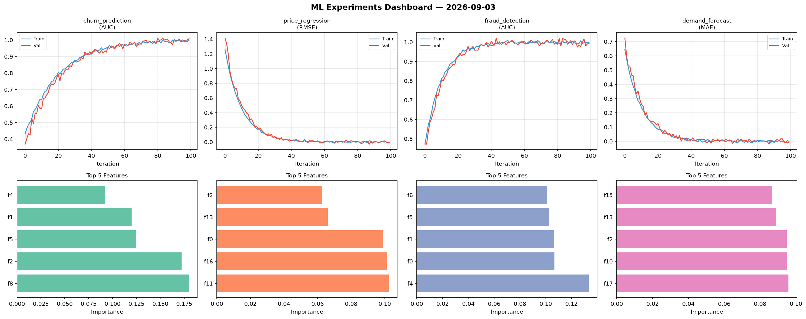
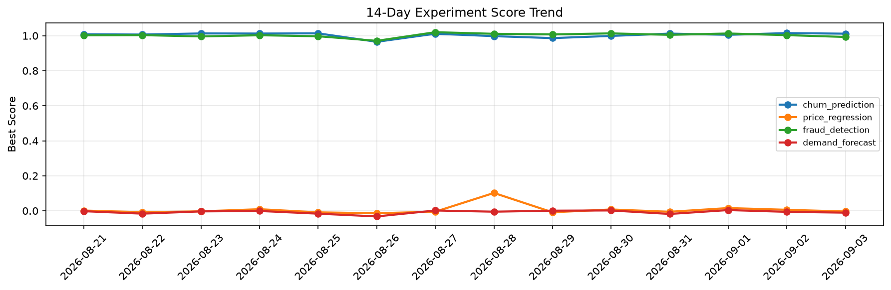

# ML Experiments Report — 2026-09-03

**Run ID:** `d2ca757298` | **Experiments:** 4 | **Trials:** 15

## Delta vs Yesterday

| Experiment | Today | Yesterday | Change |
|-----------|-------|-----------|--------|
| churn_prediction | 1.0116 | 1.0149 | 📉 -0.3% |
| price_regression | -0.0039 | 0.0058 | 📉 -167.2% |
| fraud_detection | 0.9929 | 1.0033 | 📉 -1.0% |
| demand_forecast | -0.0106 | -0.0059 | 📉 -79.7% |

## churn_prediction (AUC)

**Best Score:** 1.0116 (Trial 2)

| Trial | Score | Overfit Gap | Time | LR | Trees | Leaves |
|-------|-------|-------------|------|-----|-------|--------|
| 1 | 0.972 | 0.0027 | 8.47s | 0.05 | 100 | 127 |
| 2 ⭐ | 1.0116 | 0.0171 | 109.53s | 0.1 | 500 | 63 |
| 3 | 1.006 | 0.0071 | 3.4s | 0.2 | 200 | 127 |
| 4 | 0.9914 | 0.0068 | 10.9s | 0.2 | 100 | 63 |
| 5 | 1.0083 | 0.0049 | 126.79s | 0.1 | 500 | 127 |

## price_regression (RMSE)

**Best Score:** -0.0039 (Trial 4)

| Trial | Score | Overfit Gap | Time | LR | Trees | Leaves |
|-------|-------|-------------|------|-----|-------|--------|
| 1 | 0.1847 | 0.027 | 93.11s | 0.05 | 500 | 31 |
| 2 | 1.151 | 0.154 | 3.26s | 0.01 | 100 | 63 |
| 3 | 0.515 | 0.065 | 15.5s | 0.01 | 1000 | 127 |
| 4 ⭐ | -0.0039 | 0.0005 | 4.46s | 0.2 | 500 | 63 |

## fraud_detection (AUC)

**Best Score:** 0.9929 (Trial 1)

| Trial | Score | Overfit Gap | Time | LR | Trees | Leaves |
|-------|-------|-------------|------|-----|-------|--------|
| 1 ⭐ | 0.9929 | 0.0039 | 62.94s | 0.2 | 500 | 127 |
| 2 | 0.5773 | 0.0595 | 11.07s | 0.01 | 100 | 31 |
| 3 | 0.9884 | 0.0063 | 47.85s | 0.2 | 200 | 15 |

## demand_forecast (MAE)

**Best Score:** -0.0106 (Trial 1)

| Trial | Score | Overfit Gap | Time | LR | Trees | Leaves |
|-------|-------|-------------|------|-----|-------|--------|
| 1 ⭐ | -0.0106 | 0.0105 | 9.58s | 0.2 | 200 | 127 |
| 2 | 0.1491 | 0.0257 | 170.01s | 0.05 | 1000 | 127 |
| 3 | -0.0003 | 0.0105 | 63.36s | 0.1 | 1000 | 15 |
