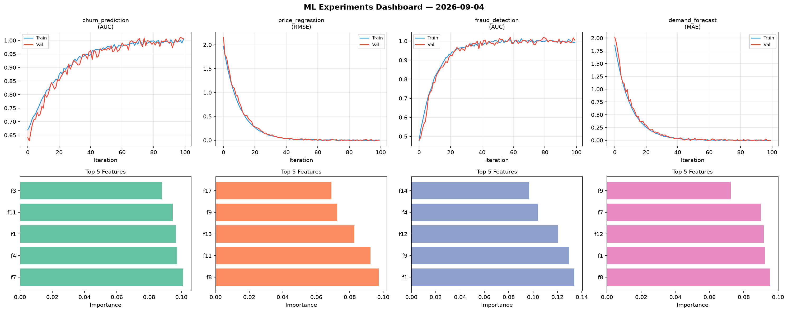
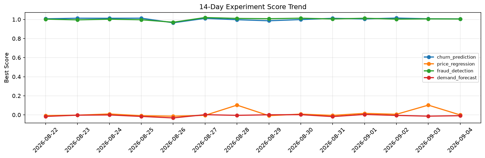

# ML Experiments Report — 2026-09-04

**Run ID:** `55d0a4f962` | **Experiments:** 4 | **Trials:** 19

## Delta vs Yesterday

| Experiment | Today | Yesterday | Change |
|-----------|-------|-----------|--------|
| churn_prediction | 1.006 | 1.0067 | 📉 -0.1% |
| price_regression | -0.0011 | 0.102 | 📉 -101.1% |
| fraud_detection | 1.0047 | 1.0061 | 📉 -0.1% |
| demand_forecast | -0.0087 | -0.0135 | 📈 35.6% |

## churn_prediction (AUC)

**Best Score:** 1.006 (Trial 2)

| Trial | Score | Overfit Gap | Time | LR | Trees | Leaves |
|-------|-------|-------------|------|-----|-------|--------|
| 1 | 0.9687 | 0.0021 | 18.35s | 0.05 | 100 | 63 |
| 2 ⭐ | 1.006 | 0.0027 | 108.82s | 0.1 | 500 | 127 |
| 3 | 0.7166 | 0.0237 | 199.68s | 0.01 | 1000 | 31 |
| 4 | 0.964 | 0.0152 | 23.43s | 0.05 | 200 | 127 |

## price_regression (RMSE)

**Best Score:** -0.0011 (Trial 4)

| Trial | Score | Overfit Gap | Time | LR | Trees | Leaves |
|-------|-------|-------------|------|-----|-------|--------|
| 1 | 0.0382 | 0.0086 | 81.89s | 0.05 | 1000 | 15 |
| 2 | 0.0073 | 0.004 | 19.58s | 0.1 | 200 | 127 |
| 3 | 0.4439 | 0.0313 | 14.18s | 0.01 | 200 | 63 |
| 4 ⭐ | -0.0011 | 0.0064 | 21.41s | 0.2 | 100 | 15 |
| 5 | 0.0108 | 0.0082 | 42.25s | 0.2 | 200 | 15 |
| 6 | 0.0069 | 0.006 | 122.08s | 0.2 | 500 | 15 |

## fraud_detection (AUC)

**Best Score:** 1.0047 (Trial 2)

| Trial | Score | Overfit Gap | Time | LR | Trees | Leaves |
|-------|-------|-------------|------|-----|-------|--------|
| 1 | 0.5909 | 0.0552 | 152.04s | 0.01 | 1000 | 127 |
| 2 ⭐ | 1.0047 | 0.0115 | 23.4s | 0.2 | 100 | 15 |
| 3 | 0.9466 | 0.0105 | 54.62s | 0.05 | 200 | 31 |

## demand_forecast (MAE)

**Best Score:** -0.0087 (Trial 1)

| Trial | Score | Overfit Gap | Time | LR | Trees | Leaves |
|-------|-------|-------------|------|-----|-------|--------|
| 1 ⭐ | -0.0087 | 0.0013 | 140.44s | 0.2 | 500 | 127 |
| 2 | 0.0169 | 0.0014 | 21.91s | 0.1 | 100 | 15 |
| 3 | 0.1493 | 0.0285 | 11.64s | 0.05 | 500 | 127 |
| 4 | 0.0086 | 0.0128 | 225.63s | 0.2 | 1000 | 63 |
| 5 | 0.0018 | 0.0125 | 40.88s | 0.1 | 200 | 63 |
| 6 | -0.0041 | 0.002 | 5.0s | 0.2 | 200 | 15 |
