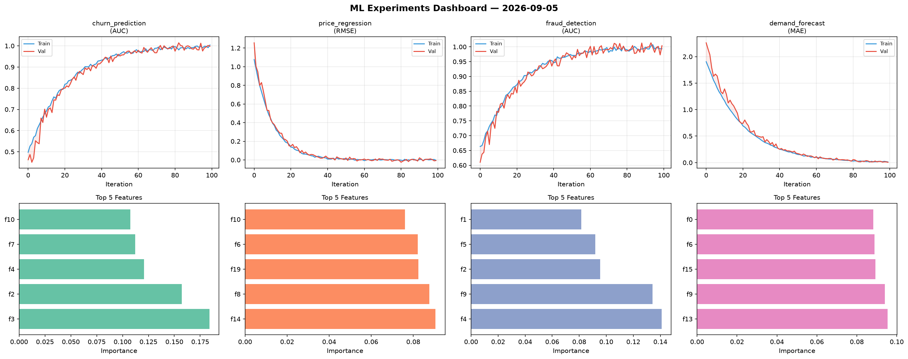
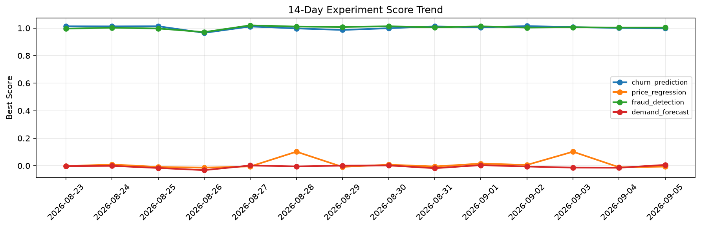

# ML Experiments Report — 2026-09-05

**Run ID:** `86359793fd` | **Experiments:** 4 | **Trials:** 15

## Delta vs Yesterday

| Experiment | Today | Yesterday | Change |
|-----------|-------|-----------|--------|
| churn_prediction | 0.998 | 1.001 | 📉 -0.3% |
| price_regression | -0.0064 | -0.0109 | 📈 41.3% |
| fraud_detection | 1.0038 | 1.0039 | 📉 -0.0% |
| demand_forecast | 0.0063 | -0.0146 | 📈 143.2% |

## churn_prediction (AUC)

**Best Score:** 0.998 (Trial 3)

| Trial | Score | Overfit Gap | Time | LR | Trees | Leaves |
|-------|-------|-------------|------|-----|-------|--------|
| 1 | 0.9386 | 0.0061 | 258.56s | 0.05 | 1000 | 15 |
| 2 | 0.9574 | 0.0079 | 27.67s | 0.05 | 100 | 15 |
| 3 ⭐ | 0.998 | 0.006 | 28.95s | 0.1 | 200 | 127 |
| 4 | 0.7083 | 0.0096 | 242.2s | 0.01 | 1000 | 15 |
| 5 | 0.9916 | 0.0036 | 1.05s | 0.1 | 100 | 127 |

## price_regression (RMSE)

**Best Score:** -0.0064 (Trial 2)

| Trial | Score | Overfit Gap | Time | LR | Trees | Leaves |
|-------|-------|-------------|------|-----|-------|--------|
| 1 | 0.8835 | 0.0031 | 125.7s | 0.01 | 500 | 15 |
| 2 ⭐ | -0.0064 | 0.0027 | 41.18s | 0.2 | 1000 | 63 |
| 3 | 0.009 | 0.015 | 23.02s | 0.2 | 100 | 127 |

## fraud_detection (AUC)

**Best Score:** 1.0038 (Trial 2)

| Trial | Score | Overfit Gap | Time | LR | Trees | Leaves |
|-------|-------|-------------|------|-----|-------|--------|
| 1 | 0.97 | 0.0007 | 20.36s | 0.05 | 200 | 127 |
| 2 ⭐ | 1.0038 | 0.0106 | 135.5s | 0.1 | 1000 | 63 |
| 3 | 0.985 | 0.0126 | 110.2s | 0.05 | 1000 | 63 |

## demand_forecast (MAE)

**Best Score:** 0.0063 (Trial 4)

| Trial | Score | Overfit Gap | Time | LR | Trees | Leaves |
|-------|-------|-------------|------|-----|-------|--------|
| 1 | 0.0186 | 0.0052 | 58.28s | 0.1 | 200 | 127 |
| 2 | 0.0089 | 0.0023 | 1.7s | 0.1 | 100 | 31 |
| 3 | 0.1129 | 0.0025 | 40.43s | 0.05 | 200 | 127 |
| 4 ⭐ | 0.0063 | 0.006 | 208.27s | 0.1 | 1000 | 15 |
