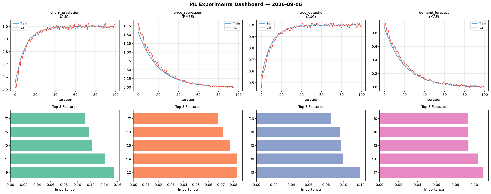
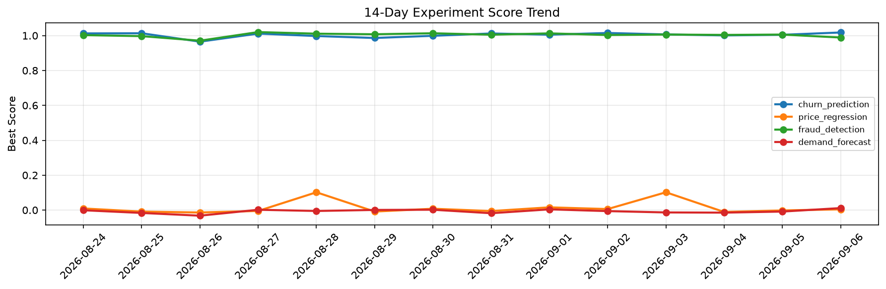

# ML Experiments Report — 2026-09-06

**Run ID:** `0de86262a0` | **Experiments:** 4 | **Trials:** 15

## Delta vs Yesterday

| Experiment | Today | Yesterday | Change |
|-----------|-------|-----------|--------|
| churn_prediction | 1.0178 | 1.0046 | 📈 1.3% |
| price_regression | 0.0042 | -0.002 | 📈 310.0% |
| fraud_detection | 0.9889 | 1.0059 | 📉 -1.7% |
| demand_forecast | 0.0115 | -0.0085 | 📈 235.3% |

## churn_prediction (AUC)

**Best Score:** 1.0178 (Trial 3)

| Trial | Score | Overfit Gap | Time | LR | Trees | Leaves |
|-------|-------|-------------|------|-----|-------|--------|
| 1 | 0.9864 | 0.0095 | 35.19s | 0.1 | 200 | 15 |
| 2 | 1.0022 | 0.0098 | 17.82s | 0.2 | 100 | 31 |
| 3 ⭐ | 1.0178 | 0.0212 | 296.6s | 0.2 | 1000 | 127 |
| 4 | 0.9937 | 0.0111 | 36.78s | 0.2 | 1000 | 127 |

## price_regression (RMSE)

**Best Score:** 0.0042 (Trial 3)

| Trial | Score | Overfit Gap | Time | LR | Trees | Leaves |
|-------|-------|-------------|------|-----|-------|--------|
| 1 | 0.161 | 0.0239 | 73.0s | 0.05 | 500 | 31 |
| 2 | 0.0063 | 0.0046 | 54.69s | 0.1 | 200 | 63 |
| 3 ⭐ | 0.0042 | 0.009 | 60.8s | 0.1 | 1000 | 31 |

## fraud_detection (AUC)

**Best Score:** 0.9889 (Trial 4)

| Trial | Score | Overfit Gap | Time | LR | Trees | Leaves |
|-------|-------|-------------|------|-----|-------|--------|
| 1 | 0.9451 | 0.0021 | 9.22s | 0.05 | 100 | 127 |
| 2 | 0.7388 | 0.0038 | 59.89s | 0.01 | 200 | 15 |
| 3 | 0.7292 | 0.0466 | 200.02s | 0.01 | 1000 | 15 |
| 4 ⭐ | 0.9889 | 0.0133 | 50.23s | 0.2 | 500 | 31 |
| 5 | 0.9689 | 0.0073 | 12.71s | 0.05 | 100 | 127 |

## demand_forecast (MAE)

**Best Score:** 0.0115 (Trial 3)

| Trial | Score | Overfit Gap | Time | LR | Trees | Leaves |
|-------|-------|-------------|------|-----|-------|--------|
| 1 | 1.0284 | 0.0492 | 130.53s | 0.01 | 500 | 127 |
| 2 | 0.0737 | 0.0029 | 6.09s | 0.05 | 200 | 127 |
| 3 ⭐ | 0.0115 | 0.0046 | 172.29s | 0.1 | 1000 | 15 |
