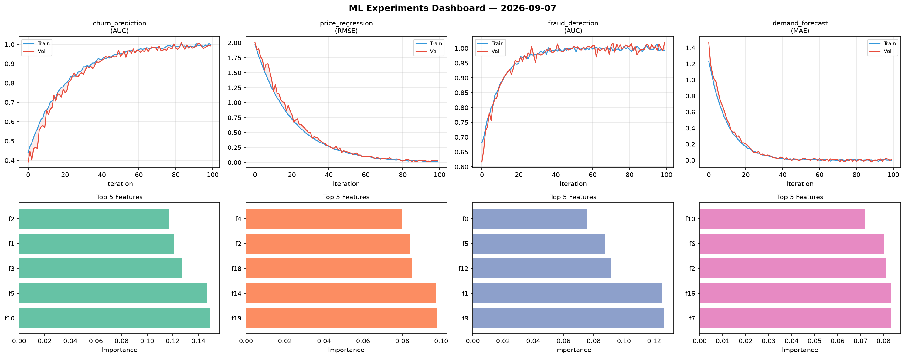
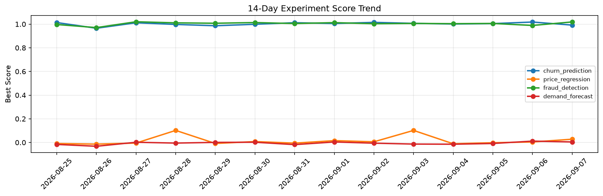

# ML Experiments Report — 2026-09-07

**Run ID:** `87e4791a29` | **Experiments:** 4 | **Trials:** 18

## Delta vs Yesterday

| Experiment | Today | Yesterday | Change |
|-----------|-------|-----------|--------|
| churn_prediction | 0.9919 | 1.0178 | 📉 -2.5% |
| price_regression | 0.0277 | 0.0042 | 📈 559.5% |
| fraud_detection | 1.0186 | 0.9889 | 📈 3.0% |
| demand_forecast | 0.0044 | 0.0115 | 📉 -61.7% |

## churn_prediction (AUC)

**Best Score:** 0.9919 (Trial 3)

| Trial | Score | Overfit Gap | Time | LR | Trees | Leaves |
|-------|-------|-------------|------|-----|-------|--------|
| 1 | 0.9891 | 0.0186 | 104.19s | 0.2 | 500 | 63 |
| 2 | 0.9809 | 0.0138 | 4.52s | 0.2 | 200 | 127 |
| 3 ⭐ | 0.9919 | 0.0053 | 19.12s | 0.1 | 100 | 15 |
| 4 | 0.958 | 0.0014 | 26.95s | 0.05 | 100 | 63 |
| 5 | 0.6458 | 0.0373 | 12.08s | 0.01 | 100 | 127 |
| 6 | 0.9896 | 0.0151 | 47.46s | 0.2 | 200 | 31 |

## price_regression (RMSE)

**Best Score:** 0.0277 (Trial 1)

| Trial | Score | Overfit Gap | Time | LR | Trees | Leaves |
|-------|-------|-------------|------|-----|-------|--------|
| 1 ⭐ | 0.0277 | 0.0119 | 39.95s | 0.1 | 500 | 127 |
| 2 | 0.0901 | 0.009 | 56.4s | 0.05 | 200 | 127 |
| 3 | 0.0805 | 0.0066 | 6.05s | 0.05 | 100 | 15 |

## fraud_detection (AUC)

**Best Score:** 1.0186 (Trial 1)

| Trial | Score | Overfit Gap | Time | LR | Trees | Leaves |
|-------|-------|-------------|------|-----|-------|--------|
| 1 ⭐ | 1.0186 | 0.0265 | 26.51s | 0.2 | 200 | 127 |
| 2 | 0.6447 | 0.0492 | 45.66s | 0.01 | 200 | 127 |
| 3 | 0.9468 | 0.0084 | 35.07s | 0.05 | 200 | 63 |
| 4 | 1.0097 | 0.013 | 282.25s | 0.2 | 1000 | 127 |
| 5 | 0.9997 | 0.0007 | 77.43s | 0.2 | 500 | 31 |
| 6 | 0.6618 | 0.0019 | 187.51s | 0.01 | 1000 | 63 |

## demand_forecast (MAE)

**Best Score:** 0.0044 (Trial 2)

| Trial | Score | Overfit Gap | Time | LR | Trees | Leaves |
|-------|-------|-------------|------|-----|-------|--------|
| 1 | 0.1878 | 0.0307 | 36.99s | 0.05 | 200 | 63 |
| 2 ⭐ | 0.0044 | 0.0079 | 24.48s | 0.2 | 1000 | 31 |
| 3 | 0.0108 | 0.0081 | 29.93s | 0.1 | 200 | 63 |
