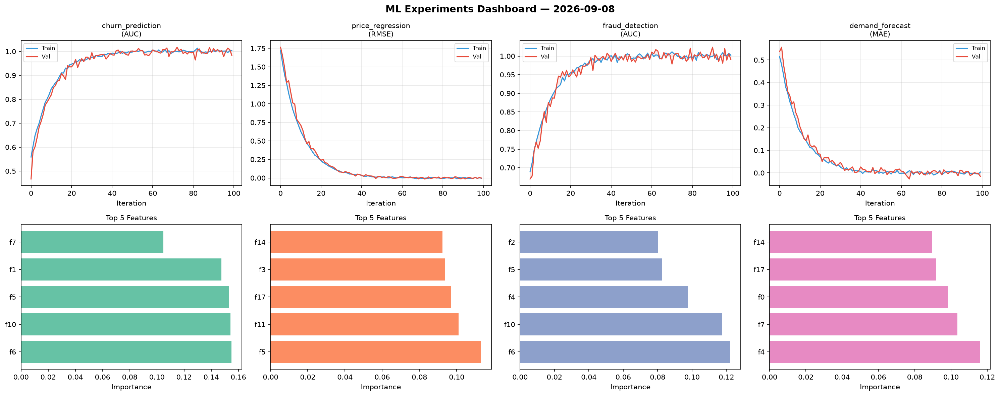
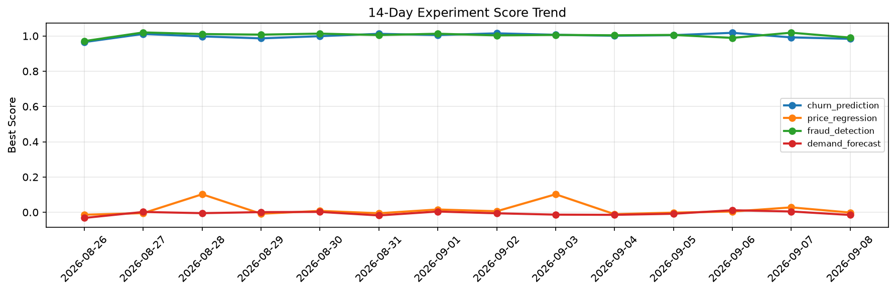

# ML Experiments Report — 2026-09-08

**Run ID:** `8021957a94` | **Experiments:** 4 | **Trials:** 20

## Delta vs Yesterday

| Experiment | Today | Yesterday | Change |
|-----------|-------|-----------|--------|
| churn_prediction | 0.9837 | 0.9919 | 📉 -0.8% |
| price_regression | -0.0017 | 0.0277 | 📉 -106.1% |
| fraud_detection | 0.9907 | 1.0186 | 📉 -2.7% |
| demand_forecast | -0.0153 | 0.0044 | 📉 -447.7% |

## churn_prediction (AUC)

**Best Score:** 0.9837 (Trial 1)

| Trial | Score | Overfit Gap | Time | LR | Trees | Leaves |
|-------|-------|-------------|------|-----|-------|--------|
| 1 ⭐ | 0.9837 | 0.0195 | 154.28s | 0.2 | 1000 | 127 |
| 2 | 0.9718 | 0.0006 | 17.62s | 0.05 | 100 | 31 |
| 3 | 0.692 | 0.0332 | 239.49s | 0.01 | 1000 | 15 |
| 4 | 0.9645 | 0.0032 | 100.83s | 0.05 | 500 | 127 |
| 5 | 0.7816 | 0.0222 | 230.45s | 0.01 | 1000 | 31 |
| 6 | 0.9537 | 0.0201 | 43.01s | 0.05 | 500 | 15 |

## price_regression (RMSE)

**Best Score:** -0.0017 (Trial 4)

| Trial | Score | Overfit Gap | Time | LR | Trees | Leaves |
|-------|-------|-------------|------|-----|-------|--------|
| 1 | 0.1167 | 0.0263 | 14.22s | 0.05 | 100 | 15 |
| 2 | 0.6033 | 0.0334 | 29.59s | 0.01 | 200 | 63 |
| 3 | 0.1019 | 0.0037 | 53.94s | 0.05 | 500 | 31 |
| 4 ⭐ | -0.0017 | 0.0015 | 115.34s | 0.2 | 1000 | 127 |
| 5 | 0.727 | 0.0952 | 213.87s | 0.01 | 1000 | 63 |

## fraud_detection (AUC)

**Best Score:** 0.9907 (Trial 2)

| Trial | Score | Overfit Gap | Time | LR | Trees | Leaves |
|-------|-------|-------------|------|-----|-------|--------|
| 1 | 0.6758 | 0.0621 | 8.11s | 0.01 | 100 | 127 |
| 2 ⭐ | 0.9907 | 0.0117 | 15.51s | 0.2 | 100 | 127 |
| 3 | 0.9897 | 0.0001 | 254.53s | 0.1 | 1000 | 127 |

## demand_forecast (MAE)

**Best Score:** -0.0153 (Trial 3)

| Trial | Score | Overfit Gap | Time | LR | Trees | Leaves |
|-------|-------|-------------|------|-----|-------|--------|
| 1 | 1.1881 | 0.1828 | 29.0s | 0.01 | 200 | 15 |
| 2 | 0.5405 | 0.0459 | 219.2s | 0.01 | 1000 | 63 |
| 3 ⭐ | -0.0153 | 0.019 | 261.38s | 0.2 | 1000 | 15 |
| 4 | 0.1871 | 0.0375 | 17.2s | 0.05 | 200 | 15 |
| 5 | 0.0027 | 0.0025 | 85.06s | 0.1 | 1000 | 127 |
| 6 | 0.488 | 0.0356 | 0.91s | 0.01 | 100 | 127 |
