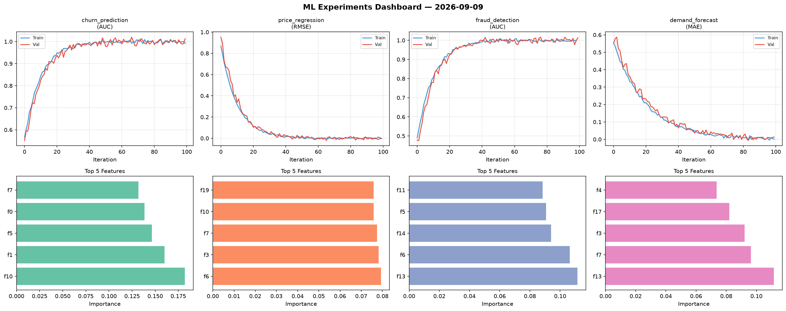
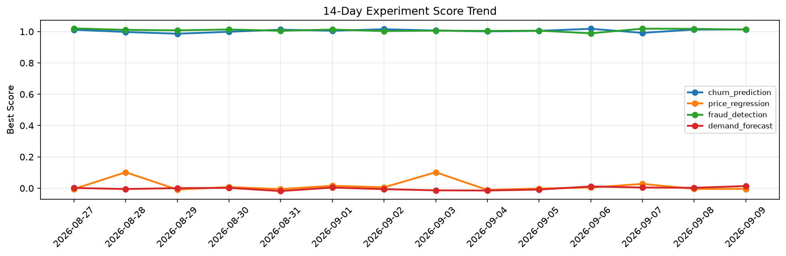

# ML Experiments Report — 2026-09-09

**Run ID:** `7731fed4c1` | **Experiments:** 4 | **Trials:** 18

## Delta vs Yesterday

| Experiment | Today | Yesterday | Change |
|-----------|-------|-----------|--------|
| churn_prediction | 1.0137 | 1.0124 | 📈 0.1% |
| price_regression | -0.0045 | -0.0043 | 📉 -4.7% |
| fraud_detection | 1.0127 | 1.0171 | 📉 -0.4% |
| demand_forecast | 0.0137 | 0.0029 | 📈 372.4% |

## churn_prediction (AUC)

**Best Score:** 1.0137 (Trial 5)

| Trial | Score | Overfit Gap | Time | LR | Trees | Leaves |
|-------|-------|-------------|------|-----|-------|--------|
| 1 | 1.0043 | 0.0086 | 43.08s | 0.1 | 500 | 15 |
| 2 | 0.9397 | 0.0132 | 106.16s | 0.05 | 500 | 31 |
| 3 | 0.7317 | 0.0146 | 176.78s | 0.01 | 1000 | 127 |
| 4 | 0.9864 | 0.0163 | 4.76s | 0.1 | 500 | 127 |
| 5 ⭐ | 1.0137 | 0.0226 | 39.75s | 0.2 | 200 | 15 |
| 6 | 0.9909 | 0.0137 | 5.35s | 0.1 | 100 | 63 |

## price_regression (RMSE)

**Best Score:** -0.0045 (Trial 2)

| Trial | Score | Overfit Gap | Time | LR | Trees | Leaves |
|-------|-------|-------------|------|-----|-------|--------|
| 1 | 0.0506 | 0.0108 | 179.87s | 0.05 | 1000 | 31 |
| 2 ⭐ | -0.0045 | 0.0028 | 2.52s | 0.2 | 100 | 15 |
| 3 | 0.0804 | 0.0104 | 26.61s | 0.05 | 200 | 31 |

## fraud_detection (AUC)

**Best Score:** 1.0127 (Trial 2)

| Trial | Score | Overfit Gap | Time | LR | Trees | Leaves |
|-------|-------|-------------|------|-----|-------|--------|
| 1 | 0.6834 | 0.0361 | 37.09s | 0.01 | 200 | 31 |
| 2 ⭐ | 1.0127 | 0.0006 | 71.32s | 0.2 | 500 | 31 |
| 3 | 0.9952 | 0.0144 | 22.81s | 0.2 | 100 | 31 |

## demand_forecast (MAE)

**Best Score:** 0.0137 (Trial 1)

| Trial | Score | Overfit Gap | Time | LR | Trees | Leaves |
|-------|-------|-------------|------|-----|-------|--------|
| 1 ⭐ | 0.0137 | 0.0123 | 57.77s | 0.1 | 200 | 31 |
| 2 | 0.0248 | 0.0192 | 8.07s | 0.1 | 100 | 15 |
| 3 | 0.5815 | 0.0391 | 77.44s | 0.01 | 500 | 63 |
| 4 | 0.3422 | 0.0124 | 33.25s | 0.01 | 200 | 127 |
| 5 | 0.0141 | 0.0213 | 52.01s | 0.2 | 500 | 31 |
| 6 | 1.264 | 0.1088 | 105.39s | 0.01 | 500 | 15 |
