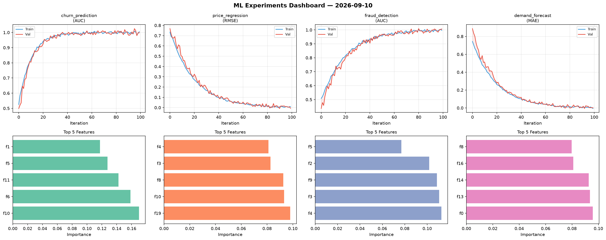
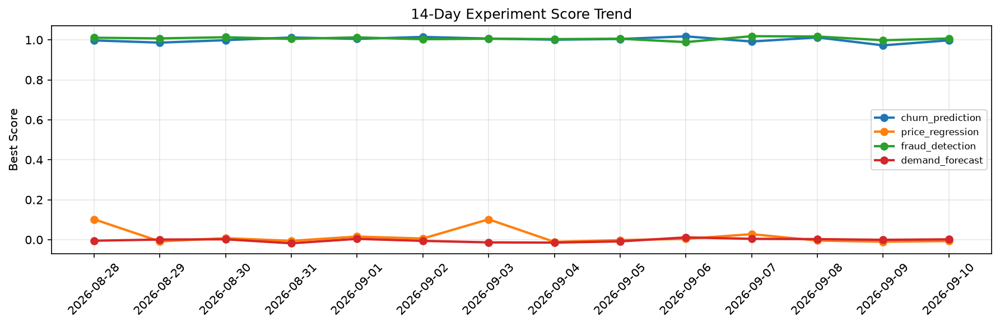

# ML Experiments Report — 2026-09-10

**Run ID:** `80f928941e` | **Experiments:** 4 | **Trials:** 19

## Delta vs Yesterday

| Experiment | Today | Yesterday | Change |
|-----------|-------|-----------|--------|
| churn_prediction | 0.9979 | 0.9727 | 📈 2.6% |
| price_regression | -0.0067 | -0.0103 | 📈 35.0% |
| fraud_detection | 1.007 | 0.9983 | 📈 0.9% |
| demand_forecast | 0.0018 | -0.0006 | 📈 240.0% |

## churn_prediction (AUC)

**Best Score:** 0.9979 (Trial 4)

| Trial | Score | Overfit Gap | Time | LR | Trees | Leaves |
|-------|-------|-------------|------|-----|-------|--------|
| 1 | 0.7835 | 0.03 | 93.21s | 0.01 | 500 | 127 |
| 2 | 0.9433 | 0.0044 | 91.43s | 0.05 | 500 | 63 |
| 3 | 0.952 | 0.0057 | 51.42s | 0.05 | 200 | 63 |
| 4 ⭐ | 0.9979 | 0.0075 | 21.39s | 0.2 | 1000 | 127 |

## price_regression (RMSE)

**Best Score:** -0.0067 (Trial 3)

| Trial | Score | Overfit Gap | Time | LR | Trees | Leaves |
|-------|-------|-------------|------|-----|-------|--------|
| 1 | 0.0147 | 0.0032 | 35.92s | 0.1 | 200 | 127 |
| 2 | 0.0244 | 0.0157 | 26.43s | 0.1 | 500 | 15 |
| 3 ⭐ | -0.0067 | 0.0157 | 131.47s | 0.1 | 1000 | 63 |

## fraud_detection (AUC)

**Best Score:** 1.007 (Trial 6)

| Trial | Score | Overfit Gap | Time | LR | Trees | Leaves |
|-------|-------|-------------|------|-----|-------|--------|
| 1 | 0.9943 | 0.0033 | 176.24s | 0.1 | 1000 | 127 |
| 2 | 1.0033 | 0.011 | 27.78s | 0.1 | 100 | 127 |
| 3 | 0.9918 | 0.005 | 6.69s | 0.1 | 100 | 127 |
| 4 | 0.9409 | 0.0108 | 44.67s | 0.05 | 500 | 127 |
| 5 | 0.9433 | 0.0199 | 86.95s | 0.05 | 1000 | 63 |
| 6 ⭐ | 1.007 | 0.0101 | 250.29s | 0.1 | 1000 | 31 |

## demand_forecast (MAE)

**Best Score:** 0.0018 (Trial 1)

| Trial | Score | Overfit Gap | Time | LR | Trees | Leaves |
|-------|-------|-------------|------|-----|-------|--------|
| 1 ⭐ | 0.0018 | 0.0072 | 276.94s | 0.1 | 1000 | 31 |
| 2 | 0.0138 | 0.0042 | 118.36s | 0.1 | 500 | 127 |
| 3 | 0.1406 | 0.0034 | 2.88s | 0.05 | 500 | 127 |
| 4 | 0.0133 | 0.0033 | 39.65s | 0.1 | 500 | 15 |
| 5 | 0.0054 | 0.0104 | 116.24s | 0.2 | 1000 | 63 |
| 6 | 0.319 | 0.0005 | 11.98s | 0.01 | 200 | 63 |
