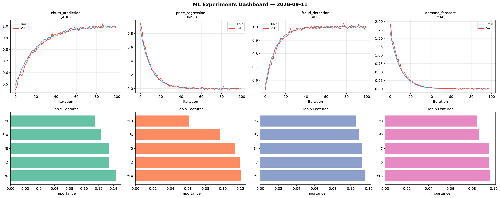
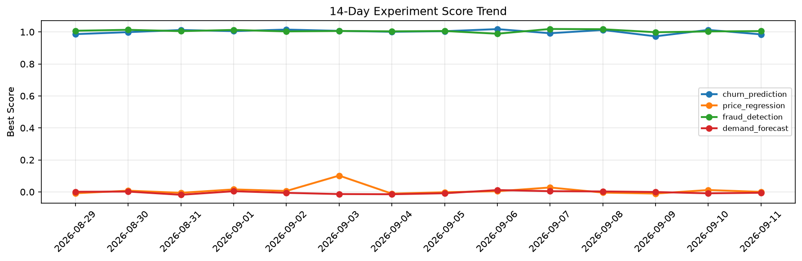

# ML Experiments Report — 2026-09-11

**Run ID:** `0a12387fdd` | **Experiments:** 4 | **Trials:** 20

## Delta vs Yesterday

| Experiment | Today | Yesterday | Change |
|-----------|-------|-----------|--------|
| churn_prediction | 0.9849 | 1.0128 | 📉 -2.8% |
| price_regression | 0.0003 | 0.0118 | 📉 -97.5% |
| fraud_detection | 1.0054 | 1.0031 | 📈 0.2% |
| demand_forecast | -0.0052 | -0.0089 | 📈 41.6% |

## churn_prediction (AUC)

**Best Score:** 0.9849 (Trial 1)

| Trial | Score | Overfit Gap | Time | LR | Trees | Leaves |
|-------|-------|-------------|------|-----|-------|--------|
| 1 ⭐ | 0.9849 | 0.0042 | 54.66s | 0.1 | 200 | 15 |
| 2 | 0.7676 | 0.0435 | 24.57s | 0.01 | 200 | 127 |
| 3 | 0.9555 | 0.0111 | 21.31s | 0.05 | 100 | 127 |
| 4 | 0.7956 | 0.0144 | 44.94s | 0.01 | 1000 | 15 |
| 5 | 0.9599 | 0.0103 | 25.0s | 0.05 | 500 | 127 |
| 6 | 0.6859 | 0.0395 | 163.97s | 0.01 | 1000 | 63 |

## price_regression (RMSE)

**Best Score:** 0.0003 (Trial 3)

| Trial | Score | Overfit Gap | Time | LR | Trees | Leaves |
|-------|-------|-------------|------|-----|-------|--------|
| 1 | 0.0093 | 0.0055 | 119.08s | 0.1 | 1000 | 31 |
| 2 | 0.0507 | 0.0103 | 8.48s | 0.05 | 500 | 15 |
| 3 ⭐ | 0.0003 | 0.0079 | 71.39s | 0.2 | 500 | 31 |
| 4 | 0.0027 | 0.0003 | 7.72s | 0.2 | 1000 | 31 |

## fraud_detection (AUC)

**Best Score:** 1.0054 (Trial 1)

| Trial | Score | Overfit Gap | Time | LR | Trees | Leaves |
|-------|-------|-------------|------|-----|-------|--------|
| 1 ⭐ | 1.0054 | 0.0071 | 100.24s | 0.2 | 500 | 31 |
| 2 | 0.6702 | 0.0446 | 7.98s | 0.01 | 100 | 15 |
| 3 | 1.0047 | 0.0044 | 9.12s | 0.2 | 100 | 31 |
| 4 | 0.6118 | 0.0605 | 115.0s | 0.01 | 500 | 63 |

## demand_forecast (MAE)

**Best Score:** -0.0052 (Trial 4)

| Trial | Score | Overfit Gap | Time | LR | Trees | Leaves |
|-------|-------|-------------|------|-----|-------|--------|
| 1 | 0.0174 | 0.0039 | 6.0s | 0.1 | 100 | 127 |
| 2 | 0.1661 | 0.0142 | 124.04s | 0.05 | 500 | 127 |
| 3 | -0.0016 | 0.0022 | 70.4s | 0.1 | 500 | 127 |
| 4 ⭐ | -0.0052 | 0.0046 | 153.52s | 0.2 | 1000 | 31 |
| 5 | 0.8604 | 0.0292 | 180.44s | 0.01 | 1000 | 31 |
| 6 | 0.1454 | 0.0168 | 15.01s | 0.05 | 500 | 31 |
