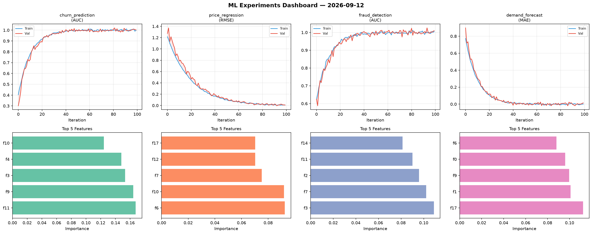
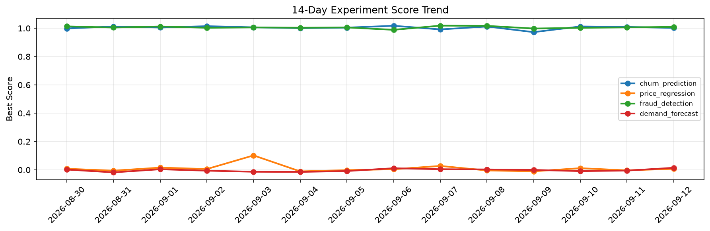

# ML Experiments Report — 2026-09-12

**Run ID:** `b0c575a858` | **Experiments:** 4 | **Trials:** 18

## Delta vs Yesterday

| Experiment | Today | Yesterday | Change |
|-----------|-------|-----------|--------|
| churn_prediction | 1.0024 | 1.0094 | 📉 -0.7% |
| price_regression | 0.0073 | -0.0036 | 📈 302.8% |
| fraud_detection | 1.0098 | 1.0062 | 📈 0.4% |
| demand_forecast | 0.0146 | -0.0052 | 📈 380.8% |

## churn_prediction (AUC)

**Best Score:** 1.0024 (Trial 3)

| Trial | Score | Overfit Gap | Time | LR | Trees | Leaves |
|-------|-------|-------------|------|-----|-------|--------|
| 1 | 0.7602 | 0.0261 | 29.74s | 0.01 | 500 | 15 |
| 2 | 0.9935 | 0.0108 | 27.17s | 0.2 | 100 | 127 |
| 3 ⭐ | 1.0024 | 0.0055 | 2.98s | 0.2 | 200 | 63 |
| 4 | 0.9519 | 0.0042 | 22.52s | 0.05 | 100 | 31 |
| 5 | 0.978 | 0.0131 | 26.09s | 0.2 | 100 | 127 |
| 6 | 0.6302 | 0.0256 | 11.21s | 0.01 | 200 | 31 |

## price_regression (RMSE)

**Best Score:** 0.0073 (Trial 1)

| Trial | Score | Overfit Gap | Time | LR | Trees | Leaves |
|-------|-------|-------------|------|-----|-------|--------|
| 1 ⭐ | 0.0073 | 0.0021 | 22.86s | 0.1 | 200 | 31 |
| 2 | 0.0094 | 0.014 | 35.72s | 0.2 | 500 | 31 |
| 3 | 0.0164 | 0.0164 | 43.45s | 0.2 | 500 | 31 |
| 4 | 0.1084 | 0.0003 | 7.98s | 0.05 | 1000 | 127 |

## fraud_detection (AUC)

**Best Score:** 1.0098 (Trial 3)

| Trial | Score | Overfit Gap | Time | LR | Trees | Leaves |
|-------|-------|-------------|------|-----|-------|--------|
| 1 | 0.995 | 0.004 | 10.66s | 0.2 | 100 | 31 |
| 2 | 0.9907 | 0.0155 | 25.8s | 0.1 | 500 | 31 |
| 3 ⭐ | 1.0098 | 0.0045 | 50.92s | 0.2 | 200 | 127 |
| 4 | 1.0034 | 0.0056 | 141.2s | 0.2 | 1000 | 127 |

## demand_forecast (MAE)

**Best Score:** 0.0146 (Trial 4)

| Trial | Score | Overfit Gap | Time | LR | Trees | Leaves |
|-------|-------|-------------|------|-----|-------|--------|
| 1 | 0.8638 | 0.0704 | 63.59s | 0.01 | 500 | 31 |
| 2 | 1.2679 | 0.0713 | 221.51s | 0.01 | 1000 | 31 |
| 3 | 0.1281 | 0.01 | 220.99s | 0.05 | 1000 | 15 |
| 4 ⭐ | 0.0146 | 0.0141 | 130.46s | 0.2 | 500 | 31 |
