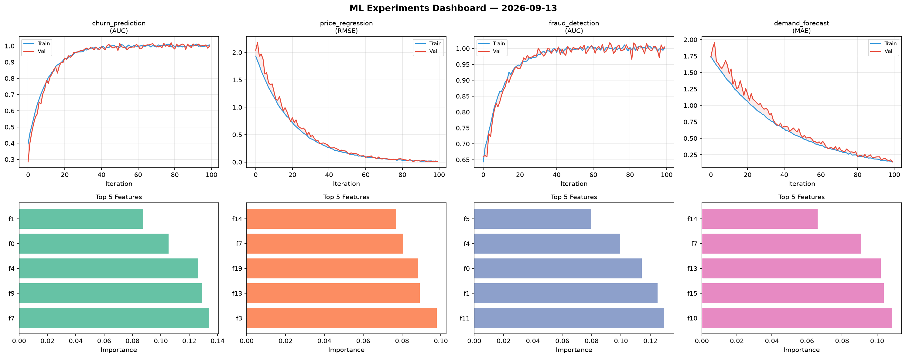
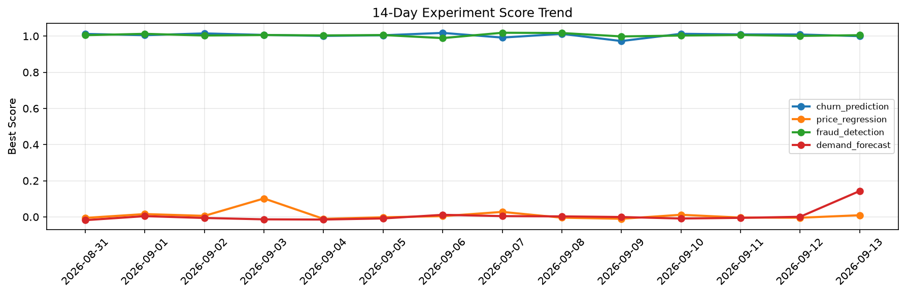

# ML Experiments Report — 2026-09-13

**Run ID:** `ca333b3f94` | **Experiments:** 4 | **Trials:** 19

## Delta vs Yesterday

| Experiment | Today | Yesterday | Change |
|-----------|-------|-----------|--------|
| churn_prediction | 0.9998 | 1.009 | 📉 -0.9% |
| price_regression | 0.0093 | -0.0046 | 📈 302.2% |
| fraud_detection | 1.0052 | 1.0011 | 📈 0.4% |
| demand_forecast | 0.1432 | 0.0007 | 📈 14250.0% |

## churn_prediction (AUC)

**Best Score:** 0.9998 (Trial 3)

| Trial | Score | Overfit Gap | Time | LR | Trees | Leaves |
|-------|-------|-------------|------|-----|-------|--------|
| 1 | 0.9529 | 0.0053 | 39.37s | 0.05 | 200 | 31 |
| 2 | 0.6846 | 0.0522 | 16.41s | 0.01 | 500 | 127 |
| 3 ⭐ | 0.9998 | 0.0061 | 46.43s | 0.2 | 500 | 31 |
| 4 | 0.5979 | 0.0413 | 20.09s | 0.01 | 200 | 31 |
| 5 | 0.9985 | 0.0072 | 23.53s | 0.1 | 200 | 127 |

## price_regression (RMSE)

**Best Score:** 0.0093 (Trial 5)

| Trial | Score | Overfit Gap | Time | LR | Trees | Leaves |
|-------|-------|-------------|------|-----|-------|--------|
| 1 | 0.0981 | 0.025 | 29.17s | 0.05 | 100 | 127 |
| 2 | 0.0135 | 0.0013 | 6.44s | 0.1 | 100 | 63 |
| 3 | 0.0686 | 0.0109 | 90.61s | 0.05 | 500 | 31 |
| 4 | 1.0769 | 0.1527 | 23.14s | 0.01 | 200 | 63 |
| 5 ⭐ | 0.0093 | 0.0059 | 56.48s | 0.1 | 500 | 63 |

## fraud_detection (AUC)

**Best Score:** 1.0052 (Trial 6)

| Trial | Score | Overfit Gap | Time | LR | Trees | Leaves |
|-------|-------|-------------|------|-----|-------|--------|
| 1 | 0.998 | 0.0062 | 112.21s | 0.2 | 500 | 127 |
| 2 | 0.9923 | 0.0045 | 19.91s | 0.1 | 500 | 31 |
| 3 | 0.9832 | 0.0074 | 34.59s | 0.1 | 200 | 31 |
| 4 | 0.6211 | 0.0478 | 49.36s | 0.01 | 1000 | 15 |
| 5 | 0.9436 | 0.0274 | 9.74s | 0.05 | 100 | 63 |
| 6 ⭐ | 1.0052 | 0.0041 | 88.11s | 0.2 | 500 | 127 |

## demand_forecast (MAE)

**Best Score:** 0.1432 (Trial 3)

| Trial | Score | Overfit Gap | Time | LR | Trees | Leaves |
|-------|-------|-------------|------|-----|-------|--------|
| 1 | 0.8923 | 0.0799 | 214.15s | 0.01 | 1000 | 127 |
| 2 | 1.2863 | 0.1918 | 19.35s | 0.01 | 100 | 15 |
| 3 ⭐ | 0.1432 | 0.0 | 60.34s | 0.05 | 500 | 127 |
