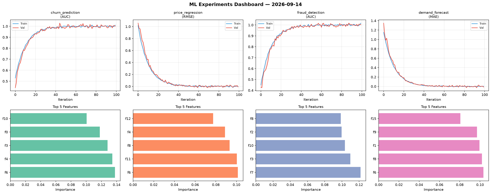
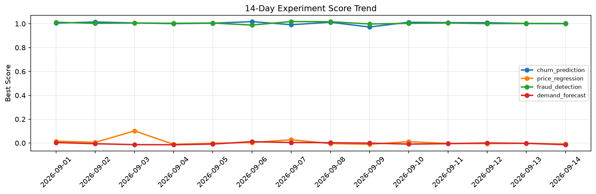

# ML Experiments Report — 2026-09-14

**Run ID:** `b0b146dd2d` | **Experiments:** 4 | **Trials:** 17

## Delta vs Yesterday

| Experiment | Today | Yesterday | Change |
|-----------|-------|-----------|--------|
| churn_prediction | 1.0006 | 1.0017 | 📉 -0.1% |
| price_regression | -0.0083 | -0.0025 | 📉 -232.0% |
| fraud_detection | 1.0022 | 1.0022 | 📉 0.0% |
| demand_forecast | -0.0139 | -0.0025 | 📉 -456.0% |

## churn_prediction (AUC)

**Best Score:** 1.0006 (Trial 5)

| Trial | Score | Overfit Gap | Time | LR | Trees | Leaves |
|-------|-------|-------------|------|-----|-------|--------|
| 1 | 0.9842 | 0.0135 | 9.89s | 0.05 | 200 | 127 |
| 2 | 0.9634 | 0.005 | 15.68s | 0.05 | 100 | 63 |
| 3 | 0.6476 | 0.0424 | 77.78s | 0.01 | 1000 | 31 |
| 4 | 0.9634 | 0.0018 | 20.09s | 0.05 | 200 | 31 |
| 5 ⭐ | 1.0006 | 0.0093 | 17.72s | 0.2 | 100 | 15 |
| 6 | 0.967 | 0.0003 | 15.99s | 0.05 | 500 | 15 |

## price_regression (RMSE)

**Best Score:** -0.0083 (Trial 1)

| Trial | Score | Overfit Gap | Time | LR | Trees | Leaves |
|-------|-------|-------------|------|-----|-------|--------|
| 1 ⭐ | -0.0083 | 0.007 | 58.29s | 0.2 | 200 | 127 |
| 2 | 0.0052 | 0.0044 | 146.52s | 0.2 | 500 | 63 |
| 3 | 0.0035 | 0.0048 | 11.27s | 0.2 | 200 | 127 |
| 4 | 0.4201 | 0.0213 | 46.06s | 0.01 | 200 | 63 |

## fraud_detection (AUC)

**Best Score:** 1.0022 (Trial 1)

| Trial | Score | Overfit Gap | Time | LR | Trees | Leaves |
|-------|-------|-------------|------|-----|-------|--------|
| 1 ⭐ | 1.0022 | 0.0143 | 14.97s | 0.2 | 500 | 127 |
| 2 | 0.6316 | 0.0204 | 85.88s | 0.01 | 500 | 127 |
| 3 | 0.9681 | 0.0013 | 6.45s | 0.05 | 100 | 63 |
| 4 | 0.9776 | 0.0178 | 5.05s | 0.2 | 100 | 31 |

## demand_forecast (MAE)

**Best Score:** -0.0139 (Trial 1)

| Trial | Score | Overfit Gap | Time | LR | Trees | Leaves |
|-------|-------|-------------|------|-----|-------|--------|
| 1 ⭐ | -0.0139 | 0.0192 | 42.47s | 0.2 | 500 | 127 |
| 2 | -0.0022 | 0.0177 | 145.87s | 0.1 | 500 | 127 |
| 3 | 0.5425 | 0.0461 | 8.12s | 0.01 | 200 | 63 |
