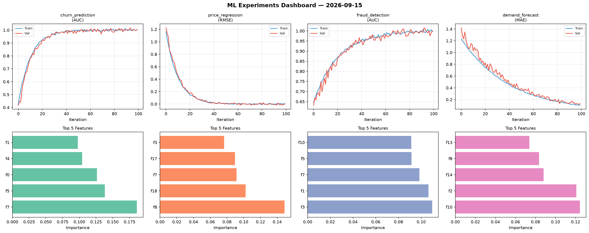
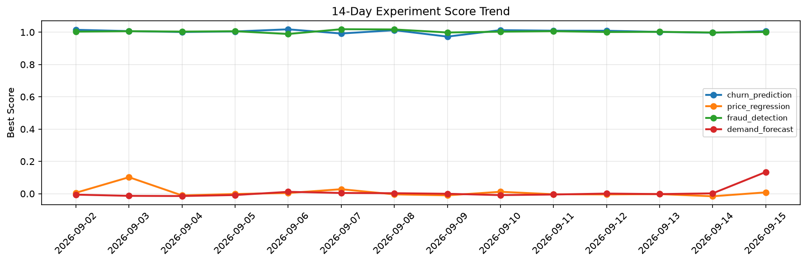

# ML Experiments Report — 2026-09-15

**Run ID:** `f0e75398c5` | **Experiments:** 4 | **Trials:** 19

## Delta vs Yesterday

| Experiment | Today | Yesterday | Change |
|-----------|-------|-----------|--------|
| churn_prediction | 1.0063 | 0.9967 | 📈 1.0% |
| price_regression | 0.0081 | -0.0161 | 📈 150.3% |
| fraud_detection | 1.0011 | 0.9983 | 📈 0.3% |
| demand_forecast | 0.134 | 0.0019 | 📈 6952.6% |

## churn_prediction (AUC)

**Best Score:** 1.0063 (Trial 1)

| Trial | Score | Overfit Gap | Time | LR | Trees | Leaves |
|-------|-------|-------------|------|-----|-------|--------|
| 1 ⭐ | 1.0063 | 0.0002 | 29.96s | 0.2 | 100 | 15 |
| 2 | 0.9951 | 0.0007 | 77.87s | 0.2 | 1000 | 15 |
| 3 | 0.7622 | 0.0048 | 15.11s | 0.01 | 100 | 63 |
| 4 | 0.9891 | 0.0083 | 15.51s | 0.2 | 500 | 63 |
| 5 | 1.0015 | 0.0021 | 22.78s | 0.2 | 100 | 127 |
| 6 | 0.737 | 0.0294 | 22.09s | 0.01 | 100 | 31 |

## price_regression (RMSE)

**Best Score:** 0.0081 (Trial 1)

| Trial | Score | Overfit Gap | Time | LR | Trees | Leaves |
|-------|-------|-------------|------|-----|-------|--------|
| 1 ⭐ | 0.0081 | 0.0106 | 63.84s | 0.2 | 1000 | 127 |
| 2 | 0.7032 | 0.1013 | 5.29s | 0.01 | 1000 | 15 |
| 3 | 0.0377 | 0.0139 | 11.39s | 0.1 | 500 | 15 |
| 4 | 0.1512 | 0.018 | 8.35s | 0.05 | 200 | 63 |
| 5 | 0.129 | 0.0212 | 28.81s | 0.05 | 100 | 127 |
| 6 | 0.0138 | 0.0031 | 32.62s | 0.1 | 200 | 31 |

## fraud_detection (AUC)

**Best Score:** 1.0011 (Trial 2)

| Trial | Score | Overfit Gap | Time | LR | Trees | Leaves |
|-------|-------|-------------|------|-----|-------|--------|
| 1 | 0.986 | 0.0061 | 227.08s | 0.2 | 1000 | 31 |
| 2 ⭐ | 1.0011 | 0.0052 | 34.16s | 0.1 | 200 | 127 |
| 3 | 0.9951 | 0.0112 | 48.53s | 0.2 | 200 | 63 |

## demand_forecast (MAE)

**Best Score:** 0.134 (Trial 3)

| Trial | Score | Overfit Gap | Time | LR | Trees | Leaves |
|-------|-------|-------------|------|-----|-------|--------|
| 1 | 1.2006 | 0.1462 | 52.78s | 0.01 | 200 | 63 |
| 2 | 0.9756 | 0.0045 | 9.54s | 0.01 | 500 | 63 |
| 3 ⭐ | 0.134 | 0.0311 | 52.28s | 0.05 | 200 | 63 |
| 4 | 1.0808 | 0.1202 | 44.48s | 0.01 | 1000 | 127 |
