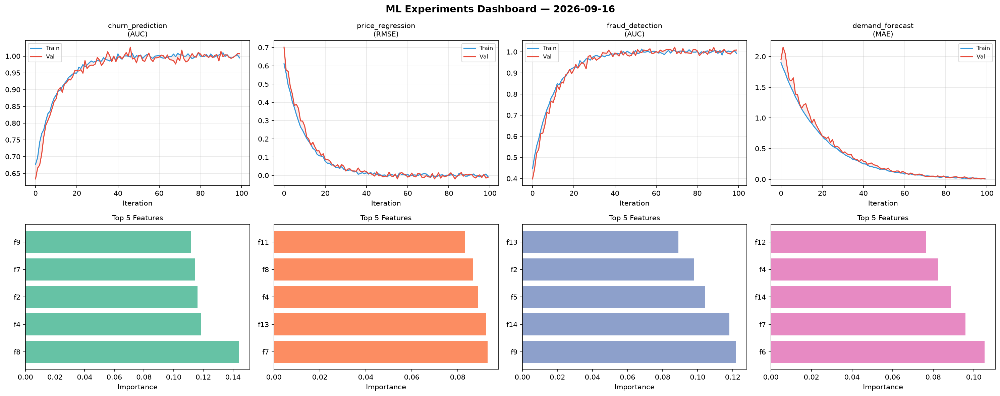
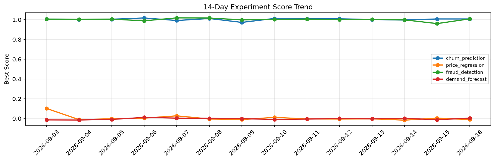

# ML Experiments Report — 2026-09-16

**Run ID:** `ce45e7714f` | **Experiments:** 4 | **Trials:** 13

## Delta vs Yesterday

| Experiment | Today | Yesterday | Change |
|-----------|-------|-----------|--------|
| churn_prediction | 1.0075 | 1.0077 | 📉 -0.0% |
| price_regression | -0.0102 | 0.0044 | 📉 -331.8% |
| fraud_detection | 1.0085 | 0.9609 | 📈 5.0% |
| demand_forecast | 0.0045 | -0.0116 | 📈 138.8% |

## churn_prediction (AUC)

**Best Score:** 1.0075 (Trial 3)

| Trial | Score | Overfit Gap | Time | LR | Trees | Leaves |
|-------|-------|-------------|------|-----|-------|--------|
| 1 | 0.9473 | 0.0111 | 18.74s | 0.05 | 200 | 31 |
| 2 | 0.9894 | 0.0053 | 18.11s | 0.2 | 100 | 63 |
| 3 ⭐ | 1.0075 | 0.0128 | 292.98s | 0.2 | 1000 | 15 |

## price_regression (RMSE)

**Best Score:** -0.0102 (Trial 3)

| Trial | Score | Overfit Gap | Time | LR | Trees | Leaves |
|-------|-------|-------------|------|-----|-------|--------|
| 1 | 0.1021 | 0.0271 | 108.6s | 0.05 | 1000 | 127 |
| 2 | -0.0082 | 0.0007 | 2.98s | 0.2 | 200 | 127 |
| 3 ⭐ | -0.0102 | 0.0035 | 253.96s | 0.2 | 1000 | 127 |

## fraud_detection (AUC)

**Best Score:** 1.0085 (Trial 4)

| Trial | Score | Overfit Gap | Time | LR | Trees | Leaves |
|-------|-------|-------------|------|-----|-------|--------|
| 1 | 0.7753 | 0.034 | 27.97s | 0.01 | 500 | 127 |
| 2 | 0.9991 | 0.0043 | 286.47s | 0.1 | 1000 | 31 |
| 3 | 0.9616 | 0.004 | 55.41s | 0.05 | 200 | 63 |
| 4 ⭐ | 1.0085 | 0.0158 | 184.84s | 0.2 | 1000 | 63 |

## demand_forecast (MAE)

**Best Score:** 0.0045 (Trial 1)

| Trial | Score | Overfit Gap | Time | LR | Trees | Leaves |
|-------|-------|-------------|------|-----|-------|--------|
| 1 ⭐ | 0.0045 | 0.0108 | 11.74s | 0.1 | 200 | 15 |
| 2 | 0.0054 | 0.0028 | 126.64s | 0.1 | 500 | 127 |
| 3 | 0.0067 | 0.0092 | 6.09s | 0.2 | 200 | 63 |
