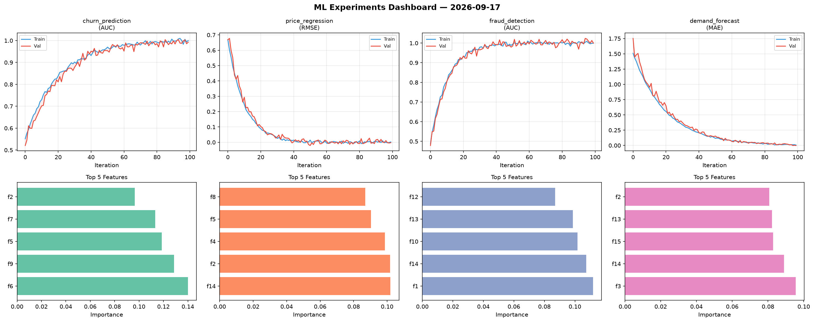
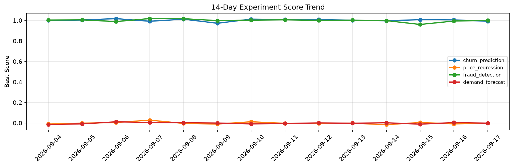

# ML Experiments Report — 2026-09-17

**Run ID:** `1bc1080684` | **Experiments:** 4 | **Trials:** 17

## Delta vs Yesterday

| Experiment | Today | Yesterday | Change |
|-----------|-------|-----------|--------|
| churn_prediction | 0.9924 | 1.0054 | 📉 -1.3% |
| price_regression | -0.0025 | -0.0088 | 📈 71.6% |
| fraud_detection | 0.9997 | 0.9943 | 📈 0.5% |
| demand_forecast | -0.0018 | 0.004 | 📉 -145.0% |

## churn_prediction (AUC)

**Best Score:** 0.9924 (Trial 3)

| Trial | Score | Overfit Gap | Time | LR | Trees | Leaves |
|-------|-------|-------------|------|-----|-------|--------|
| 1 | 0.9285 | 0.0323 | 12.29s | 0.05 | 100 | 63 |
| 2 | 0.9858 | 0.0076 | 24.99s | 0.1 | 100 | 31 |
| 3 ⭐ | 0.9924 | 0.0076 | 71.7s | 0.1 | 1000 | 63 |
| 4 | 0.9665 | 0.0043 | 135.25s | 0.05 | 500 | 63 |

## price_regression (RMSE)

**Best Score:** -0.0025 (Trial 1)

| Trial | Score | Overfit Gap | Time | LR | Trees | Leaves |
|-------|-------|-------------|------|-----|-------|--------|
| 1 ⭐ | -0.0025 | 0.0047 | 58.04s | 0.2 | 200 | 63 |
| 2 | 0.0991 | 0.0026 | 108.4s | 0.05 | 500 | 63 |
| 3 | 0.0462 | 0.0143 | 237.45s | 0.05 | 1000 | 15 |
| 4 | 0.0608 | 0.0168 | 28.05s | 0.05 | 100 | 127 |
| 5 | 0.749 | 0.0187 | 35.84s | 0.01 | 200 | 15 |
| 6 | 0.0145 | 0.0104 | 47.49s | 0.1 | 200 | 31 |

## fraud_detection (AUC)

**Best Score:** 0.9997 (Trial 4)

| Trial | Score | Overfit Gap | Time | LR | Trees | Leaves |
|-------|-------|-------------|------|-----|-------|--------|
| 1 | 0.6891 | 0.037 | 2.5s | 0.01 | 200 | 15 |
| 2 | 0.9557 | 0.0006 | 93.59s | 0.05 | 500 | 31 |
| 3 | 0.6965 | 0.0136 | 4.44s | 0.01 | 100 | 31 |
| 4 ⭐ | 0.9997 | 0.0001 | 55.57s | 0.2 | 200 | 31 |

## demand_forecast (MAE)

**Best Score:** -0.0018 (Trial 3)

| Trial | Score | Overfit Gap | Time | LR | Trees | Leaves |
|-------|-------|-------------|------|-----|-------|--------|
| 1 | 0.1713 | 0.0233 | 23.44s | 0.05 | 500 | 31 |
| 2 | 0.0568 | 0.0081 | 88.86s | 0.05 | 500 | 127 |
| 3 ⭐ | -0.0018 | 0.0077 | 200.86s | 0.1 | 1000 | 15 |
