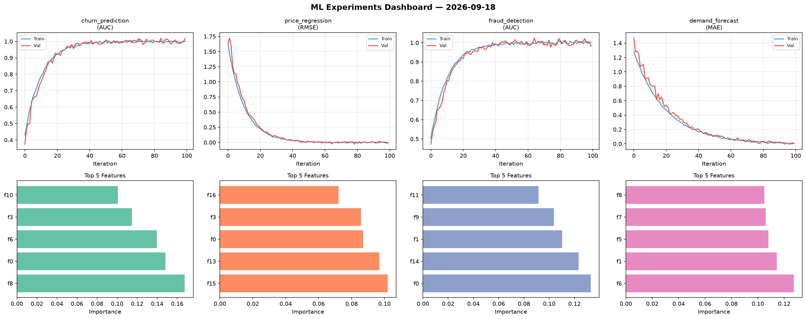
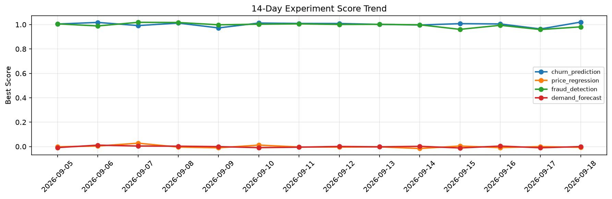

# ML Experiments Report — 2026-09-18

**Run ID:** `42c0512b83` | **Experiments:** 4 | **Trials:** 18

## Delta vs Yesterday

| Experiment | Today | Yesterday | Change |
|-----------|-------|-----------|--------|
| churn_prediction | 1.0205 | 0.9643 | 📈 5.8% |
| price_regression | -0.0064 | -0.0002 | 📉 -620.0% |
| fraud_detection | 0.9814 | 0.9594 | 📈 2.3% |
| demand_forecast | -0.0003 | -0.01 | 📈 97.0% |

## churn_prediction (AUC)

**Best Score:** 1.0205 (Trial 2)

| Trial | Score | Overfit Gap | Time | LR | Trees | Leaves |
|-------|-------|-------------|------|-----|-------|--------|
| 1 | 0.6106 | 0.0375 | 196.94s | 0.01 | 1000 | 127 |
| 2 ⭐ | 1.0205 | 0.0217 | 3.62s | 0.2 | 200 | 63 |
| 3 | 0.9557 | 0.0108 | 13.15s | 0.05 | 100 | 31 |
| 4 | 0.7892 | 0.0156 | 20.51s | 0.01 | 100 | 63 |
| 5 | 0.9229 | 0.0297 | 24.52s | 0.05 | 100 | 63 |

## price_regression (RMSE)

**Best Score:** -0.0064 (Trial 6)

| Trial | Score | Overfit Gap | Time | LR | Trees | Leaves |
|-------|-------|-------------|------|-----|-------|--------|
| 1 | 1.1931 | 0.1798 | 21.33s | 0.01 | 500 | 127 |
| 2 | 1.1375 | 0.1384 | 58.5s | 0.01 | 200 | 127 |
| 3 | 0.1063 | 0.0127 | 248.46s | 0.05 | 1000 | 15 |
| 4 | 0.1489 | 0.0095 | 210.89s | 0.05 | 1000 | 127 |
| 5 | 0.5437 | 0.0295 | 5.78s | 0.01 | 200 | 15 |
| 6 ⭐ | -0.0064 | 0.0017 | 19.62s | 0.2 | 100 | 127 |

## fraud_detection (AUC)

**Best Score:** 0.9814 (Trial 2)

| Trial | Score | Overfit Gap | Time | LR | Trees | Leaves |
|-------|-------|-------------|------|-----|-------|--------|
| 1 | 0.9561 | 0.0056 | 19.92s | 0.05 | 200 | 63 |
| 2 ⭐ | 0.9814 | 0.0218 | 11.26s | 0.2 | 100 | 31 |
| 3 | 0.6882 | 0.0319 | 126.13s | 0.01 | 500 | 63 |
| 4 | 0.6767 | 0.0068 | 78.4s | 0.01 | 500 | 15 |

## demand_forecast (MAE)

**Best Score:** -0.0003 (Trial 2)

| Trial | Score | Overfit Gap | Time | LR | Trees | Leaves |
|-------|-------|-------------|------|-----|-------|--------|
| 1 | 0.0152 | 0.0156 | 40.19s | 0.1 | 200 | 127 |
| 2 ⭐ | -0.0003 | 0.0066 | 73.79s | 0.1 | 500 | 31 |
| 3 | 0.4425 | 0.0351 | 78.95s | 0.01 | 1000 | 63 |
