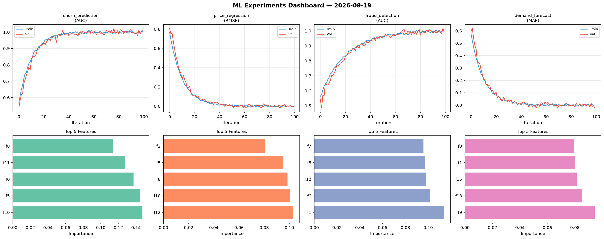
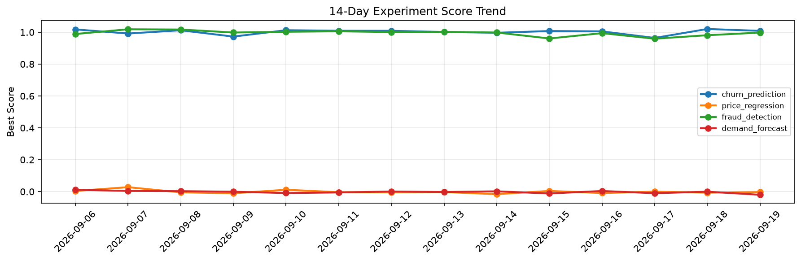

# ML Experiments Report — 2026-09-19

**Run ID:** `5396cade0a` | **Experiments:** 4 | **Trials:** 19

## Delta vs Yesterday

| Experiment | Today | Yesterday | Change |
|-----------|-------|-----------|--------|
| churn_prediction | 1.0087 | 1.0205 | 📉 -1.2% |
| price_regression | -0.0028 | -0.0064 | 📈 56.2% |
| fraud_detection | 0.9976 | 0.9814 | 📈 1.7% |
| demand_forecast | -0.0199 | -0.0003 | 📉 -1960.0% |

## churn_prediction (AUC)

**Best Score:** 1.0087 (Trial 5)

| Trial | Score | Overfit Gap | Time | LR | Trees | Leaves |
|-------|-------|-------------|------|-----|-------|--------|
| 1 | 1.0073 | 0.0111 | 101.66s | 0.2 | 1000 | 15 |
| 2 | 0.9428 | 0.0204 | 16.67s | 0.05 | 1000 | 15 |
| 3 | 1.0044 | 0.0061 | 86.33s | 0.2 | 500 | 31 |
| 4 | 0.6063 | 0.0292 | 1.75s | 0.01 | 100 | 63 |
| 5 ⭐ | 1.0087 | 0.0045 | 110.09s | 0.2 | 500 | 15 |

## price_regression (RMSE)

**Best Score:** -0.0028 (Trial 4)

| Trial | Score | Overfit Gap | Time | LR | Trees | Leaves |
|-------|-------|-------------|------|-----|-------|--------|
| 1 | 0.1371 | 0.004 | 204.4s | 0.05 | 1000 | 15 |
| 2 | 0.4595 | 0.0524 | 17.48s | 0.01 | 100 | 63 |
| 3 | 0.0624 | 0.006 | 33.46s | 0.05 | 200 | 31 |
| 4 ⭐ | -0.0028 | 0.0013 | 160.68s | 0.2 | 1000 | 15 |
| 5 | 0.9307 | 0.0938 | 93.39s | 0.01 | 1000 | 127 |

## fraud_detection (AUC)

**Best Score:** 0.9976 (Trial 2)

| Trial | Score | Overfit Gap | Time | LR | Trees | Leaves |
|-------|-------|-------------|------|-----|-------|--------|
| 1 | 0.9846 | 0.0247 | 27.7s | 0.2 | 200 | 63 |
| 2 ⭐ | 0.9976 | 0.0044 | 11.54s | 0.1 | 1000 | 31 |
| 3 | 0.7128 | 0.0299 | 182.88s | 0.01 | 1000 | 63 |
| 4 | 0.9865 | 0.0082 | 142.77s | 0.1 | 500 | 127 |

## demand_forecast (MAE)

**Best Score:** -0.0199 (Trial 4)

| Trial | Score | Overfit Gap | Time | LR | Trees | Leaves |
|-------|-------|-------------|------|-----|-------|--------|
| 1 | -0.0082 | 0.0121 | 111.25s | 0.2 | 500 | 127 |
| 2 | 1.4268 | 0.2278 | 79.63s | 0.01 | 500 | 15 |
| 3 | 0.1192 | 0.0014 | 1.59s | 0.05 | 100 | 127 |
| 4 ⭐ | -0.0199 | 0.0111 | 16.69s | 0.2 | 200 | 127 |
| 5 | 1.2107 | 0.0529 | 74.74s | 0.01 | 1000 | 31 |
