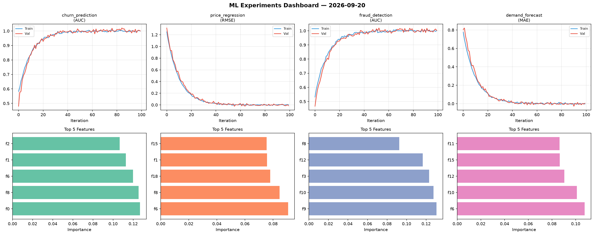
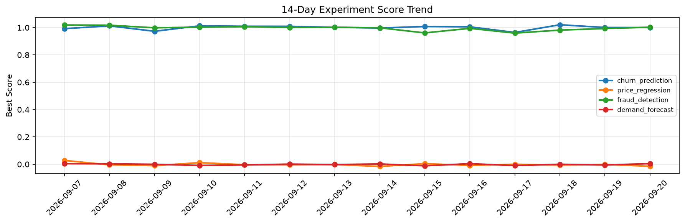

# ML Experiments Report — 2026-09-20

**Run ID:** `f2c94f5849` | **Experiments:** 4 | **Trials:** 20

## Delta vs Yesterday

| Experiment | Today | Yesterday | Change |
|-----------|-------|-----------|--------|
| churn_prediction | 1.0001 | 1.0006 | 📉 -0.0% |
| price_regression | -0.015 | -0.0012 | 📉 -1150.0% |
| fraud_detection | 1.0024 | 0.993 | 📈 0.9% |
| demand_forecast | 0.0044 | -0.0056 | 📈 178.6% |

## churn_prediction (AUC)

**Best Score:** 1.0001 (Trial 2)

| Trial | Score | Overfit Gap | Time | LR | Trees | Leaves |
|-------|-------|-------------|------|-----|-------|--------|
| 1 | 0.7917 | 0.0204 | 1.1s | 0.01 | 200 | 15 |
| 2 ⭐ | 1.0001 | 0.0012 | 10.14s | 0.2 | 200 | 63 |
| 3 | 0.9917 | 0.001 | 4.82s | 0.1 | 100 | 31 |
| 4 | 0.7843 | 0.0149 | 31.96s | 0.01 | 500 | 31 |

## price_regression (RMSE)

**Best Score:** -0.015 (Trial 4)

| Trial | Score | Overfit Gap | Time | LR | Trees | Leaves |
|-------|-------|-------------|------|-----|-------|--------|
| 1 | -0.0092 | 0.0109 | 285.92s | 0.2 | 1000 | 15 |
| 2 | 0.3376 | 0.021 | 82.36s | 0.01 | 500 | 127 |
| 3 | -0.0005 | 0.0027 | 72.61s | 0.2 | 500 | 15 |
| 4 ⭐ | -0.015 | 0.0201 | 11.56s | 0.2 | 200 | 31 |
| 5 | 0.0087 | 0.0036 | 58.59s | 0.2 | 1000 | 127 |

## fraud_detection (AUC)

**Best Score:** 1.0024 (Trial 4)

| Trial | Score | Overfit Gap | Time | LR | Trees | Leaves |
|-------|-------|-------------|------|-----|-------|--------|
| 1 | 0.9886 | 0.0134 | 35.98s | 0.2 | 200 | 15 |
| 2 | 0.9902 | 0.007 | 22.11s | 0.1 | 100 | 63 |
| 3 | 0.6523 | 0.0166 | 7.13s | 0.01 | 200 | 31 |
| 4 ⭐ | 1.0024 | 0.0018 | 8.51s | 0.2 | 100 | 31 |
| 5 | 0.8043 | 0.0058 | 51.79s | 0.01 | 200 | 31 |
| 6 | 0.9454 | 0.0186 | 157.32s | 0.05 | 1000 | 63 |

## demand_forecast (MAE)

**Best Score:** 0.0044 (Trial 2)

| Trial | Score | Overfit Gap | Time | LR | Trees | Leaves |
|-------|-------|-------------|------|-----|-------|--------|
| 1 | 0.7396 | 0.0148 | 46.38s | 0.01 | 500 | 31 |
| 2 ⭐ | 0.0044 | 0.0087 | 250.47s | 0.2 | 1000 | 31 |
| 3 | 1.3394 | 0.1556 | 286.22s | 0.01 | 1000 | 127 |
| 4 | 0.464 | 0.0055 | 103.36s | 0.01 | 500 | 63 |
| 5 | 0.0246 | 0.0194 | 44.14s | 0.2 | 500 | 127 |
